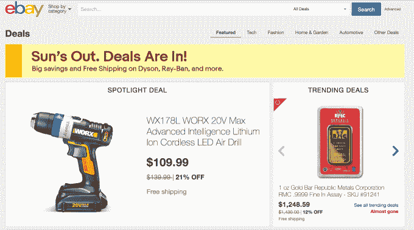
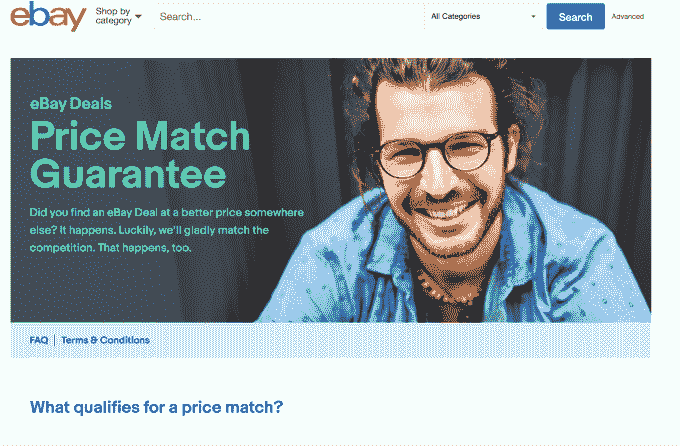

# Ebay 现在将在超过 50，000 件商品上与亚马逊、沃尔玛和其他公司的价格相匹配

> 原文：<https://web.archive.org/web/https://techcrunch.com/2017/06/21/ebay-will-now-match-amazons-walmarts-and-others-prices-on-over-50000-items/>

随着亚马逊和沃尔玛继续争夺全球最大零售商的宝座，电子商务领域的另一个长期竞争对手易贝也在加快步伐。该公司今天早上宣布了一个新的[价格匹配保证](https://web.archive.org/web/20230315162300/http://cc.ebay.com/price-match-guarantee/)，涵盖其网站上的 50，000 多种商品——承诺它将拥有最好的网上交易，或者它将匹配竞争对手的最低价格。

此举是易贝方面的一项重大努力，以确保随着市场在行业主要参与者的支持下进行整合，它不会将客户流失到亚马逊、沃尔玛和其他在线商店。

然而，只有选择项目可用于这种价格匹配保证，易贝说。

首先，为了获得资格，该商品必须是每天通过[易贝交易](https://web.archive.org/web/20230315162300/http://www.ebay.com/deals)售出的未开封的新商品之一。交易是易贝在其所有类别中选择的“趋势”库存——如消费电子产品、家居花园和时装。这些交易通常提供 20%到 90%的折扣，并且来自超过 900 个易贝值得信赖的卖家。

这些卖家既包括寻求扩大客户群的小型商家，也包括主要的消费品牌。易贝说，在任何时候，都有“成千上万”的商品通过 Deals 网站提供，特色交易每天至少更新一次，从太平洋时间早上 8 点开始。

如果你不知道这次发布是如何应对迫在眉睫的亚马逊威胁的，易贝关于新价格匹配功能的声明会让你大吃一惊:它特别指出了这样一个事实，即访问易贝交易需要“*无会员“*”。(会员资格？嗯……那会是指谁呢？)

这并不是易贝第一次挑战亚马逊。今年 3 月，[该公司宣布](https://web.archive.org/web/20230315162300/https://techcrunch.com/2017/03/20/ebay-takes-on-amazon-with-guaranteed-3-day-delivery-on-20-million-items/)将在其网站上推出 2000 万件商品的 3 天[保证送货](https://web.archive.org/web/20230315162300/http://www.prnewswire.com/news-releases/ebay-to-roll-out-guaranteed-delivery-for-20-million-items-300425914.html)。如果物品没有及时到达，易贝表示将退还运费。或者，如果商品已经免费运送——今天易贝 67%的交易都是这样——易贝表示将在买家下次购买时给他们一张优惠券。

至于新的价格匹配保证，有一些[警告](https://web.archive.org/web/20230315162300/http://cc.ebay.com/price-match-guarantee/)——虽然没有什么太出乎意料的。

Ebay 表示，它只会匹配在竞争对手网站上销售的相同商品的价格——是的，在你申请价格匹配担保时，该商品必须是现货。

该公司表示，它将与一些最大的在线零售商的价格相匹配，包括亚马逊、沃尔玛、Jet.com(也叫沃尔玛)、家得宝、西尔斯、塔吉特、百思买和 Wayfair。

为了要求价格匹配，消费者必须在购买前拨打易贝客服电话，以获得用于结账的差价优惠券。优惠券 24 小时后到期。

易贝公司北美高级副总裁哈尔·劳顿在一份声明中说:“购物者可以放心购物，因为他们知道自己在易贝买到了最超值的东西。”。“自 2011 年推出以来，我们的易贝交易选择呈指数级增长。价格已经极具竞争力，但如果顾客发现它的价格更低，我们很乐意与竞争对手的价格相匹配，”他补充说。

此举也可能有助于吸引新的购物者，他们一直认为易贝主要是一个拍卖网站。虽然该公司继续支持这种形式，当然，现在固定价格商品占其商品总量的大部分(87%)。此外，该公司指出，易贝上销售的所有商品中有 80%是新的，其中三分之二在三天内送到。

价格匹配保证仅在美国提供，从今天开始生效。