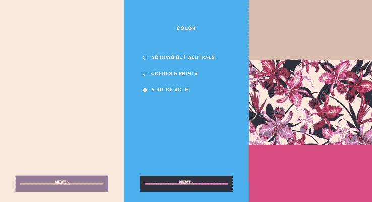

# Sofia Vergara 的内衣订阅服务 EBY 今天上线 

> 原文：<https://web.archive.org/web/https://techcrunch.com/2017/09/27/eby-the-undies-subscription-service-from-sofia-vergara-goes-live-today/>

# EBY，Sofia Vergara 的内衣订阅服务，今天上线

今天，又有一项订阅服务加入其中。

Sofia Vergara 和 Renata Black 的 [EBY 内衣](https://web.archive.org/web/20221025230106/https://join-eby.com/)企业刚刚上线，让用户注册每三个月收到三条新内衣。

但是 EBY 不仅仅是普通的订阅服务。正如 Warby Parker 和 Lemonade 在他们的业务中建立了一层社会公益，EBY 也在利用科技做好事。该公司将把其净销售额的 10%捐给七吧基金会。

通过 Seven Bar Foundation，Eby 将向全球贫困女性提供小额贷款，帮助她们创业或发展业务。价格从 80 美元到 2600 美元不等。“随着每个妇女变得自给自足，她的贷款得到偿还，并传递给另一个妇女，创造了乘数效应，打破了贫困的循环，”根据该新闻稿。

就产品而言，EBY 允许用户选择丁字裤、厚脸皮裤和三角裤，或者它们的组合。顾客还可以选择中性色、颜色和图案，或者两者的组合。

“这创造了一个完美的组合，”索菲亚·维加拉在八月接受 TC 采访时说。“当你很有魅力的时候，没什么好害羞的，但是现在女人们都可以这么做。我们可以拥有一切。而这就是花钱给自己治病的同时帮助其他女性的绝佳例子。”

每三个月买三条内裤要花 48 美元，相当于每条 16 美元。作为参考，你可以在 Gap 买到 9 美元/双的比基尼内裤，而 Calvin Klein 内衣要 22 美元/双。该公司表示，就质量而言，其产品更接近高端，产品的尺寸从 XS 到 4X 都有。

最终，根据新闻稿，EBY 将出售不同的订阅，让你每个月得到不止一双。

“一切都在电话或电脑上进行，”Vergara 说。“你再也不需要离开家去购物了。”