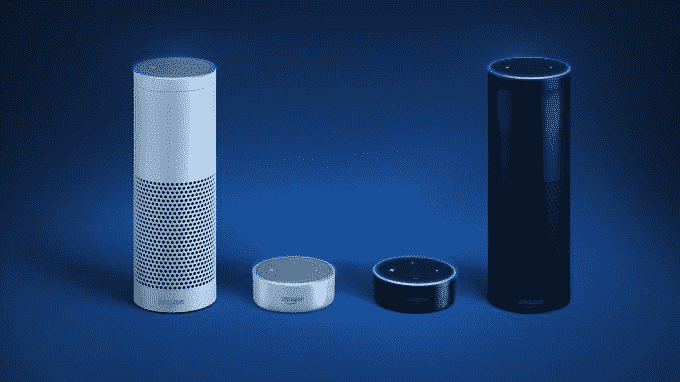
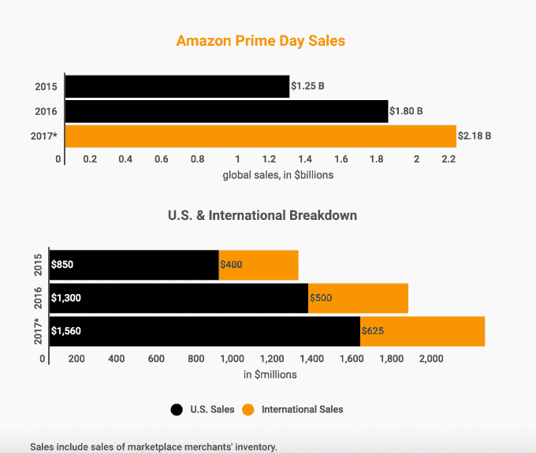
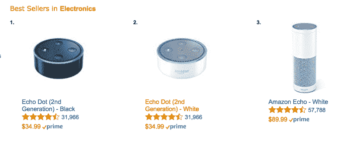
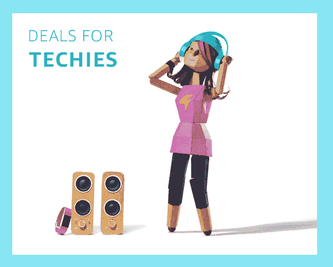

# Echo 设备是亚马逊 Prime Day 的最畅销产品 

> 原文：<https://web.archive.org/web/https://techcrunch.com/2017/07/11/echo-devices-are-amazon-prime-days-best-sellers/>

亚马逊在 Prime Day 对其语音驱动的 Echo 设备大幅打折的决定似乎为这家在线零售商带来了回报。虽然今天下午 Prime Day 仍在进行中，但亚马逊已经比去年 Prime Day 卖出了更多的 Echo 设备。

具体来说，与 2016 年 Prime Day 相比，它在美国的 Echo 设备销量是其两倍多，在全球的销量是其三倍多。据一位消息人士透露，该公司内部人士称，Echo 设备目前正以“每分钟数千台”的速度销售。消息人士补充说，Echo Dot 似乎有可能首先售罄，尽管人们对所有基于 Alexa 的产品的兴趣出乎意料地高。

换句话说，尽管像谷歌、微软、苹果或者更多的公司也想让我们的家里充斥着语音扬声器，但先行者仍然带来了自己的购买者海啸。

相比之下，2016 年亚马逊 Prime Day 导致亚马逊设备销量增长了 3 倍，其中 Echo speaker 在美国的销量增长了 2.5 倍。看来我们今年有望超过这些增幅。

当然，亚马逊模糊的统计数据令人恼火。

这家零售商从未公布其自身设备销售的实际数字，但至少[年初](https://web.archive.org/web/20221207074732/https://www.geekwire.com/2017/8-million-people-amazon-echo-customer-awareness-increases-dramatically/)消费者情报研究伙伴(CIRP)发布的一项估计表明，超过 800 万美国消费者现在可能拥有亚马逊 Echo 设备，让你了解一下市场的规模。

这款智能音箱于 2014 年底首次向 Prime 会员出售，2015 年 6 月开始全面上市。假设 CIRP 的数字([820 万](https://web.archive.org/web/20221207074732/http://www.ecommercebytes.com/cab/abn/y17/m01/i24/s02))大致正确，这将比 11 月计算的 510 万 CIRP 增加 60%。

当然，今天 Echo 设备销量的增长不能全部归因于对亚马逊智能扬声器类别的兴趣增加。

同样值得注意的是，2017 年的黄金日从技术上讲是在今年年初开始的——美国东部时间周一晚上 9 点。此外，今年的销售活动已经扩展到全球 13 个国家，而 2016 年只有 10 个国家，这也转化为销售额的增加。虽然英国和德国都在去年的 Prime Day 阵容中，但 Echo 尚未扩展到这些市场(它只在 2016 年 9 月在[出现):这也将转化为一个肿块。](https://web.archive.org/web/20221207074732/https://beta.techcrunch.com/2016/09/14/amazons-alexa-powered-echo-and-echo-dot-coming-to-uk-and-germany/)

似乎即使以亚马逊的销售标准来看，Prime Day 也是一个惊喜。“Prime Day 超出了亚马逊的所有预期，”该消息人士称。"他们对这一增长感到震惊。"

总体而言，网络零售商预计亚马逊今年的 Prime Day 销售额将超过 20 亿美元，比 2016 年的 Prime Day 增长 20%。我们的消息来源更加乐观，他说，由于对基于 Alexa 的硬件的浓厚兴趣，如果销售额跃升 40%，他不会感到惊讶。

互联网零售商的估计包括市场商家的库存。它还认为，更长的时间——与去年的 24 小时销售相比，30 小时的销售——将是黄金日销售增长的一个重要因素。

截至美国东部时间周二凌晨 4 点，亚马逊表示，Echo 是其美国网站上最畅销的商品，此前数百万 Prime 会员已经购买了它的商品。

如果 Echo 系列设备在这个黄金时期表现良好，那就不足为奇了。最初的 Echo 降价 50%，至 89.99 美元，而 Dot 降价 15 美元，至 34.99 美元，Echo 设备销售的其他市场也有相应的折扣。Echo 目前只支持美国和英国英语以及德语的命令和信息。

该零售商指出，亚马逊的其他设备在早期也表现不错。剩下的美国畅销书包括 Echo Dot 和搭载 Alexa 的新款 Fire 7 平板电脑。

目前，根据亚马逊网站上自己的畅销书部分，黑色的 Echo Dot 是美国最畅销的电子设备，其次是白色的 Echo Dot，然后是白色的 Echo。各种各样的 Fire 平板电脑、Kindle Paperwhite 和 Fire TV Stick with remote 也位列前十。

为了帮助消费者联系到他们最感兴趣的交易，亚马逊今年在其网站上将 Prime Day 销售[分成不同的类别](https://web.archive.org/web/20221207074732/https://www.amazon.com/ref=nav_logo)。

截至今天下午，亚马逊表示，其网站上的“技术人员”类别是购物最多的类别之一，还有“家庭厨师”和“为家庭”在技术板块，亚马逊正在大力推广自己的硬件——包括 Echo 设备、Fire 平板电脑、Kindle 电子阅读器——以及 Echo Dot/Philips Hue[Starter Kit](https://web.archive.org/web/20221207074732/https://www.amazon.com/All-New-Echo-Dot-2nd-Generation/dp/B01KUF2CH8/ref=gbps_tit_m-3_62d6_43ff8713?smid=ATVPDKIKX0DER&pf_rd_p=ffcb75c7-e01d-4198-b44a-8ee857d262d6&pf_rd_s=merchandised-search-3&pf_rd_t=101&pf_rd_i=14611812011&pf_rd_m=ATVPDKIKX0DER&pf_rd_r=C1VTHG4QC7JQP3WYCPM7)等套装。

CIRP [估计](https://web.archive.org/web/20221207074732/https://www.geekwire.com/2017/study-amazon-reaches-85-million-prime-members-u-s-35-last-year/)美国有 8500 万 Prime 会员，比去年同季度的 6300 万增长了 35%。这意味着今年有更多的人有资格在 Prime Day 购物，购买亚马逊的设备。