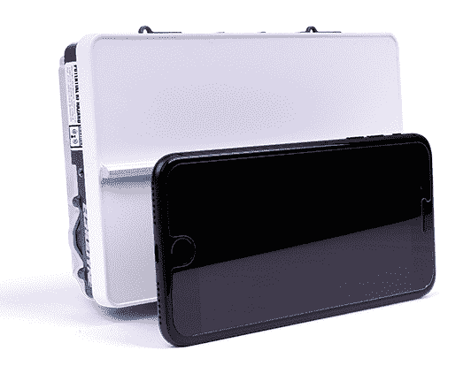

# Echodyne 的袖珍雷达可能是无人机(和无人机猎人)的下一个必备技术

> 原文：<https://web.archive.org/web/https://techcrunch.com/2017/05/12/echodynes-pocket-sized-radar-may-be-the-next-must-have-tech-for-drones-and-drone-hunters/>

仅仅因为我们生活在一个传感器众多的时代，并不意味着我们总能找到合适的传感器。我们一直缺少的一个特别的东西是一个雷达系统，它可以检测数百米外的障碍物和飞机，但却可以舒适地安装在一架小型无人机上。物理定律似乎阻止了它——[，但 Echodyne 还是让它工作了](https://web.archive.org/web/20230305185540/http://echodyne.com/)。它准备推出它的第一款产品。

问题不在于你后院的无人机不知道树在哪里(它知道),也不在于汽车不知道彼此之间有多远(它们知道)。那就是，如果你想飞到几百英尺的高空，你就不得不开始担心直升机、小型飞机，如果你飞得足够高，还要担心商用喷气式飞机。你需要看到数百或数千英尺才能有效地适应它们(这被称为“检测和避免”)，在这个范围内，世界上没有任何光学、激光雷达或超声波传感器是可靠有效的。

雷达通常是答案，但有两个问题:首先，一个像样的相控阵雷达将非常大，其次，我们谈论的是六位数。这两者对小型无人机或小公司都不友好。

Echodyne 的雷达在尺寸和价格上只是它的一小部分，但在许多功能上却是一样的——有些甚至比“大男孩”还要好。怎么可能呢？用超材料重新思考整个系统。

## 制作台面

我们不会太深入到事情的技术层面，但事情是这样的。相控阵雷达使用天线网格，通过以精确定义的模式发射无线电波，可以将雷达波束导向所需的方向。通过每秒多次这样做，你可以在整个视野范围内扫描光束，而无需移动设备本身。

这是高空无人机的必备功能，它必须扫描前方的大片区域，寻找即将到来的空中交通——所谓必备，我的意思是他们真的*必须拥有它们*。联邦航空局是这么说的。

问题是，由于涉及大量的电子设备，这些设备很难小型化到一定程度:天线必须有一定的尺寸才能在给定的波长下工作，它们的控制器占用空间，还有接收数据的处理，等等。

T2 Echodyne 使用一种叫做超材料的东西在一个非常非常小的规模上创建相控阵。该设备使用的不是几十个单独的天线，而是一个精心设计的 3D 图案表面，允许波束以几乎相同的方式传播，但精度更高，功率更低。

它扫过最大 120 度水平和 80 度垂直(方位角和仰角，如果我们是航空的话)，视野大致相当于人类的视野。这并非偶然:这些系统旨在取代飞行员的警惕性，无论是机载还是远程。有效替代人的视觉敏锐度和搜索能力是在操作者视线之外自主飞行的先决条件。

在那个窗口内，“超材料电子扫描阵列”或 MESA 可以发现 2 公里外的小型飞机，如塞斯纳，750 米处的四轴飞行器大小的无人机，以及 250 米处的鸟。

我自己在 Echodyne 的总部后面看到了这种能力，尽管一架演示无人机在那周早些时候被困在了一棵树上(操作员失误)，但另一架无人机参加了现场演示。飞出了我自己看不见的范围，也超出了激光雷达或光学探测的范围。但是在雷达显示屏上却一清二楚:一组圆点向外闪烁，静止的圆点表示树木和其他障碍物。(其角分辨率约为 1×3 度。)

Echodyne 去年年底测试了这一功能:

现在，光束扫描整个区域需要大约一秒钟，但因为光束可以随意定向(不需要转动碟形天线)，如果它检测到一个物体，它可以投入额外的资源来更密切地跟踪它。因此，它可以一只眼睛盯着天空，另一只眼睛用更频繁的脉冲观察可疑的无人机。Echodyne 声称，这种聚焦方式还可以让雷达确定速度，精确到每秒 2 米以内。

它在一个大约两个 iPad Minis 大小的封装中实现了所有这些功能，重 1.5 磅，功耗仅为 35 瓦。具有同等能力的系统可能会大十倍或二十倍，并且更耗电。唯一真正的问题是范围比更大的系统短——他们可能会看到 12 公里外的飞机。但是正如 Echodyne 向我指出的，四轴飞行器的飞行速度不是 300 节；更重要的是定位更近、更活跃的威胁和障碍。

一万美元，你不会买一个台面来安装在你的自行车上，但如果你是亚马逊或优步或任何正在寻找无人机商业应用的人，这不仅仅是一点点诱人。

## 1.插上 2。利润

开始看到这将如何严重改变游戏？Prosumer 无人机可以被赋予比飞行器更大、更贵的传感能力，使它们操作起来更智能、更安全。这种推动打开了一大堆可能性。

“我们接到了你能想到的所有申请的电话，”首席执行官艾本·弗兰肯伯格说。“第一次，你可以得到相当于微型相控雷达的东西，人们会说，‘哦，我的上帝，我现在可以做这个了！’"

较小的无人机可以看得更清楚，较大的飞行器可以装上几架，看到更多，在一个全新的行业中，反无人机行动可以获得一个便宜、易于部署的探测系统。

 这最后一个特别有前途。“安全已经从 2D 问题变成了三维问题，”弗兰肯伯格指出。监狱需要让携带毒品的无人机远离墙壁。私人测试机构必须在外围监视他们。有人可能提到了一堵墙。

相控或移动雷达阵列笨重而昂贵——大约 7 位数的价格。一个 MESA 无人机探测系统可能会花费 20-30，000 美元，重量是它的四分之一，可以用汽车电池运行一周。如果可以选择，后者似乎是显而易见的。如果你想让它飞起来，别无选择:试着用幻影举起一个 30 磅重的相控阵。

超材料雷达的起源可以追溯到 intelligent Ventures，它在几年前获得了一些有前途的学术成果，并在内部进行了孵化。它拥有 Echodyne 为自己的目的授权和设计的专利。在 R&D 时期，该公司从包括比尔·盖茨和保罗·艾伦在内的西雅图投资者那里筹集了资金，并在第一款产品的基础上继续筹集资金，这款产品的利息很高。

MESA 仍需要由 FCC 进行评估，FAA 仍在制定管理视距外无人驾驶飞机的规则。但是考虑到这些传感器和现有传感器之间的价格和性能差异，在不久的将来，台面型传感器(更大、更小或定制)将几乎成为无人机和探测站的强制要求，这似乎是一个必然的结论。