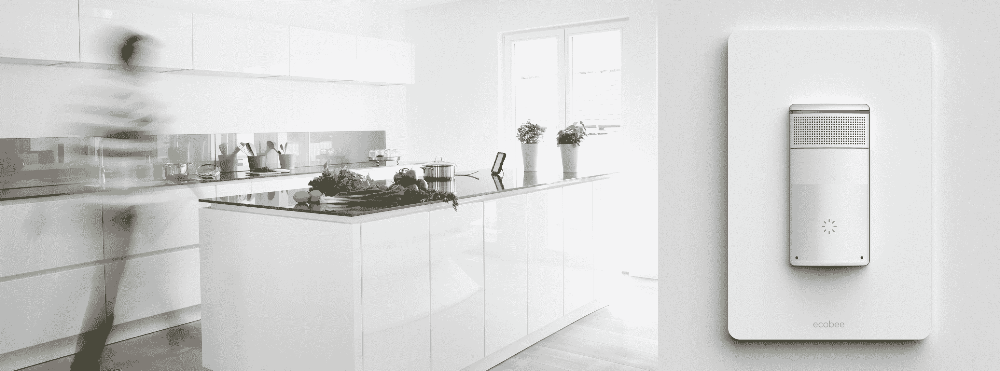

# Ecobee 正在将 Alexa 集成到其恒温器和电灯开关中 

> 原文：<https://web.archive.org/web/https://techcrunch.com/2017/05/03/ecobee-is-building-alexa-into-its-thermostats-and-light-switches/>

# Ecobee 正在将 Alexa 内置于其恒温器和电灯开关中

Ecobee 在今天的碰撞会议上发布了最新的联网恒温器。迄今为止，最有趣的一点是[它包括一个麦克风](https://web.archive.org/web/20230220175846/https://www.ecobee.com/voice/)，利用亚马逊的远场语音识别来提供 Alexa 功能。如果 Alexa 在你的生活中还不够，该公司还将在今年晚些时候计划将亚马逊的智能助手直接内置到智能灯开关中。

Ecobee4 将于 5 月 15 日上市，售价 249 美元。实际的以恒温器为中心的技能听起来在发布时会相对较少，自然包括调节室温，但 Alexa 的功能意味着该系统配备了亚马逊助手能够提供的 12，000 项左右的其他技能。远场技术意味着它不会与其他支持 Alexa 的设备争夺你的注意力。

该公司自己的新闻材料通过“将声音的力量编织到整个家庭的墙壁中”，使整个事业听起来模糊不清。你可能有过的任何关于带麦克风的设备进入你家的隐私担忧，当它们进入我们房子的墙壁时，几乎肯定会放大。

亚马逊表示，它自己的 Echo 设备在等待唤醒命令时会被动监听，该公司正在对发送到 AWS 服务器的所有信息进行加密。但最近第三方硬件制造商采用 Alexa 功能的增长无疑感觉像是一个更大趋势的开始。和往常一样，为你的恒温器和墙壁安装语音功能进行成本效益分析是值得的。

然而，对亚马逊来说，这种合作是理想的。毕竟，该公司的硬件产品在很大程度上是其他服务的入口，该公司移动的所有 Echo 设备实际上只是将 Alexa 带到大众面前的管道。随着越来越多的硬件公司支持该助手进入他们自己版本的 Echo 和智能手机等其他设备，该公司让其他所有人在传播 Alexa 福音方面做了很多繁重的工作。