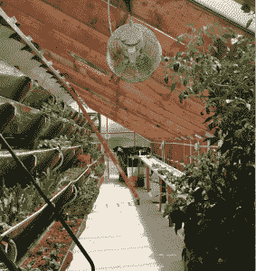
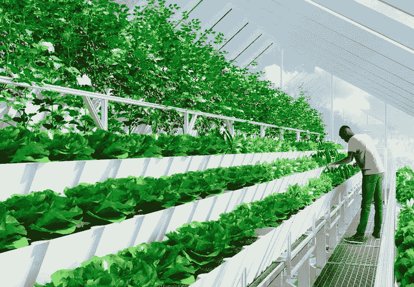

# Edenworks 正在城市屋顶上构建食物的未来

> 原文：<https://web.archive.org/web/https://techcrunch.com/2015/09/01/edenworks-is-building-the-future-of-food-on-urban-rooftops/>

来自墨西哥的鳄梨。来自智利的苹果。中国的西兰花。如果你看一看你在杂货店购买的产品上的标签，他们很可能会读到这样的内容。

快进二十年。你现在不用开车去全食超市花高价购买两周前采摘的、用防腐剂和冰箱人工保鲜的农产品，而是在你的屋顶上收获莴苣、采摘西红柿和抓鱼。

这是由生物工程师杰森·格林、建筑师本·西尔弗曼和制造商马特·拉·罗萨于 2013 年末创办的创业公司 [Edenworks](https://web.archive.org/web/20230227002611/http://edenworks.org/) 的愿景。Edenworks 在团队手工建造的屋顶车间经营业务，去年一直在布鲁克林一家金属加工店的屋顶上经营一个水生温室。

“我们正在通过太阳能和风能实现分布式发电，下一个真正需要实现分布式发电的是食品生产，”格林说。“有大量的能源投入到食物的分配中，而食物的生长是为了运输，而不是质量、味道或营养。”

Edenworks 生态系统建立在垂直种植的概念上，植物堆叠在倾斜的表面上，以便在有限的空间内生长更多。

在五层堆叠的种植床中，包含无土栽培介质的托盘，Edenworks 正在种植各种绿叶蔬菜和草本植物。然而，不同于传统的耕作或水培，这些植物被喂以鱼肥。

在一排排工厂后面是巨大的 250 加仑的水箱，里面装着海鲜(目前是罗非鱼和淡水对虾)。鱼排出的废水被有益菌消化，并转化为作物的优质植物养料，作物吸收肥料并过滤水，然后再返回鱼缸。

“没有任何合成或人工的东西，所有进入系统的都是植物或动物，”格林说。

除了技术。Edenworks 正在使用传感器实时捕捉环境条件和水化学数据。数据被上传到该公司的农场管理系统，可通过手机或桌面访问，该系统为农民提供了每日任务列表。

例如，如果你在种植罗勒，这款应用程序会告诉你一天要从种植床的确切位置移植多少罗勒幼苗，需要投入多少肥料，以及何时收获。如果算法关闭，并建议您在罗勒准备好之前收割，您可以暂停任务，系统将了解到罗勒在特定条件下需要更长时间。

使用该应用程序的农民越多，该算法就能越准确地预测和建议最佳种植方法。该系统拥有 200 多种作物的数据，其中 50 种已经在 Edenworks 自己的温室中进行了实验，并根据水产养殖进行了校准。

目前，Edenworks 正在向纽约的两家餐馆出售顶级农产品和草药，同时继续建设其第二代农业基础设施。格林说，由于农场不像大多数水培操作那样是一个无菌系统，他们能够种植的产品质量要高得多。

你可以非常清楚地品尝到不同之处。值得一提的是，我尝过的西红柿、芝麻菜、罗勒以及任何一种萝卜，都比我吃过的任何同类食物都要美味。这就像喝了好几年的啤酒，直到有人递给你一杯 IPA:从技术上来说，它们都是啤酒，但品尝了后者之后，相比之下，这些啤酒尝起来没有味道，被冲淡了。

许多高科技、超本地化的城市农场正在为五星级酒店种植特殊品种的生菜，或者向全食超市出售高端罗勒，以实现盈利。然而，真正的影响在于 Edenworks 成为普通大众日常食物来源的潜力。

格林估计，拥有一个 75，000 平方英尺的温室，Edenworks 将能够为 5，000 人提供足够的食物。根据 Green 的说法，考虑到 Edenworks 使用的水和能源比传统农业少 90 %,提高效率和积极环境影响的潜力是巨大的。

“农业消耗了全球 30%的碳能源和 92%的淡水，”格林说。“因此，围绕交通、建筑基础设施和农业，你会遇到这些交织在一起的问题，最终的解决方案是让农业成为城市设计的一部分。”

Edenworks 将于明年初在长岛市部署一个全面的商业种植系统，但格林表示，他们已经在与世界各地的一些机构客户进行谈判，这些客户希望安装自己的温室。由于 Edenworks 的基础设施是预制的、扁平包装的，并运送到现场，最终用户能够像一个巨大的宜家系统一样组装一个温室。

“我们可以部署在纽约，我们可以部署在沙特阿拉伯，”格林说。“冷却系统需要稍微调整一下，或者我们可能会改变屋顶的角度，但相对于为食品生产找到更好的基础设施这一全球性问题来说，这些都是微不足道的。”

在新鲜食物有限或受到威胁的地方，Edenworks 是一个解决方案——尽管非常昂贵。然而，随着技术成本的降低，房地产业主开始将温室纳入他们的发展计划，你可以想象这些系统对于公寓建筑或学校来说是一种令人难以置信的富有成效的投资。

接下来，Edenworks 计划将雨水收集和过滤系统整合到其温室中，这样，理想情况下，种植者根本不需要利用市政水源。

格林说:“对于所有这些在世界各大城市拔地而起的建筑，每个人都在寻找边缘，而富有成效的绿色空间是下一个层次。”。“如果你能在一栋居民楼的顶部种植小青菜、香草、海鲜和蘑菇，这将比大楼的其他部分提供更好的回报期。”