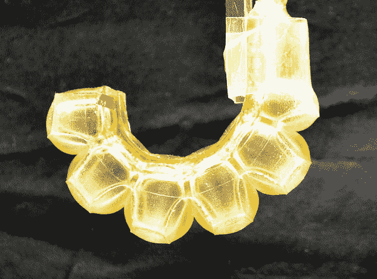
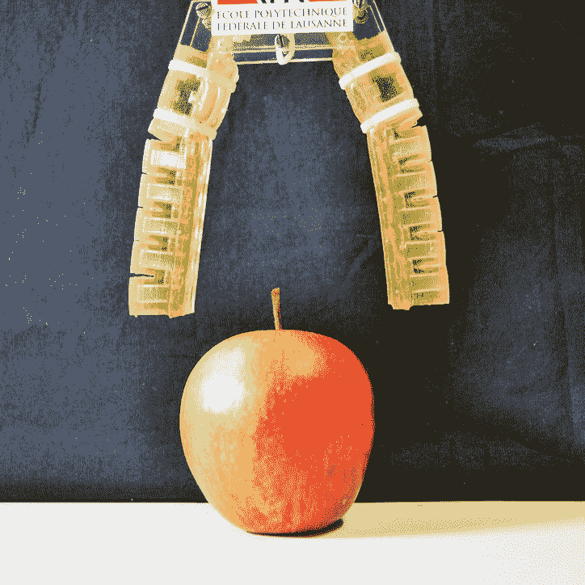

# 瑞士研究人员正在开发明胶制成的可食用机器人 

> 原文：<https://web.archive.org/web/https://techcrunch.com/2017/03/13/edible-robotics/>

瑞士洛桑联邦理工学院(EPFL)的研究人员发布的一篇新论文详细介绍了基于明胶的致动器的创造，这项技术可能会使我们更接近可食用机器人。

这是一个不可否认的奇怪的梦想，这个团队在这个早期阶段还没有完全想好。在与 TechCrunch 的一次对话中，该校智能系统实验室的主任达里奥·弗洛雷亚诺(Dario Floreano)承认，该团队可能在他们的研究中本末倒置了。这项工作显然是出于创造新事物的挑战，而不是解决任何特定功能的愿望。

“一年前(研究生和合著者 Jun Shintake)找到我说，‘我们正在做所有这些受生物启发的机器人，但生物系统被吃掉了，而我们的系统没有’”，他解释道。“我觉得这很有趣。食物和机器人有非常不同的约束和属性。甚至在考虑如何利用它们之前，我就认为这是一个非常有趣的挑战，看看我们能否将这两个领域结合起来。”

Floreano 列出了可食用机器人的许多潜在应用，包括食物可以自己走到更热或更冷的地方，或者一点一点地走向它想要喂食的人或动物。然而，更直接引人注目的是提供自动化药物治疗的可能性，正如最近 Recode 的一篇文章所提到的，这篇文章帮助 EPFL 的研究引起了更广泛的关注。

“这绝对是一个非常有趣的应用，”Floreano 说，“因为你可以将药物成分带到你希望它们产生效果的地方。”

这项研究是在麻省理工学院去年发布的一项类似研究之后进行的，该研究详细描述了一种由干猪肠制成的折纸机器人的创建，该机器人本质上是为了捕捉和移除有害的吞咽物品，如电池。让 EPFL 的研究与众不同的潜在因素是创造了完全可消化的驱动器，可以被人体分解。

这种致动器的创造是该团队正在进行的[软机器人](https://web.archive.org/web/20221224143326/https://techcrunch.com/tag/soft-robotics/)研究的一部分，软机器人是机器人学的一个子领域，受大自然的启发，可以制造更好地适应环境的组件。该技术值得注意的应用包括能够适应各种不同形状的机器人抓具。

一旦进入人体，机器人可以利用内部化学反应来驱动运动。他们还可以利用无毒电池，这种电池被设计成不断增长的可食用电子产品领域的一部分，这种电池不能被消化，但可以无害地穿过身体。

至于味道，在目前 EPFL 早期可食用机器人的凝胶版本中几乎不存在。尽管研究人员正在与附近的世界级酒店管理学校洛桑酒店管理学院合作，在未来创造味道更好的机器人。