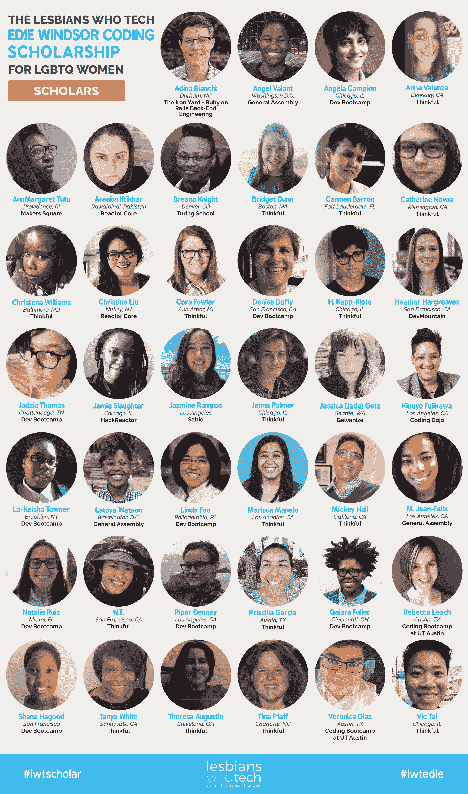

# Edie Windsor 编码奖学金选择 40 名 LGBTQ 女性学习如何编码 

> 原文：<https://web.archive.org/web/https://techcrunch.com/2016/09/26/edie-windsor-coding-scholarship-lgbtq/>

科技行业缺少来自男女同性恋、双性恋、跨性别者和同性恋群体的人——不是因为他们缺乏技能，而是因为他们缺乏平等的机会。女同性恋者科技组织(Lesbians Who Tech)已经挑选了 40 人获得奖学金，参加像 General Assembly、Dev Bootcamp 和 Turing 这样的学校的编码训练营。

在过去的几年里，编程训练营已经成为一种替代方式，可以获得进入科技行业所需的技能，而不需要进入传统的学院或大学。需要注意的是，这些项目可能相当昂贵，根据课程报告，一个关于编码训练营的信息和评论的数据库，平均每个学生大约 11，000 美元[。](https://web.archive.org/web/20230118123259/https://www.coursereport.com/reports/2016-coding-bootcamp-market-size-research)

进入 Lesbians Who Tech 的 Edie Windsor Coding Scholarship，该奖学金去年在美国的 5 到 12 所编码学校中从 5 到 40 名学者增加了一倍多。科技女同性恋者能够做到这一点，要感谢成功的 Kickstarter 活动，从 722 人那里筹集了超过 10 万美元，以及 [Dev Bootcamp 的承诺，以达到 10 万美元的目标](https://web.archive.org/web/20230118123259/http://www.usatoday.com/story/tech/news/2016/05/04/lesbians-who-tech-dev-bootcamp-scholarships/83901964/)。在今年获得奖学金的 40 人中，67%是有色人种，10%是跨性别者，100%是 LGBTQ。

“我的名字和伊迪·温莎的名字出现在同一个句子里，真是不可思议。它激励我成为一名战士，无论发生什么，”将参加 Dev Bootcamp 的学者娜塔莉·鲁伊斯说。“她的努力加速了向我的权利、我们的权利的积极转变——她的故事是非凡的。此外，有机会全力以赴地学习和发展是一件幸事。这真的改变了我的生活轨迹。我很高兴能够参加 Dev Bootcamp，并加入这个美好的社区。”

除了是导致美国最高法院推翻《婚姻保护法》的诉讼背后的人之外，温莎还是一名计算机科学家。1958 年，当她开始在 IBM 工作时，她开始了自己在科技行业的职业生涯。在那里工作期间，她最终成为了一名高级系统程序员，这是当时最高的技术级别。她是纽约市第一个获得 IBM 个人电脑的人。

“当我第一次听说伊迪·温莎在 IBM 的技术背景时，我就知道，从事技术工作的女同性恋者在讲述她的故事中扮演着重要的角色，”女同性恋者技术公司的创始人符晓薇·皮茨福德告诉我。“这样，未来科技领域的 LGBTQ 女性不仅会知道她英勇击败了 DOMA，还会知道，和她们一样，她也是一名技术人员。我们以 Edie 的名字命名我们的编码奖学金，以确保她的故事将继续激励世界各地的 LGBTQ 妇女。因为有了像 Edie Windsor Coding 奖学金基金这样的支持，我们可以改变技术的面貌。”

看看下面的学者吧。

