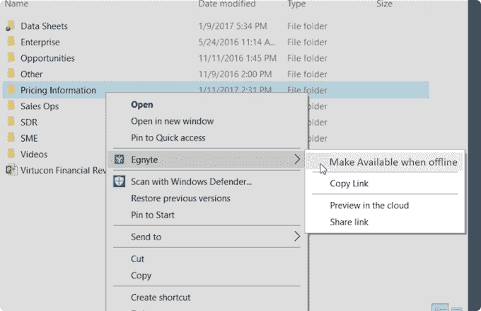

# Egnyte Connect 可让商业用户随时随地访问文件 

> 原文：<https://web.archive.org/web/https://techcrunch.com/2017/02/08/egnyte-connect-lets-business-users-access-files-wherever-they-live/>

# Egnyte Connect 让商业用户无论住在哪里都能访问文件

云本应解决文件访问问题。麻烦在于，当你为一家大公司工作时，你的一些文件可能存在于云中，而另一些则在本地。不管这些文件存储在哪里，您如何访问它们？Egnyte 希望通过今天针对桌面的 Egnyte Connect 的发布来解决所有这些问题。

Egnyte 一直试图将自己与 Box 和 Dropbox 区分开来，成为竞争对手完全云方法的混合存储替代方案。如果您有本地文件，Egnyte 也没问题。他们也将帮助管理它们，而 Egnyte Connect 直接参与了这一战略。

Egnyte 已经有了一个用于查看文件的 Connect mobile 应用程序，但随着今天桌面应用程序的发布，它试图让通常携带笔记本电脑的企业用户在办公室内外查看和编辑文件，而不必担心文件存储在哪里或完成后的同步。

Connect 在幕后为用户处理所有这些事情。他们所要做的就是选择一个文件。如果他们在办公室，并且文件同时位于云和本地，通常 Connect 会选择本地文件，因为这样更快，但是用户永远不知道文件来自哪里，因为 Connect 为他们管理所有这些。

公司首席执行官 Vineet Jain 在一份声明中解释说:“Egnyte Connect 的新版本通过自动为用户提供最快的内容路径，使用户能够在用户不知情的情况下实现内容基础设施的现代化，从而将‘内容位置’与‘用户体验’分离。”

该应用程序通过直接集成到 Windows 或 Mac OS 文件系统中来工作。有几个关键特征值得指出。首先，如果您的文件存储在本地，您可以将它们标记为离线使用。例如，如果你是一名销售人员，你想标记一份合同和价格单带到你的客户那里，这可能很方便。

Egnyte 直接集成到 Windows 或 Mac 文件系统中。照片:埃格尼特

理想情况下，云会为您做到这一点，但是如果这些文件存储在 SharePoint 或本地的其他存储库中，您需要采取这一步骤。另一个重要功能是通用文件锁定，如果另一个用户标记了使用(例如离线)，它会锁定文件，禁止在任何设置下使用。值得注意的是，如果您需要与多个用户协作处理一个文档，协作特性将总是覆盖锁，允许多个用户并发访问。

Egnyte 自 2007 年以来一直存在。它拥有 300 多名员工，超过 14，000 家企业使用它的产品。自成立以来，它已经筹集了超过 6200 万美元，但自 2013 年的 2950 万美元融资以来，没有再筹集任何新资金。截至 2016 年第四季度，该公司的现金流为正，一些关键客户包括红牛、纳斯达克、Warby Parker 和 Fender。