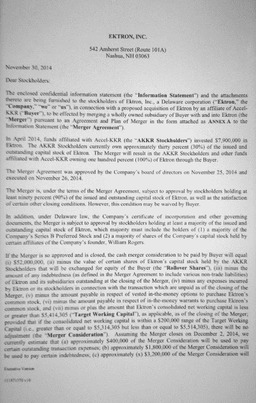

# Ektron 总裁承认将公司出售给 Accel-KKR 

> 原文：<https://web.archive.org/web/https://techcrunch.com/2014/12/05/ektron-president-fesses-up-to-selling-the-company-to-accel-kkr/>

# Ektron 总裁承认将公司出售给 Accel-KKR

在向 TechCrunch 否认 Ektron 已被出售后，公司总裁蒂姆·麦金农在后来的电话交谈中承认，在一份确认[交易的文件开始在网上流传](https://web.archive.org/web/20230207164631/http://ow.ly/i/7Qeg0/original)后，出售事实上已经发生。

本周早些时候，我们发表了一篇关于[Ektron 被](https://web.archive.org/web/20230207164631/https://techcrunch.com/2014/12/03/rumor-web-content-management-firm-ektron-sold-to-private-equity-company/)出售给一家不知名的私募股权公司的传闻。据推测，这家公司是今年早些时候投资该公司的加速 KKR 公司。

今天 Ektron 发布了一份[的简短新闻稿](https://web.archive.org/web/20230207164631/http://www.prnewswire.com/news-releases/ektron-receives-additional-growth-equity-investment-from-accel-kkr-300005649.html),声称它已经从 Accel-KKR 获得了额外的资金。在收到更新的新闻稿后，我们联系了麦金农，他告诉 TechCrunch 这是一项股权投资，没有发生出售。

那是在一份发给股东的文件被上传到互联网之前。根据该文件，“2014 年 4 月，与阿克塞尔-KKR 公司(AKKR 股东)有关联的基金向 Ektron 投资了 790 万美元。AKKR 股东目前持有百分之三十(30%)的 Ektron 发行在外的股本。合并将导致 AKKR 的股东和其他与 Accel-KKR 有关联的基金通过买方百分之百(100%)拥有 Ektron。”

对我来说那听起来确实像一次全面的销售。当我在第二次谈话中问他这件事时，麦金农别无选择，只能承认有过一次出售，他告诉我，“交易结束了，罗恩在星期二下午 2 点。这笔交易已经成交好几天了。”当我追问他之前已经否认时，他说，“不，它发生了。”

麦金农接着说，他不能说出加速度 KKR 拥有百分之多少，但他说，当所有说的和做的都不会是 100%。根据他的说法，该公司将在一个新的实体下重生，一些现有的股东将被发行新的股票。正如他在我们的第一次谈话中所说的，其他人将被买断，从而让阿克塞尔-KKR 和其他股东对公司有更多的控制权。

除了承认出售之外，麦金农指出，无论是谁发布了这份文件，他说这是发给所有股东的一份更大的法律文件的封面，这样做违反了保密协议。