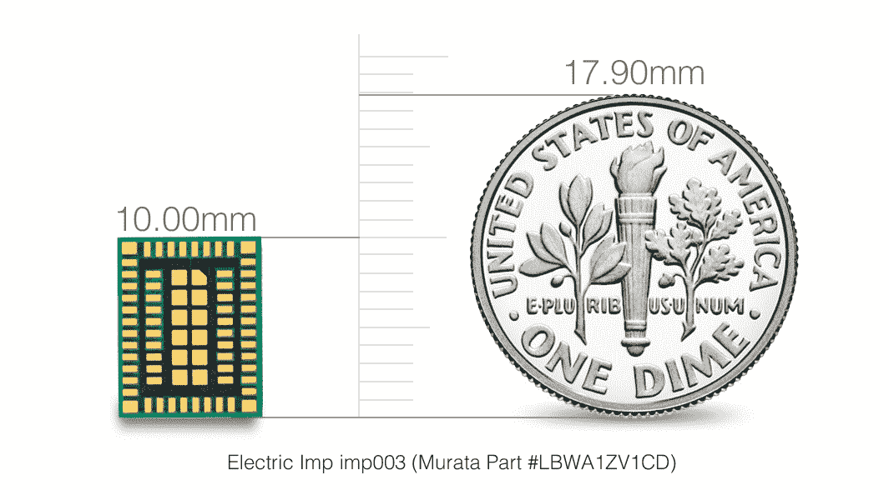

# Electric Imp 从富士康和其他公司筹集 1500 万美元，使物联网成为现实 

> 原文：<https://web.archive.org/web/https://techcrunch.com/2014/08/13/electric-imp-15m-foxconn/>

未来，我们购买的每台设备似乎都将联网，让我们无论身在何处，都能跟踪和管理家中和办公室里发生的事情。但是这些设备需要一个平台来轻松地为它们创建应用程序。电动 Imp 希望成为为所有这些设备提供动力的结缔组织，通过无线模块和基于云的平台连接它们。

[Electric Imp](https://web.archive.org/web/20221226065351/http://www.crunchbase.com/organization/electric-imp) 已经从一群战略投资者那里筹集了 1500 万美元的 B 轮融资，其中包括消费电子产品制造巨头[富士康](https://web.archive.org/web/20221226065351/http://www.crunchbase.com/organization/foxconn-technology-group)，以及 PTI Ventures 和 [Rampart Capital](https://web.archive.org/web/20221226065351/http://www.crunchbase.com/organization/rampart-capital-llc) 。两年前，Electric Imp 从 Redpoint Ventures 和 Lowercase Capital 筹集了大约 800 万美元的资金。

除了其他投资者之外，创始人兼首席执行官雨果·费恩斯(Hugo Fiennes)在这一轮投资中投入了更多自己的资金，这要感谢他从将 Nest 出售给谷歌中获得的一笔横财。你看，费因斯是决定自己动手建造电动 Imp 之前的早期团队成员之一。

“收购 Nest 后，我发现自己的谷歌现金充裕。我有点难过，我没有留下来，因为那样我就再也不用工作了，”费因斯告诉我。也就是说，他认为电动 Imp 有更大的机会。他表示:“我个人认为，市场小鬼正在解决的问题比 Nest 能够解决的问题更大。”

如今，全球约有 50 万台联网设备中嵌入了电动 Imp 芯片。但是考虑到每年售出的大量设备，该公司在变得无处不在之前还有很长的路要走。与富士康的战略合作伙伴关系应该有助于它获得更多的采用，以及电动 Imp 已经签署但尚未准备好宣布的其他一些合作伙伴关系。

今年早些时候宣布的与无线芯片制造商 Murata 的合作也将对其有所帮助。通过该协议，Murata 设计了一个集成的 Imp 模块，其大小约为第一代模型的 1/10。

村田公司还将向硬件开发商出售该模块，这让电动 Imp 的日子稍微好过一点。不用担心销售和提供设备本身，该公司可以专注于自己最擅长的事情，即提供后端技术，控制使用其平台的连接设备。

在消费者方面，未来几年，有很多设备可能会变得智能，或者至少会“联网”。这包括从洗碗机和洗衣机到智能冰箱和烤箱的所有产品。因此，为所谓的白色家电提供服务的潜在市场越来越大。

这是它希望通过与通用电气(GE)和 Quirky 等公司的合作来解决的问题，让制造商能够制造出可以通过其平台管理的设备。

Electric Imp 的技术还可以用于企业和工业应用，如资产管理、暖通空调、能源管理和制造。其中一个例子是与清洁能源公司 [Bonded Energy Solutions](https://web.archive.org/web/20221226065351/http://www.bondedenergysolutions.com/) 的合作，该公司使用 Imp 技术将六栋住宅楼的能源使用量减少了至少 15%。

因此，该公司获得了新的资金，并决定从富士康获得部分资金，这并不令人惊讶。随着合作伙伴的到位和资金的到位，它可以开始为我们日常使用的更多设备提供结缔组织。