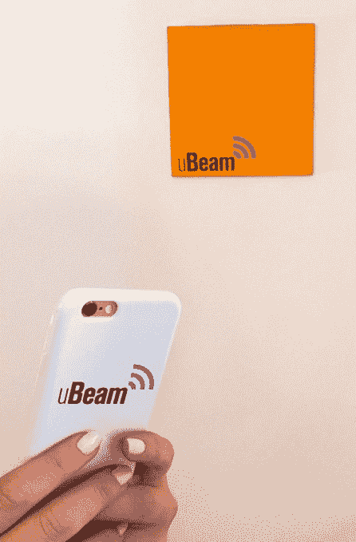
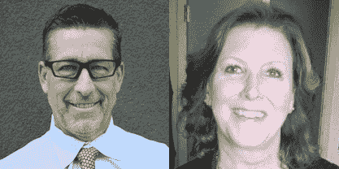
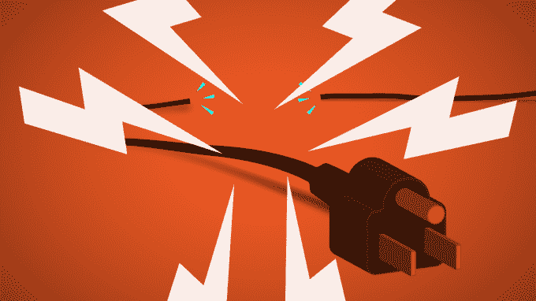

# 成熟的首席运营官和首席财务官 TechCrunch 表示，uBeam 为超声波无线电源投资 1000 万美元

> 原文：<https://web.archive.org/web/https://techcrunch.com/2015/09/28/electric-liberation/>

uBeam 正准备推出其无线手机充电器，因此其 26 岁的首席执行官 Meredith Perry 雇佣了一些硬件行业的资深人士来推动业务的发展。前苹果和 Palm 财务负责人[莫尼卡·沈虎](https://web.archive.org/web/20230214183838/https://www.linkedin.com/in/monicahushen)将成为 [uBeam](https://web.archive.org/web/20230214183838/http://ubeam.com/) 的新首席财务官，思科、Palm 和诺基亚副总裁[杰夫·迪瓦恩](https://web.archive.org/web/20230214183838/https://www.linkedin.com/pub/jeff-devine/5/12a/973)将以首席运营官的身份加入。

招聘的火力来自新的加薪。4 月份，我报道了 uBeam 计划进行 5000 万美元的 B 轮融资。现在我已经证实，它已经从当前和新的战略投资者那里筹集了 1000 万美元的无上限可转换债券，包括洛杉矶律师兼交易撮合者肯·赫兹，Twitter 全球媒体副总裁凯蒂·雅各布·斯坦顿，通用大西洋公司前首席合伙人帕特·赫德利，以及阿里·伊曼纽尔的 WME 风险投资公司。

据说，uBeam 的外壳可以在 15 英尺外为手机无线充电

这些钱和关系将帮助 uBeam 实现大家所说的梦想。该公司一直非常保密，但其技术使用超声波发射器在 15 英尺左右的距离内一次向多个设备传输电荷。这不是一个无线充电板，你也可以把手机插在上面。uBeam 的充电盒将发射器发射的超声波振动转化为能量。当你在咖啡馆时，它可以在你的口袋里给你的手机充电。

早期的原型需要巨大的非便携式接收器。但现在佩里说，“作为一家公司，我们已经到达了一个自然的转折点，随着我们推出产品的临近，我们的重点正在从小规模原型开发转向大规模生产大众产品。”

如果成功的话，超声波转换充电的影响将远远超出为手机供电。它可以切断家用电器的电线等等。在我们看到快速、安全、高效的远距离充电的全功能公开演示之前，我们无法确定。但是一些非常聪明的人在赌 uBeam。

它的第一轮 320 万美元种子资金来自知名投资者，如安德森·霍洛维茨基金、创始人基金、勒德洛风险投资公司、CrunchFund(由 TechCrunch 的创始人运营)、特洛伊·卡特、肖恩·范宁和马克·库班。紧接着，2014 年 10 月，uBeam 从现有投资者和新牵头的前期风险投资中获得了[1000 万美元的首轮融资](https://web.archive.org/web/20230214183838/https://techcrunch.com/2014/10/30/ubeam-10m-upfront/)。现在又多了 1000 万美元。

uBeam 的新首席运营官杰夫·迪瓦恩和首席财务官莫尼卡·沈虎(左起)

新的首席运营官 Devine 将为 uBeam 提供进入执行阶段的制造过程导航经验。他曾是思科供应链管理副总裁，拥有 30 年的工作经验。与此同时，新任首席财务官沈虎在领导财富 500 强公司的财务团队期间处理了 9 起收购案。我听说 uBeam 已经与三星和苹果谈过了，所以无论是合作还是 M&A 的潜力，沈虎的技能都会派上用场。

现在的问题是 uBeam 如何启动，谁来帮忙。我听说星巴克已经就成为战略投资者进行了广泛的谈判，维珍航空、喜达屋酒店和主要快餐品牌也是如此。他们可能会在商店、飞机或酒店安装 uBeam 发射器，分发充电盒，并使用无线电源吸引顾客。

我们的生活方式被我们对定量充电的迫切需求微妙地控制着。我们已经成为电子微妙的奴隶。但是乌班能打破锁链。

