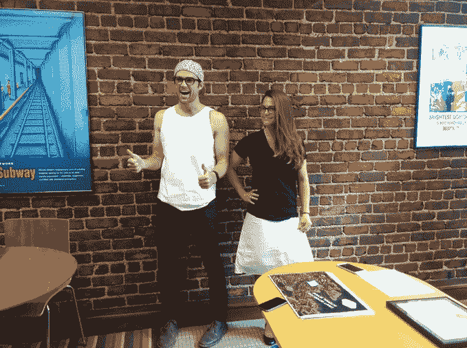

# Electroloom 是一款正在研发中的 3D 织物打印机 

> 原文：<https://web.archive.org/web/https://techcrunch.com/2015/05/18/electroloom-is-a-3d-fabric-printer-in-the-making/>

# Electroloom 是一款正在研发中的 3D 织物打印机

[3D 打印](https://web.archive.org/web/20221231223359/https://techcrunch.com/topic/subject/3d-printing/)正在推进各种领域，允许塑料和金属部件、[电路板](https://web.archive.org/web/20221231223359/https://techcrunch.com/2015/01/06/the-voltera-v-one-makes-circuit-boards-in-minutes/)的快速原型制作，甚至为食品生产提供[替代方案——或者提供一种成本更低的方式](https://web.archive.org/web/20221231223359/https://techcrunch.com/2014/03/27/foodini/)[构建活体组织结构](https://web.archive.org/web/20221231223359/https://techcrunch.com/2015/05/04/biobots-is-a-3d-printer-for-living-cells/)用于药物测试。这是这项技术的另一大希望:可穿戴的 3D 打印衣服。(不仅仅是目前由接合塑料制成的[精致艺术品](https://web.archive.org/web/20221231223359/https://techcrunch.com/2013/07/20/why-3d-printing-will-work-in-fashion/)。)

[Electroloom](https://web.archive.org/web/20221231223359/https://www.kickstarter.com/projects/electroloom/electroloom-the-worlds-first-3d-fabric-printer/description) 是一台仍处于初级阶段的机器，它是一台原型 3D 打印机，使用静电纺丝技术将液体(目前是一种定制的聚酯/棉混纺)变成无缝织物——将溶液喷洒到成型模具上，无需通过缝合来组装服装。

该机器背后的旧金山团队将这一过程称为场导向制造，并指出他们正在使用打印机室内的内部电场来引导纤维形成他们试图创造的任何形状。

因为 3D 打印织物是由大量微小的纳米纤维制成的，他们声称它能够以类似于传统织物的方式弯曲和悬垂。这一想法是为了形成完整的定制服装，而不需要大量的裁剪和缝合——正如今天的服装业所要求的那样。

到目前为止，Electroloom 技术已经开发了大约一年半，并且仍然是一项正在进行中的工作，尽管该团队现在已经发起了一项众筹活动，旨在发运少量的 alpha 单元(和一个开发套件)，以开始获得项目的外部反馈。

“我们正在寻找那些想要使用、探索、破坏、破解和改进我们的机器的人，以便最终我们能够提供一种更强大、更可靠的技术，”他们在他们的 [Kickstarter 活动页面](https://web.archive.org/web/20221231223359/https://www.kickstarter.com/projects/electroloom/electroloom-the-worlds-first-3d-fabric-printer/description)上写道。

在撰写本文时，他们已经筹集了不到 50，000 美元目标的一半，还有 28 天的众筹时间。如果他们达到了融资目标，他们的目标是在 2016 年 3 月之前向 Kickstarter 的支持者提供 alpha 单元。

他们目前能够打印的服装，比如下图的背心和裙子，不会赢得任何时尚奖项。他们早期的面料看起来相对较薄——所以穿起来可能不会太热——所以很明显，要生产出真正可穿的衣服，技术和工艺还需要进一步发展。但是用可喷涂的布料制作衣服的潜力看起来确实很吸引人。

