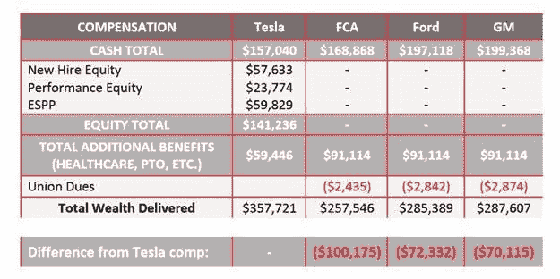

# 埃隆·马斯克在特斯拉全体员工电子邮件 TechCrunch 中谈到工作条件问题

> 原文：<https://web.archive.org/web/https://techcrunch.com/2017/02/24/elon-musk-addresses-working-condition-claims-in-tesla-staff-wide-email/>

在员工和工会倡导者何塞·莫兰本月早些时候在 [Medium post](https://web.archive.org/web/20221006195814/https://medium.com/@moran2017j/time-for-tesla-to-listen-ab5c6259fc88#.az71v82lg) 上提出指控后，特斯拉首席执行官埃隆·马斯克分享了他自己对这家汽车制造商工厂工作条件的调查结果。

马斯克的这封冗长的电子邮件发给了所有特斯拉员工，并解决了莫兰提出的所有关切领域，包括安全、薪酬和工作时间。特斯拉首席执行官表示，根据对莫兰特定团队和工厂的调查，关于不当安全控制的说法是没有根据的。事实上，马斯克表示，该公司的事故率不到大型汽车行业平均事故率的一半。

马斯克还绘制了薪酬图表，考虑了基于股权的薪酬和福利，以显示相对于三大汽车制造商的可观薪酬优势。当然，这取决于股票在授权期内保持稳定或有所改善。关于工作时间，马斯克表示，自去年以来，该公司已将加班时间减少了 50%，并希望通过 Model 3 的生产继续提高这些数字。

奇怪的是，马斯克还在“乐趣”一节中作了总结，他在其中讨论了路线图上的无形员工福利，如分布在工厂各处的冷冻酸奶站，以及旨在帮助员工以独特方式在弗里蒙特园区走动的电动过山车——包括一个“可选”的环路。

> 为了让特斯拉成为并保持 21 世纪最伟大的公司之一，我们必须拥有一个尽可能安全、公平和有趣的环境。你每天都期待着来上班，这对我非常重要。为此，我们必须成为一家公平公正的公司——唯一值得创造的公司。
> 
> 这对于我们加速实现清洁、可持续能源未来的使命至关重要。反对我们的势力很多，而且非常强大。如果大卫有六英寸高，这就是大卫对战歌利亚！只有变得更聪明、更快、作为一个紧密结合的团队工作得更好，我们才有成功的机会。我们永远不应该忘记起源于美国的汽车创业公司的历史:几十家已经破产，只有两家，特斯拉和福特，没有破产。尽管形势对我们非常不利，但我对你们的信任是我坚信我们会成功的原因。
> 
> 这就是为什么当我看到最近宣传 UAW 的博客帖子时，我如此心烦意乱，因为它与我们的使命不同，它真正效忠的是大型汽车公司，他们从员工那里收取的会费远远超过他们从特斯拉那里获得的收入。
> 
> 他们所采取的策略是不真诚的或者完全错误的。我将在下面讨论他们的秘密攻击。虽然本次讨论的重点是弗里蒙特，但这些原则同样适用于全球每一家特斯拉工厂。
> 
> 安全第一
> 
> 工作场所最重要的问题是安全。如果你没有健康，那么其他一切都不重要。仅仅是因为规模和运气不好，在一家拥有超过 30，000 名员工的公司中总会有一些伤害，但我们的目标很简单:尽可能接近零伤害，成为汽车行业迄今为止最安全的工厂。特斯拉高管团队和我绝对致力于这个目标。
> 
> 这就是为什么我对上周博文中的安全声明感到特别困扰，博文中写道:“几个月前，我的工作团队中有八分之六的人因各种工伤同时休病假。我听说在工厂的其他区域，人体工程学更加严格。”
> 
> 显然，这不可能是真的:如果他的团队中有四分之三的人突然休病假，我们将无法运营工厂的这一部分。此外，如果其他部门的情况真的更糟，这将意味着工厂 80%或更多的人受伤，生产将下降到几乎为零，停车场将几乎空无一人。如你所知，我们有相反的问题——永远没有足够的空间停车！事实上，我们正在以最快的速度建造更多的停车场。此外，希望我们该死的巴特火车站会在所有地狱冻结之前开放！
> 
> 在调查这一说法后，它不仅对这个人的团队是不真实的，对工厂数百个团队中的任何一个都是不真实的。
> 
> 也就是说，减少过度加班和提高安全性极其重要。这就是为什么我们雇用了数千名额外的团队成员来创建第三班，这减轻了每个人的负担。此外，自五年前特斯拉在弗里蒙特开始生产以来，工厂就有专门的健康和安全专家，我们定期与运营负责人举行安全会议。由于工厂中的大多数伤害都是人体工程学性质的，我们有一个人体工程学部门专门负责这个问题。
> 
> 最终结果是，自 1 月 1 日以来，我们的总可记录事故率(TRIR)低于 3.3，不到行业平均水平 6.7 的一半。
> 
> 当然，我们的目标是尽可能实现零伤害，所以我们需要不断改进。如果您有安全方面的顾虑或如何改进的想法，请告知您的经理、安全代表或人力资源合作伙伴。您也可以通过诚信热线发送匿名通知(这广泛适用于您在我们公司发现的任何问题),或者发送电子邮件至 safety@tesla.com。
> 
> 补偿
> 
> 在特斯拉，我们认为每个人都成为公司的所有者是非常重要的。这是你的公司。这就是为什么，不像其他汽车公司，每个人都被授予股票，你可以通过员工股票购买计划以低于公众的折扣购买股票。去年，股票股权奖励大幅增加，今年晚些时候，一旦 Model 3 实现高销量，这种情况将再次出现。
> 
> 下图对比了从 2013 年 1 月 1 日开始工作的特斯拉生产团队成员的总薪酬与同期通用、福特和菲亚特克莱斯勒的总薪酬。使用四年期限是因为这是新员工股权授予的授权期限。我相信，未来 4 年的股权收益将是类似的。如下图所示，一名特斯拉团队成员的总薪酬比其他美国汽车公司的员工多 7 万至 10 万美元！
> 
> 
> 
> 工作时间
> 
> UAW 博客中提出的另一个问题是工作时间。首先，我想感谢你为我们公司的成功付出的努力。这些时间对你、对你的家人、对我们公司都很重要，我无法告诉你我有多感激。
> 
> 然而，速度必须是可持续的。这就是为什么要建立第三班倒，也是为什么我们根据工厂各个团队的反馈制定了替代工作计划。
> 
> 这些变化产生了巨大的影响。今年生产团队成员的平均工作时间约为每周 43 小时。自从去年我们在 Model X 上实现率的超级艰难时期以来，加班时间的百分比下降了近 50%，这可能是历史上最难制造的汽车。多么惊人的成就！这也是一个教训，这就是为什么模型 3 被设计成更容易制造。
> 
> 乐趣
> 
> 随着我们越来越接近成为一家盈利的公司，我们将能够买得起越来越多有趣的东西。例如，正如我在上次公司演讲中提到的，一旦 Model 3 在今年晚些时候达到批量生产，我们将举办一场真正令人惊叹的派对。还会有一些小东西出现，比如分散在工厂各处的免费冷冻酸奶摊和我个人最喜欢的东西:特斯拉电动豆荚车过山车(当然，还有可选的环线路线！)这将允许在我们的弗里蒙特园区进行快速有趣的旅行，进出工厂并连接所有停车场。会变得非常好的🙂
> 
> 再次感谢你的努力，我期待着与你一起创造一个令人惊叹的未来！
> 
> 埃伦（可溶性显影剂粉末）