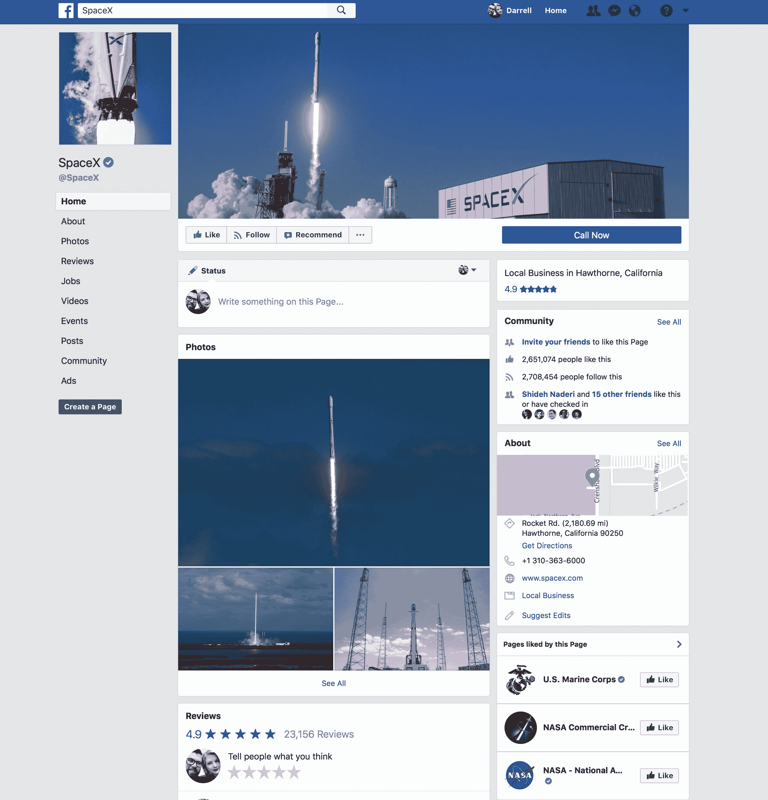
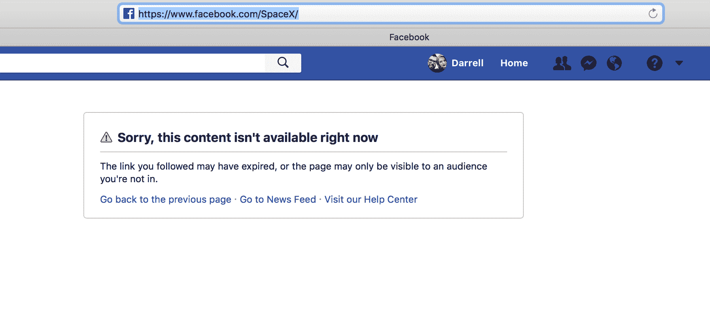
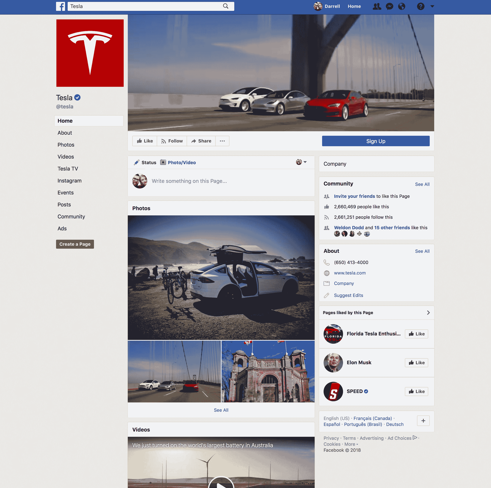

# Elon Musk 在#deletefacebook  之后删除了 own、SpaceX 和特斯拉脸书的页面

> 原文：<https://web.archive.org/web/https://techcrunch.com/2018/03/23/elon-musk-deletes-own-spacex-and-tesla-facebook-pages-after-deletefacebook/>

# 埃隆·马斯克在#删除 Facebook 后删除了自己、SpaceX 和特斯拉脸书的页面

埃隆·马斯克显然不知道他的公司 SpaceX 有一个脸书主页。这位 SpaceX 和特斯拉的首席执行官回应了 Twitter 上的一条评论，该评论呼吁他删除 SpaceX，特斯拉和埃隆·马斯克的官方页面，以支持#deletefacebook 运动，他首先承认他不知道有一个这样的页面，然后承诺他确实会删除它们。

他就是这样做的，因为 SpaceX 脸书页面在今天早些时候直播后现在已经消失了(正如你可以从东部时间下午 12:10 左右拍摄的截图中看到的)。

截至本文发布时，转到上述任何一个页面都会转到一条消息，上面写着“对不起，该内容现在不可用”。这是一个快速的转变，因为马斯克似乎在他将这些页面全部下线前 20 分钟才发现它们的存在。

马斯克还回应了 Twitter 上关于他自己和他的公司大量使用 Instagram 的另一条评论，insta gram 当然属于脸书。这位多产的企业家[指出【Instagram 是“边缘性的”，因为 FB 的“影响力正在慢慢蔓延”，但看起来他对目前保持这种存在没什么意见。](https://web.archive.org/web/20230321111558/https://twitter.com/elonmusk/status/977213864969256960)

在被删除之前，SpaceX 和特斯拉的页面都有超过 260 万个赞和关注，参与度极高。你不得不怀疑马斯克的社交媒体管理员工在这些下降时是否哭了一点。

正在开发…