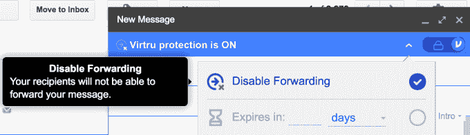
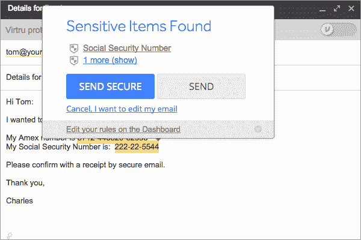
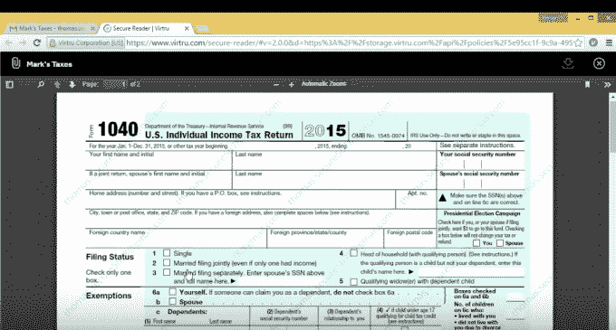

# 电子邮件和文件加密服务 Virtru 由前美国国家安全局工程师创建，融资 2900 万美元

> 原文：<https://web.archive.org/web/https://techcrunch.com/2016/08/22/email-and-file-encryption-service-virtru-built-by-ex-nsa-engineer-raises-29-million/>

谈论在正确的地点和正确的时间。继[政府间谍](https://web.archive.org/web/20230225042543/https://techcrunch.com/2014/05/12/nsa-allegedly-intercepts-shipments-of-servers-to-install-spying-backdoors/)、数据泄露、恶意黑客、身份盗窃和其他在线威胁被披露后，电子邮件和文件加密应用 [Virtru](https://web.archive.org/web/20230225042543/http://virtru.com/) 现已发展到 4000 多名客户，并已完成 2900 万美元的首轮融资，该公司今天上午宣布。

这一轮由 Bessemer Venture Partners 牵头，包括 New Enterprise Associates (NEA)、索罗斯基金管理公司(由亿万富翁乔治·索罗斯担任董事长，他也是以权利为重点的[开放社会基金会](https://web.archive.org/web/20230225042543/https://www.opensocietyfoundations.org/)的负责人，该基金会推动负责任和宽容的民主制度)，以及 Haystack Partners、Quadrant Capital Advisors 和 Blue Delta Capital。

随着新一轮的到来，Sonatype 首席执行官兼 Sourcefire 前首席执行官韦恩·杰克逊(Wayne Jackson)将加入公司董事会。他将与联合创建网络安全公司 VeriSign、Good Technology 和 Defense.net 的 BVP 合伙人大卫·考恩(David Cowan)以及创建电子邮件安全公司 Postini 的 Authentic8 首席执行官斯科特·皮特里(Scott Petry)一起工作。

Virtru 于 2014 年推出，由 John 和 Will Ackerly 兄弟创建，两人都有政府部门的技术背景。事实上，威尔是美国国家安全局的云安全工程师，而约翰在去私募股权公司之前，为白宫提供技术问题的建议，包括数字隐私。

两人的想法是将安全性和隐私带到人们日常使用的应用程序中，但要让日常用户更容易实现。首次亮相的第一款产品是 Chrome 和 Firefox 的扩展，集成了 Gmail 等流行的电子邮件服务，允许用户使用端到端加密来保护他们的电子邮件，并指定电子邮件在自动删除之前可以在某人的收件箱中保留多长时间，或者是否允许电子邮件转发。

此后，该公司将其加密、访问控制和数据丢失预防(DLP)工具引入 Gmail、Google Drive、雅虎和 Outlook 等服务(2010 年、2013 年和 2016 年)。它还拥有自己的独立电子邮件应用程序，可在 Google Play 和 iTunes 应用程序商店上使用。有了这笔资金，它将致力于扩展到其他云平台，如微软 Office 365。它还将进一步开发其 SDK 和 API，以便软件开发人员可以将 Virtru 集成到自己的应用程序中。

Virtru 的加密即服务架构基于可信数据格式(Trusted Data Format，TDF)，这是一种由 Will 开发的开源技术，它将每个内容对象包装在自己的安全信封中，只有授权方才能访问。客户管理自己的加密密钥，可以随时撤销他人的权限和访问权，即使数据已经公开或共享。

今年，该公司还推出了其他功能，包括加密搜索，用于搜索电子邮件或文件中的加密内容；基于硬件的加密密钥；它首次推出了自己的 SDK。

这项技术之所以有趣和引人注目，并不在于它一定是最安全的——约翰之前承认，有更安全的在线通信方式——但这些方式往往难以使用，而且价格昂贵。相反，Virtru 足够简单，任何人都可以理解，它可以跨不同平台工作。[个人使用](https://web.archive.org/web/20230225042543/https://www.virtru.com/pricing/)免费，专业版(5 美元/月)和企业版分级定价。

虽然该产品的灵感是为了简化每个人的安全性，但除了个人之外，Virtru 现在也被企业使用。它的软件使企业管理 Gmail、Google Drive 和 Google Apps 的安全和加密变得更简单，并帮助企业遵守 CJIS、CFPB 和 HIPAA 以及知识产权保护等规定。如今，它在媒体、娱乐、政府、医疗保健、金融服务和制造业领域招揽客户。

考虑到影响初创公司融资能力的危机，这笔资金值得注意——特别是在拥挤的网络安全领域，今年早些时候[曾被](https://web.archive.org/web/20230225042543/http://www.reuters.com/article/us-cyber-venturecapital-analysis-idUSKCN0VW2IZ)称为资金“干旱” [BVP 的考恩当时在](https://web.archive.org/web/20230225042543/http://%E2%80%9Cas%20we%20share%20our%20personal%20information%20with%20banks,%20doctors,%20schools,%20employers,%20and%20governments,%20our%20individual%20privacy%20depends%20upon%20their%20security,%E2%80%9D%20said%20bvp%20partner%20david%20cowan.%20%E2%80%9Cthe%20success%20of%20virtru%E2%80%99s%20email%20and%20file%20protection%20offerings%20show%20that%20they%E2%80%99re%20setting%20the%20new%20standard%20for%20business%20privacy.%E2%80%9D/)表示，许多新创公司已经在复制市场上的技术，或者正在推出黑客已经找到规避方法的产品。这些挑战导致初创公司需要更长的时间来完成交易，不得不削减支出，或者寻找出路。然而，就目前而言，Virtru 似乎并不在那个桶里。

考恩在一份声明中说:“我们与银行、医生、学校、雇主和政府分享我们的个人信息，我们的个人隐私取决于他们的安全。”“Virtru 的电子邮件和文件保护产品的成功表明，他们正在为商业隐私设定新的标准。”