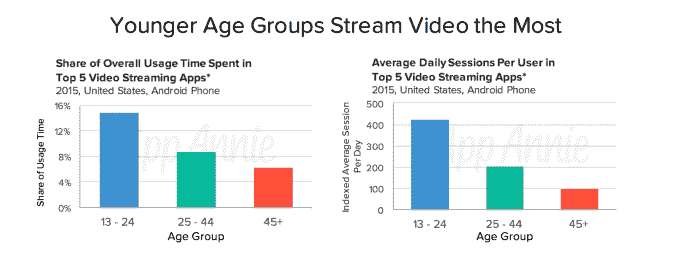

# 在手机最年轻的用户中，电子邮件正在消亡

> 原文：<https://web.archive.org/web/https://techcrunch.com/2016/03/24/email-is-dying-among-mobiles-youngest-users/>

如果有人怀疑消息应用是移动优先时代的通信未来，今天早上发布的一项新研究提供了一些可靠的数字来支持它们的吸引力——以及它们在当今最年轻用户中对电子邮件的日益主导地位。根据来自 [App Annie](https://web.archive.org/web/20230306013332/https://www.appannie.com/) 的一份[报告](https://web.archive.org/web/20230306013332/http://blog.appannie.com/adapting-your-strategy-user-engagement-patterns/)，电子邮件实际上正在这些人群中消亡。13 至 24 岁的人现在在消息应用上的总使用时间是 45 岁以上的人的 3.5 倍以上，而年龄较大的用户仍然默认使用复制桌面功能的应用，如电子邮件和网络浏览器。

App Annie 指出，这些发现的数据来自真实世界用户的大样本，并结合了该公司自己的专有数据集。然而，它只关注 Android 智能手机用户，在美国，这并不代表市场的整体概况。添加 iOS 数据可能会在一定程度上改变这些数字，尽管更大的趋势可能会保持不变。

对于那些在成长过程中没有手持智能手机的人来说，似乎有一种将智能手机当作小型个人电脑使用的倾向。例如，45 岁以上的人花在手机上的时间比其他任何年龄组都多。此外，他们花在 Android 前五名电子邮件应用上的时间更多，花在前五名消息应用上的时间更少。

与此同时，最年轻人口的情况可能正好相反。2015 年，13 至 24 岁的人更有可能在他们的设备上使用即时通讯应用而不是电子邮件。事实上，这两种服务的使用模式差异相当大。(见左上图。)短信应用的使用不仅超过了电子邮件，还远远超过了电子邮件。

随着向移动优先文化的转变，以及年轻用户成为成年人，通讯应用的重要性只会增加。这就是为什么许多当今的顶尖公司已经加倍努力，要成为这个领域的领导者。例如，脸书一直在努力使其 Messenger 和 WhatsApp 产品不仅仅是短信的替代品，它整合了企业对消费者的通信、电子商务和产品发现，以及通过一个名为“m”的实验性半人半机器人的虚拟帮助

在其他市场，KakaoTalk、LINE 和微信等即时通讯平台已经做了很多同样的事情。事实上，在某些情况下，通讯应用[正在成为整个互联网的入口](https://web.archive.org/web/20230306013332/http://a16z.com/2015/08/06/wechat-china-mobile-first/)[——而不是网络浏览器、谷歌搜索，甚至是像脸书这样更公开的社交网络。](https://web.archive.org/web/20230306013332/http://qz.com/248863/messaging-apps-are-reprising-the-webs-business-model-circa-1999/)

该报告发现，除了喜欢发短信，如今最年轻的用户也是手机视频流媒体服务的大量消费者，并指出他们在安卓系统前五大流媒体应用上花费的时间是 45 岁以上人群的两倍以上。App Annie 表示，年轻用户平均每天访问这些应用的频率是普通用户的 4 倍多。

然而，当谈到移动购物时，中间层(25-44 岁)在 Android 上的五大零售应用上花费的时间最多，并且比年轻和年长的同龄人更频繁地启动它们。这说明了他们使用移动服务的消费能力和舒适度。当然，随着时间的推移，随着收入的增加，青少年也会有类似的行为。

