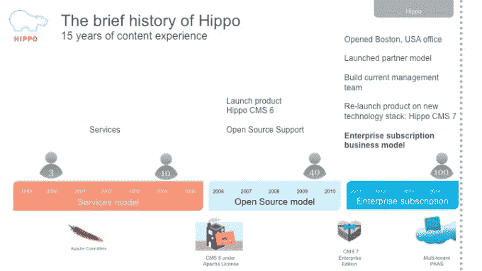

# EMC 与 Hippo 合作获得客户体验管理立足点 

> 原文：<https://web.archive.org/web/https://techcrunch.com/2015/02/18/emc-partners-with-hippo-to-gain-customer-experience-management-foothold/>

[EMC](https://web.archive.org/web/20221006071651/http://www.emc.com/index.htm?fromGlobalSelector) 和 [Hippo](https://web.archive.org/web/20221006071651/http://www.onehippo.com/en) 今天宣布建立合作伙伴关系，在这一合作中，开源 web 内容管理平台 Hippo 将与 [EMC Documentum](https://web.archive.org/web/20221006071651/https://www.emc.com/domains/documentum/index.htm?id=14) 集成，后者是 EMC 的企业内容管理软件。

正如所有的好交易一样，每个合作伙伴都会有所收获。EMC 填补了其内容管理武库中缺失的一块，而无需花费大量资金。Hippo 获得了更广阔的企业市场，并与 EMC 系列中的其他工具集成，同时保持了其独立性。

作为两家公司协议的一部分，Hippo 将成为面向技术连接合作伙伴的 EMC 业务合作伙伴计划的一部分。

EMC Documentum 是一个历史悠久的品牌，正在努力应对内容管理市场的混乱局面，Hippo 为他们提供了一个现代化的开源 web 内容管理工具，旨在帮助用户管理客户体验。

今天的 web 内容管理工具需要做的不仅仅是简单地创建、编辑和维护 web 内容，它们需要帮助创建定制的数字体验。这个想法是根据你对访问者的了解来提供内容，比如他们使用的设备，以及这是第一次访问还是经常访问。这些线索有助于系统在正确的时间以正确的方式为正确的屏幕提供更个性化的内容，而不是像第一次访问台式计算机一样对待每个访问者。在最好的情况下，客户体验管理模仿了最佳的实体客户体验(了解您的客户)，同时利用了数字化的优势。

EMC 企业内容部门的 Chris McLaughlin 表示，Hippo 的产品将帮助 EMC 客户通过所有渠道提供与上下文相关的数字体验。“它通过衡量哪些内容是重要的，并基于这种洞察力提供最佳的个性化数字体验，使内容成为一项独特优势。客户可以通过内容和应用传递价值，从而创造真正的竞争优势，”麦克劳克林在一封电子邮件中写道。

当您将它与其他 EMC 产品(如用于管理内容访问的 EMC Documentum 和用于高级分析的 Pivotal Gemfire)相结合时，他看到了工具的强大组合。

对于总部位于阿姆斯特丹并在波士顿设有美国办事处的 Hippo 来说，该交易使他们能够进入更广阔的市场，并获得巨大的 EMC 营销和销售引擎。或许更重要的是，这给了他们企业的街头信誉。

“他们愿意合作是一件大事。Hippo 首席技术官 Arje Cahn 告诉 TechCrunch:“这是一种验证，是一种认可，表明我们的产品具有企业能力。他说，该公司一直对此有信心，但这笔交易向市场发出了一个信号。

Hippo 正在寻找一种方式，通过某种形式的合作来扩大其在美国的业务，尽管它并不一定期望与 EMC 合作。“我们正积极致力于(扩大我们的美国市场)。这个出现了。这并不完全是偶然的，但这是一个很好的契合，因为它让我们能够做到这一点。”他补充说，他们是特别好的一对，因为 EMC 合作伙伴 Pivotal，[提供开源大数据](https://web.archive.org/web/20221006071651/https://beta.techcrunch.com/2015/02/17/pivotal-pivots-key-big-data-suite-components-to-open-source/)和云平台服务，为这笔交易带来了好处。

Cahn 对合作的潜力和它给 Hippo 带来的东西感到兴奋，但他说这并不意味着他的公司正在寻求被收购。他说，Hippo 有一个长期的产品计划，只是想看看合作关系会把他们带到哪里。

“我们目前不打算收购。”他说。

Hippo 成立于 1999 年，但在 2008 年开始销售 Hippo CMS 之前一直是一家服务公司。它在 2010 年推出了该产品的企业版。该公司这些年一直在白手起家，到目前为止还没有得到任何资助。客户包括迪士尼、康泰纳仕和任仕达。