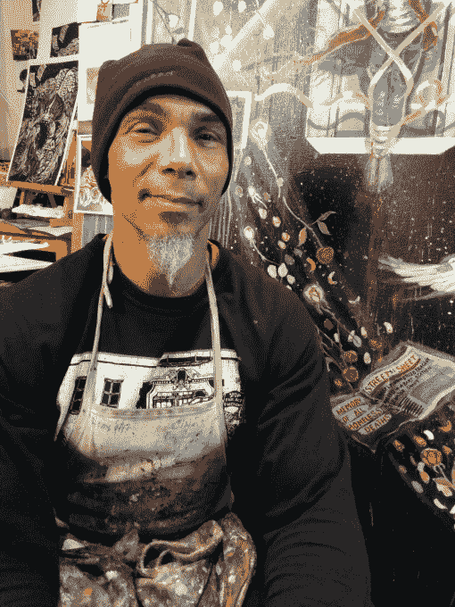
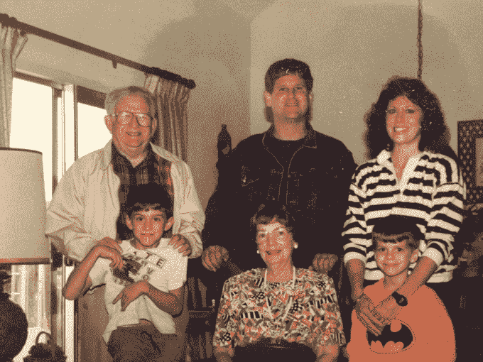

# 结束无家可归现象 

> 原文：<https://web.archive.org/web/https://techcrunch.com/2014/12/18/ending-the-invisibility-of-homelessness/>

凯文·阿德勒撰稿人

凯文·f·阿德勒是旧金山媒体和互动公司 NearShot 的创始人兼首席执行官。

昨晚在旧金山，我们的 6436 名邻居露宿街头或露宿街头。

缺乏负担得起的、安全的和支持性的住房是社会的一大祸害。维持一个人在街头流浪一年需要 9 万美元，相比之下，为一个以前无家可归的人提供支持性住房需要 1.8 万美元。在过去 10 年中，75，000 人涌入旧金山，而新的住房单元仅建造了 17，000 个。

我们可以通过向无家可归者提供负担得起的、安全的和支持性的住房选择，并通过选举将住房作为人类基本需求而斗争的代表，在 2020 年前结束长期无家可归的状况。

但是提供帮助意味着理解无家可归者的需求不仅仅是住房。

“他们”是个人，他们需要能够讲述自己的故事。

罗尼·古德曼是一位 54 岁的艺术家，也是旧金山的半程马拉松运动员。他在海特街 440 号的工作室展示他的画作，装饰着弗里达·卡罗、爵士乐传奇、社会正义和三藩市街道的彩色图案。

他慷慨地回馈他的社区，通过跑半程马拉松筹集了 15000 美元，并为有价值的事业捐赠原创艺术品，如[招待所](https://web.archive.org/web/20230206084429/http://hospitalityhouse.org/)、 [Coltrane 教堂](https://web.archive.org/web/20230206084429/http://www.coltranechurch.org/)和[街道表](https://web.archive.org/web/20230206084429/http://www.cohsf.org/)。罗尼也无家可归。虽然以前有人给他提供过住房，但那是在一个他说“我很想故态复萌”的地方。

艺术家兼马拉松运动员罗尼·古德曼

神经科学研究表明，内侧前额叶皮层——当我们看到一个同伴而不是一个物体时，我们大脑中激活的部分——在我们看到一个无家可归的人时不会激活。因此，当我们走过自己的家人身边时，如果他们看起来无家可归，我们可能会认不出他们。

如果不知道他们的故事，我们可能会觉得像罗尼这样的人不像人。可笑的是，我们知道脸书熟人的每一个细节，却对今年 350 万无家可归的美国人知之甚少。

这个问题是我个人的。马克是我的叔叔。他是我的大家庭中最注重家庭的成员。他记得每个生日。

马克也无家可归。他患有精神分裂症，在 10 年前 50 岁去世之前，他在街上游荡了 30 年，在中途之家进进出出。

作者的叔叔，马克·阿德勒，30 年来一直无家可归

今年年初，我启动了 HomelessPOV，帮助像 Ronnie 和 Mark 这样的人使用可穿戴相机、智能手机和邻居的帮助来捕捉他们的故事。

在与 15 名无家可归的自传作者合作并收到来自全国各地想要参与其中的人们的 300 多条信息后，几个月前我辞去了在 edtech 的工作，创建了 [NearShot](https://web.archive.org/web/20230206084429/http://nearshot.com/) ，这是一家新型的媒体和互动公司，使用*沉浸式讲故事*将人们与生活联系起来，因为它很少被看到但却经常被感受到。

“娱乐”这个词在我们的社会中有一个负面的含义，让人联想到时髦的青春期前的选美皇后和豪宅中的富人的无脑真人秀。我们正在将娱乐的概念恢复到其富有同情心的拉丁词根:“憋在心里”，例如，娱乐一个想法或体验。

我们已经进入了 2015 年全美无家可归者 100 个故事策划活动的最后时刻。在拍摄过程中，我们与当地企业和服务提供商合作，为无家可归者和非无家可归者的邻居提供互动和一起进餐的机会。

在我们挑选的 15 位自传作者中，无家可归的原因是多种多样的。它们包括缺乏负担得起的住房、贫困、失业、创伤、成瘾、医疗费用、家庭暴力、精神疾病、身体残疾、驱逐、离婚、关系破裂、悲伤、绝望和其他意想不到的改变生活的事件。

自始至终，每次谈话中都会出现一个评论:“我意识到我无家可归不是因为我缺少住房，而是因为我失去了支持我的家人和朋友。”

一个新的无家可归者服务品牌明白这一点，利用一点技术来建立关系，提供急需的服务，并使无家可归者人性化。

Artlifting 帮助无家可归的艺术家出售和展示他们的作品。 [HandUp](https://web.archive.org/web/20230206084429/http://handup.us/) 可以让任何人直接向需要帮助的无家可归的邻居捐款。 [Lava Mae](https://web.archive.org/web/20230206084429/http://lavamae.org/) 改造市政公共汽车，为无家可归者提供移动淋浴。旧金山的社区支柱，如圣安东尼餐厅(St. Anthony's ,刚刚在 10 月份开设了一个新的餐厅，旨在为另一个 64 年的日常餐饮服务培养人际关系。

我们很自豪能与这些组织合作，并赞扬其他建立社会资本的人的工作。还有 [sf.citi 与 Project Homeless Connect](https://web.archive.org/web/20230206084429/http://www.sfciti.com/updates/sf-citi-announces-partnership-with-project-homeless-connect) 的历史性合作；[隐形人](https://web.archive.org/web/20230206084429/http://invisiblepeople.tv/)利用视频和社交媒体分享街头故事；旧金山[和西雅图](https://web.archive.org/web/20230206084429/http://hacktivation.org/)[的无家可归者黑客马拉松](https://web.archive.org/web/20230206084429/http://www.geekwire.com/2014/hack-homelessness/)，以及 Tenderloin Neighborhood Development Corporation 的变革服务，为租户提供“我们通常认为理所当然的联系感和社区感”这些组织认识到家“不仅仅是四面墙和一个屋顶。”

在这个社区中，我们可以支持自我表达和社会资本，支持理解彼此的故事和建立关系的重要性。让我们停止互相回避，并作为人类同胞重新开始交往。

单靠技术并不能解决问题。但它可以帮助我们讲述自己的故事，让彼此的生活有所不同 **。**

**编者按:** *凯文·f·阿德勒(Kevin F. Adler)是总部位于旧金山的媒体+互动公司 [NearShot](https://web.archive.org/web/20230206084429/http://www.nearshot.com/) 的创始人兼 CEO，其第一个项目是*[*homeless POV*](https://web.archive.org/web/20230206084429/http://nearshot.com/)***。***