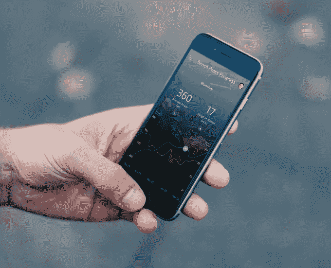
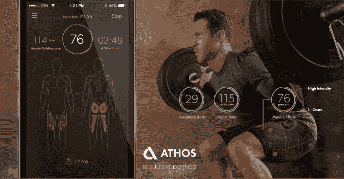

# Enflux 是一款智能身体追踪健身装备，在 Kickstarter  上发布

> 原文：<https://web.archive.org/web/https://techcrunch.com/2016/03/07/enflux-a-smart-body-tracking-workout-outfit-launches-on-kickstarter/>

今天，Kickstarter 上发布了一款新的身体跟踪健身装备，它看起来将与阿索斯和其他运动跟踪传感器竞争。

[Y Combinator 支持的公司 Enflux](https://web.archive.org/web/20230325080833/http://www.getenflux.com/) ，今天[开始在 Kickstarter 上为其充满传感器的健身装备](https://web.archive.org/web/20230325080833/https://www.kickstarter.com/projects/1850884998/enflux-smart-clothing-3d-workout-tracking-and-form)(甚至可以放在洗衣机里)。这基本上要归功于首席执行官 Doug Hoang 在赛车传感器工作后的几个月里遭受的一系列跑步损伤。

“这是真的与[我的联合创始人]在同一时间交谈，他们有丰富的锻炼经验，”黄说。“‘你可以这样做，’他们说，所以我有了这些我们开发的运动传感器，我可以把它们绑在我的腿上，测量偏航、俯仰和滚动。当时我甚至没有车，所以这是一个小小的错位问题，但当我开始为铁人三项训练时，就像是，'这是下一件大事。'"

Enflux 的设备包括一件衬衫和一条裤子，上面装有传感器，可以在你锻炼时跟踪你的身体状况。目标是帮助人们获得正确的形式，并作为一种在你的智能手机上工作的私人教练。你的手机上有一个头像，可以让你回顾你的练习，还有一系列统计数据，可以帮助你了解你的练习是否正确。

对 Enflux 来说，这将是一个巨大的挑战:这项技术大约一年后才能上市，包括获得其专利的完全签署。这可能会为其他竞争对手打开大门，用类似的——可能更好的——产品在市场上击败该公司。但是具有发动机设计背景的 Hoang 表示，每家公司的方法都有一点不同。

最初，这种设备由一堆绑在你身体上的传感器组成，但现在这些传感器被放入一件真正的衬衫和裤子中。它们紧紧地贴在身体上，Hoang 说这种设备大约有两周的电池寿命。身体周围总共有十个传感器，将运动转化为智能手机应用程序，然后记录所有这些。

该公司正在与大约 500 名私人教练合作，以帮助建立正确锻炼形式和风格的基线，并且该公司继续在这些私人教练和专家的帮助下增加新的锻炼。随着时间的推移，它还将收集人们如何锻炼的数据，并调整过程，以更好地为不同风格和体型的人量身定制锻炼。

所有这些都旨在关注你的状态，并给你反馈，以防止受伤，并帮助人们在训练中取得进步。许多跑步者可能会与 Hoang 有关联，并发现这很有用:膝盖受伤是最令人讨厌的问题之一，可能会让你偏离轨道，有时可以通过其他练习和调整跑步形式来预防，Hoang 说。

另一个目标是，该公司希望开始与其他服务合作——可能像 MyFitnessPal 这样的服务——以更好地整合整个健身和健康体验。Hoang 说，目前 Enflux 没有任何具体的计划，但希望与其他服务“友好合作”。

Enflux 面临着一些严峻的竞争——尤其是一款距离上市还有一年的产品。另一家智能服装公司阿索斯[已经融资 5100 万美元](https://web.archive.org/web/20230325080833/https://techcrunch.com/2015/11/18/athos-pushes-up-to-51-million-in-the-bank-with-funding-from-chamath-palhapitayas-socialcapital/)，最近一轮由社交+资本领投。还有其他追踪器[也在寻求像 Atlas](https://web.archive.org/web/20230325080833/https://techcrunch.com/video/atlas-way-more-than-a-fitness-tracker/519399365/) 这样的可穿戴设备。Atlas 也在 Indiegogo [上开展了一次成功的活动，该项目筹集了超过 60 万美元](https://web.archive.org/web/20230325080833/https://www.indiegogo.com/projects/the-atlas-wristband#/)。

一个有趣的注意是，Hoang 将搬到台湾，以便更好地管理硬件公司与制造商之间的复杂关系。例如，他们收到的第一批传感器不能工作，因为他们在生产中没有得到完全正确的规格。Hoang 将成为移动 CEO，这对公司来说可能是一个挑战，但为了确保这一过程顺利进行，这可能是必要的。

“事情总是会这样，因为我们经常失败，而他们很了解技术，”Hoang 说。“这就是为什么我们在做完整的订单之前，对我们经历的每一个过程进行小测试，一年一年。”