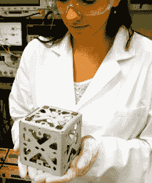
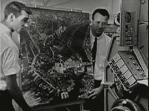
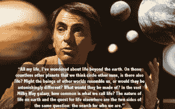

# 加速空间技术的未来 

> 原文：<https://web.archive.org/web/https://techcrunch.com/2017/04/17/engage-mister-sulu/>

爱丽丝·劳埃德·乔治撰稿人

爱丽丝·劳埃德·乔治是纽约的早期投资者，也是

[Flux](https://web.archive.org/web/20221005150023/http://theflux.libsyn.com/podcast)

，一系列与前沿技术领导者的播客对话。

More posts by this contributor

此时此刻，有 500，000 多块太空碎片正在环绕地球飞行。这些碎片以每小时 40000 公里的速度行进，卫星与这些碎片的碰撞足以损害甚至[摧毁我们的通信网络](https://web.archive.org/web/20221005150023/http://www.space.com/5542-satellite-destroyed-space-collision.html)。

Accion Systems 正在开发防止这种情况发生的技术。该公司于 2014 年从麻省理工学院分离出来，制造离子发动机，使卫星能够在太空中机动并避免这些碰撞。

在 Flux 的一次[采访中，我采访了 Accion Systems 的联合创始人兼首席执行官娜塔莉亚·贝利。她揭示了该公司如何能够满足蓬勃发展的小型卫星行业的需求，以及为什么传统制造商无法跟上，她如何处理从学术界到商业的跳跃，以及她从雷神公司的比尔·斯旺森那里学到的管理团队的知识。](https://web.archive.org/web/20221005150023/https://itunes.apple.com/us/podcast/10-natalya-bailey-propelling-the-future/id1192848099?i=1000384477665&mt=2)

贝利还讨论了阿波罗任务如何推动计算向前发展，为什么太空探索对我们的生存至关重要，以及如何让更多的女性进入 STEM 领域。

对话摘录如下。

Accion Systems 的联合创始人兼首席执行官娜塔莉亚·贝利(Natalya Bailey)持有一个带有四个微型推进器模块的 1U 立方体卫星原型。

**AMLG:** 今天，我很高兴地欢迎 Accion Systems 的创始人兼首席执行官 Natalia Bailey。Accion 成立于三年前，他们建造液体离子系统，为卫星的电力推进提供动力。这是一项可以改变太空动力学的技术，通过使卫星能够机动和重新定位，延长它们的寿命，这是非常巨大的，可以用于许多任务，包括(一天)星际探索。欢迎娜塔莉亚，很高兴你能来。

NB:谢谢你邀请我参加这个节目。

AMLG: 我们开始吧。我很想听听你是如何创立 Accion 的——你是如何走到现在这一步的？

注:我创建 Accion 的道路始于我对研究空间推进和在该领域进行研究的兴趣。这让我来到麻省理工学院攻读航空航天学博士学位。

实际上，在去那里之前，我在杜克大学攻读硕士学位，并试图创办一家火箭公司，虽然技术不同，但想法相似，但那家公司后来倒闭了。我以为这将是我最后一次尝试创业和初创公司，所以我去攻读博士学位，并认为我最终会成为一名教授或在一个研究实验室工作。我开始研究这种新型的离子引擎。我们最终引起了工业界的极大兴趣。时机是惊人的——当我们测试这项技术的概念证明时，整个行业对更小的卫星越来越感兴趣。在推进方面存在巨大的技术差距，我们正在研究可以填补这一差距的东西。我们有一些大型航空航天公司，洛克希德公司和波音公司，来到麻省理工学院，试图从麻省理工学院获得技术许可或购买系统。我的研究顾问记得我曾经试图创办一家公司，所以他知道我有创业倾向，建议我再试一次。

2012 年，我和我的实验室伙伴决定分拆，于是我们成立了一家占位公司来争夺 IP。后来，我通过了博士答辩，他退学了，我们在 2014 年正式分手，开始了一帆风顺的生活。

来自这些大公司——洛克希德公司和波音公司——的兴趣让你感到惊讶吗？你一定要赶走他们吗？许可所有的核心技术是不是很诱人，或者你知道自己找到了正确的机会，是不是感到一种巨大的解脱？

注意:回想起来，这似乎是产品适合市场的一个非常明显的标志。我想是马克·安德森或本·霍洛维茨说的，“如果市场真的需要一项技术，它会从一家公司中拿出来。”因此，即使团队缺乏经验，行动缓慢，还有其他挑战，如果市场真的想要什么，强大的力量可以让它发生。我们仍然生活在一种幻想中，认为没有人能比我们更好地制造这些系统，因为它们对于航空航天来说是非传统的。洛克希德公司没有现成的制造工厂或流程能比我们更好地开发这些技术。所以这是一个很好的位置。

**AMLG:他们没有这个能力，这看起来很疯狂。他们分配资源是不是太小众了？创业公司做这个有什么优势？**

NB:技术本身很不一样，还有制造。我们利用 [MEMs 制造技术](https://web.archive.org/web/20221005150023/https://en.wikipedia.org/wiki/Microfabrication)——与用于制造英特尔计算机处理器的生产线相同——我们用它们来制造我们的推进器芯片。洛克希德公司传统上不生产计算机处理器，也不具备这些能力。

AMLG:所以你找到了他们无法解决的特定领域。对于不知道卫星推进系统是干什么的听众，你能解释一下为什么它如此重要吗？

NB:主要的应用是机载推进系统，这是我们正在研究的。这不同于从地球表面发射。我们处理卫星已经在太空中的情况。如果你看看一项任务的进展，卫星是由一个不太精确的大体积火箭发射到轨道上的，所以首先它必须重新定位自己以到达它实际打算去的地方。

然后在整个任务期间，总会有一些小的干扰使卫星偏离预定轨道。它必须校正这些因素，比如重力、大气阻力和其他扰动。

你还必须为避免碰撞做预算。如果美国国家航空航天局通知你，你正准备撞上什么东西，你有责任让开。那么在卫星寿命结束时，你也要负责让它脱离轨道。你不能无限期地让卫星留在轨道上——那被称为太空垃圾，对我们来说是个热点话题。所以这是最典型的任务之一，但随着我们开始超越低地球轨道，推进系统也可以用于转移轨道，到达月球和火星以及其他星际探索任务。

超过 500，000 块太空碎片围绕地球运行，速度高达 17，500 英里/小时，足以让一小块碎片损坏卫星或航天器。这是一段时间的推移，显示了自 1984 年以来的积累[ [欧洲航天局](https://web.archive.org/web/20221005150023/https://www.youtube.com/watch?v=9cd0-4qOvb0)的完整视频]。

**AMLG:**

你能谈谈使用你们技术的第一组卫星的具体应用吗？

注:最终两个主要的应用是成像或地球观测和通信。这是我们将要解决的两个主要商业应用。我们的第一批客户恰好是能够承受更高风险的人。在过去的 10 年里，我们没有像一些更成熟的玩家希望他们的供应商那样向太空发射推进系统。所以我们的第一批客户正在尝试做一些事情，比如将一颗小卫星从近地轨道带到月球轨道，或者尝试展示其他以前没有被证明过的新颖技术或任务组件。所以我们现在关注的是那些风险承受能力较高的客户。

**AMLG:你提到了星际和火星——一群业内人士抱怨说，SpaceX 对火星殖民的关注转移了人们对常规火箭发射和支持近地卫星生态系统的关注，而这些近地卫星可能是你的大部分客户群。你对此有什么想法？**

注意:关于这一点有两个想法。首先，它类似于阿波罗计划，当你有一个难以置信的、大胆的目标要实现时，衍生技术和你在这个过程中必须解决的其他挑战实际上对其他领域非常有益，不仅仅是太空。看看阿波罗，你甚至可以说那项投资的一些回报是一般的计算机，以及该计划产生的其他一切。

AMLG:在计算机进步方面，我们从阿波罗计划中具体得到了什么？

注意:个人电脑在那个时候刚刚开始被考虑，在许多早期的阿波罗任务中，一切都是通过手工计算来完成的，后来他们开始将打孔卡输入到机载电脑中。它正处于向计算的转变点，大量的资金被投入到阿波罗计划的开发中。所以[阿波罗的粉丝们说，计算机是因为阿波罗计划而产生的。](https://web.archive.org/web/20221005150023/http://www.computerweekly.com/feature/Apollo-11-The-computers-that-put-man-on-the-moon)我认为，总的来说，为整个国家设定重大目标通常会产生很多很酷的衍生技术。

关于火星殖民的另一件事是，如果你把人类看作一个物种，如果我们在 300-400 年后，这可能不是因为我们留在地球上。为了我们的长期保存，开始探索太阳系中的其他行星是值得的，并希望最终超越这一点。

**AMLG:这种探索其他星球的兴趣从何而来。你在俄勒冈长大，对吗？那是什么感觉？你是如何对太空感兴趣的？**

注意:在俄勒冈长大很棒。这是非常户外活动，我真的不记得花任何时间在室内。我会在外面的蹦床上过夜。在俄勒冈州没有太多的光污染，所以我可以看星星。我会想到外星人，然后注意到这些非常固体的光点在天空中移动，我意识到它们不是飞机。所以我试图找出它们可能是什么，并意识到我正在观看空间站。我主要是想研究外星人，但我的家庭很实际，所以我决定把它和我喜欢的数学结合起来，最终选择了航空航天工程。从那以后我再也没有回头。AMLG:你一直都对科学感兴趣吗？你的父母对科学感兴趣吗？

NB:是啊。我父亲是生物学家。我总是收集虫子，研究它们，把它们放在我卧室的水箱里，直到我父母发现它们。在学校里，我开始擅长数学，并发现它对我来说很容易。科学和外星人的结合把我引向了工程学。AMLG:当你谈到外星人时，我想起了卡尔·萨根写的我最喜欢的一本书——《接触》。我不知道你是否看过这部电影或这本书，但我觉得你就像电影里的艾莉。她是一位才华横溢的科学家，偶然发现了一件大事。

NB:我肯定看过。我目前正在重新研究卡尔·萨根的《原始宇宙》。

**阿姆鲁:我爱原始的宇宙。我是卡尔·萨根的超级粉丝，我爱他的声音，他的声音听起来很鼓舞人心。说到书，我知道你是个狂热的读者。有没有哪本书特别影响了你或你的创业之路？**

NB:我是一个超级哈利波特迷，很多关于 Accion 的东西都是以哈利波特的各个方面命名的，包括 Accion 这个名字本身。

AMLG:那是 Accio 咒语吗？召唤咒语？

NB:没错。一个周末的深夜，我和我的联合创始人在网上聊天，浏览着哈利波特咒语的词汇表，试图给公司命名。Accio，召唤咒语，如果你在它的末尾加上一个“N”，它就变成了“accelerate”和“ion”的串联，这就是我们所做的。这是我们如何命名该公司的官方故事，但实际上它来自咒语词汇表。

* * *

引自卡尔·萨根 20 世纪 80 年代的电视剧《宇宙》

[要继续阅读，可以在[媒体](https://web.archive.org/web/20221005150023/https://medium.com/@TheFluxPodcast/10-natalya-bailey-propelling-the-future-7cba65e5df02)上找到对话的完整文字记录。]