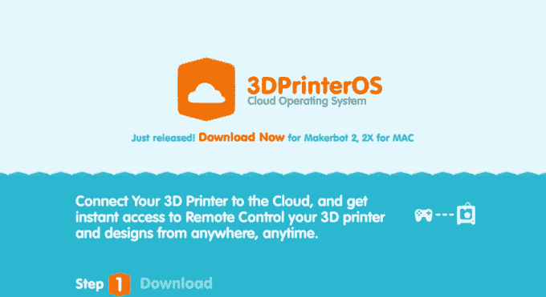
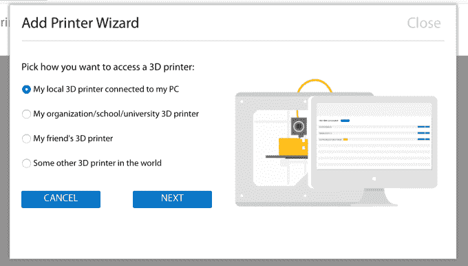
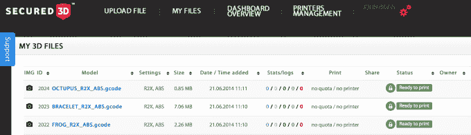

# 工程师为世界各地的所有打印机构建 3D 打印操作系统 

> 原文：<https://web.archive.org/web/https://techcrunch.com/2014/08/22/engineers-build-a-3d-printing-os-for-all-printers-everywhere/>

# 工程师为世界各地的所有打印机构建 3D 打印操作系统

如果你在过去一年左右使用过 3D 打印机，你会注意到一件事:碎片。少数人使用开源应用程序(这是糟糕的)，许多人使用自制的解决方案，范围从令人惊讶到“呸”现在，一组工程师希望为所有 3D 打印机创建一个标准化的可用操作系统，确保任何时候你点击一个按钮来打印 3D 模型，你都会看到完全相同的屏幕和功能。

这个名为 [3DPrinterOS](https://web.archive.org/web/20230217062701/http://www.3dprinteros.com/) 的解决方案是一个独立的软件系统，可以连接许多流行的打印机。它可以在 Mac 和 Windows 上运行，也可以在 Linux 和 Raspberry Pi 上运行。使用这个软件，你的打印机就变成了一个联网的“黑匣子”用户可以简单地发送文件并打印出来。该服务与 Makerbot、Ultimaker 和一些 RepRap 型号(实际上是一些最流行的打印机型号)兼容，还允许您通过互联网控制和提交打印作业。

首席执行官约翰·多格鲁表示:“3D 打印世界的发展速度令人难以置信，但如果没有一个能够跨打印机、软件和应用程序进行通信的平台，用户就无法真正享受和释放 3D 打印的全部潜力。”。“我们的目标是一个与大多数设计工具和 3D 打印机兼容的平台，这样梦想家、设计师和首次创造者就可以首次用一种通用语言进行协作、交流和创作。”

这个想法是让 3D 打印像 2D 打印一样简单。通过创建一个队列，一种在作业运行时观察作业的方式，并添加一些可靠的兼容性，您实际上可以将 3000 美元的 Makerbot 变成 150 美元的 HP，这是一件好事。

该项目由 Dogru 和 Anton Vedeshin 创建，植根于云计算和 IT 安全。他们认为，通过把繁重的工作交给服务器，你可以让 3D 打印变得更容易实现，更容易被所有人使用。

“除此之外，许多当前的操作系统需要复杂的 20 多次点击工作流程才能打印设计，”Dogru 说。“3D 打印的能力非常令人兴奋。当我们看到一台 3D 打印机从几分钟前还只是一个想法的东西中呼之欲出地创造出一个实物时，我们仍然会感到震惊。我们希望与全世界分享这种兴奋和惊奇的感觉。”

这些应用程序刚刚退出测试，现在可供所有人使用。或许，仅仅是或许，这将是最终给你身边的 3D 打印机带来错误信息“PC LOAD LETTER”的产品？

