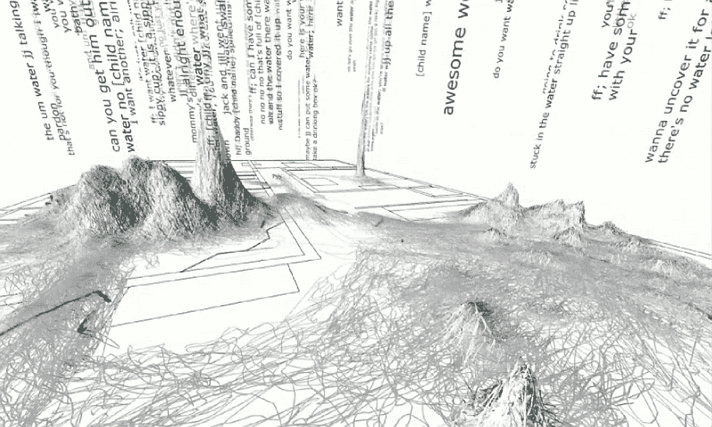

# 恩利克·费密和风险投资的未来 

> 原文：<https://web.archive.org/web/https://techcrunch.com/2017/05/16/enrico-fermi-and-the-future-of-venture-capital/>

马特·奥古兹是

[venture/science,](https://web.archive.org/web/20221002143721/http://ven.sc/)

一家总部位于旧金山的量化投资公司。

More posts by this contributor

恩利克·费密把一张大纸撕成小块，扔了出去。几秒钟后，碎片在半空中被吹了一小段距离，落在大约 8 英尺远的地方。

费米步测了这段距离，然后查阅了他早些时候准备好的图表。根据相应的数据，他告诉周围的人，撞击空气将文件炸飞的冲击波来自大约 1 万吨 TNT 爆炸的力量。

1945 年 7 月那个凉爽的早晨，费米和他的同事们试验了第一颗原子弹。爆炸强度后来被计算为 20 千吨。这为费米赢得了由该项目的资深物理学家发起的赌注。

费米用这样一个普通的测试来解决这样一个复杂的问题，他的猜测又一次是正确的。他的同事称他为物理教皇，因为他们说他像教皇一样不会犯错。

不管是什么问题，他不仅解决了，而且看起来毫不费力。但是费米没有超人的力量。他从很小的时候就开始学习物理和数学的基础，并掌握了它们。只有在那之后，他才能如此轻松地解决这些问题。

在接下来的几十年里，对复杂性的研究取得了进展，并扩展到许多问题领域和行业。诺贝尔奖被授予研究太空的前沿学术领袖，首先是希尔伯特·西蒙的开创性工作“[有限理性](https://web.archive.org/web/20221002143721/https://en.wikipedia.org/wiki/Bounded_rationality)”。

西蒙只是说，人类受到他们接收的有限信息或处理大量信息的有限能力的“束缚”，因此最终“[满足](https://web.archive.org/web/20221002143721/https://en.wikipedia.org/wiki/Satisficing)他们的决定，根据他们后来认定的“直觉”选择最佳替代方案

在风险投资的早期，当资本稀缺、交易量小、历史数据不存在时，直觉就是亚瑟·洛克(Arthur Rock)和汤姆·帕金斯(Tom Perkins)的全部。这种稀缺性导致了他们在 1960 年的细致努力，因为他们发现并资助了未来的领先公司。作为建立在这些传奇例子之上的风险企业，他们一直保持着启发式驱动策略。

在接下来的 50 年里，可供选择的交易数量呈指数增长，决策过程变得非常容易出现偏差。决策偏差最终削弱了洛克家和珀金斯家曾经带来的基金级高回报。

也许风险资本行业在几十年的老策略中变得过于自满，因为顶级公司不缺乏流入其连续基金的资本。尽管如此，试探法仍然是事实上的策略，主要是因为风险投资本质上是复杂的。

塞缪尔·阿布拉斯曼在他的《过度复杂的 T2》一书中彻底描述了复杂性。

他解释说，在一个复杂的系统中:

> *各部分本身需要连接起来，在纷乱的舞蹈中相互作用。当这种情况发生时，你会看到某些特征行为，一个复杂系统的标志:微小的变化通过这个网络级联，在复杂系统中发生反馈，甚至对这个系统的初始状态存在敏感的依赖。这些特性，以及其他一些特性，使系统从复杂到复杂。*

彼得·泰特洛克和丹·加德纳在他们著名的著作《预测的艺术和科学》中解释了解决这些复杂问题的方法。毫不奇怪，我们发现恩利克·费密是这本书的核心。

在描述一群普通人如何解决复杂的问题时，他们说，比如中国爆发另一场致命禽流感的风险，或者阿勒颇在 2013 年落入自由叙利亚军手中的可能性。

将一个问题费米化的方法是首先计算基本速率或者建立一个“外部视角”，这个术语是由另一位诺贝尔奖获得者丹尼尔·卡内曼创造的。然后，一个人转向建立一个“内部观点”,这是关于理解特定案例的所有细节。

然后，这两种观点通过各种决策模型组合起来，这些决策模型向上或向下调整最初的估计，并且通常带有[置信区间](https://web.archive.org/web/20221002143721/https://en.wikipedia.org/wiki/Confidence_interval)和[安全系数](https://web.archive.org/web/20221002143721/https://en.wikipedia.org/wiki/Factor_of_safety)。

如今，关于创业公司的数据比以往任何时候都多。我们认识到推动一家年轻公司成功或失败的关键因素。然而，系统化这个数据集并为风险投资行业建立一个模型工具箱仍然具有学术水平的挑战，因为在风险投资中，有许多相互作用的活动部分。一个专有研究小组发现，如果创始团队之前已经创立了一家公司并出售了它，他们失败的可能性会降低 14%。

如果他们已经创办了一家公司，但还没有退出，这个数字是 8%，但仍然比那些从未创办过公司的人要好。我们了解到，与单一创始人的公司相比，3 名创始人的团队失败的可能性要低 8%，而对于 4 名或更多联合创始人的团队，这一比例又会下降。从团队到产品，从市场到收入和利润，从产品到牵引力，每一个属性都有不同程度的重要性。将定性转换为定量是一项挑战，但并非不可能。

话虽如此，但必须澄清的是，决策模型并不创造一个“水晶球”或“魔法黑匣子”，交易从一端进来，优步从另一端出来。这是一个围绕如何选择有利机会和计算最佳支票金额的结构化计算流程，而不是追逐“热门交易”最后，这种策略并没有违背传统智慧，相反，它“揭示”了新的视角，增强了直觉。

VC 中的第二个问题是如何计算支票大小。这个问题的解决方案也定义了最优投资组合中的公司数量——这是一个经常争论的话题。传统企业在解决这个问题时采用了更多的启发式方法。最流行的观点也是“乐观偏见”的一个完美例子，并声称“一个本垒打将弥补所有的损失”。其他启发包括，投资大量种子期公司，并对那些没有失败的公司进行再投资。

在基金层面，在第一年投资一半的基金资本，在接下来的两年投资另一半是很常见的。开始“费米化”这个问题的正确地方，应该是首先建立“外部观点”，这意味着理解回报分布，然后通过研究影响公司成败的所有属性的复杂性来调整这个观点。

研究表明，对于早期阶段的公司，有 48%的完全失败风险，25%的部分失败风险，其余部分的回报有长尾效应。现实生活中没有完美的曲线，因此出现了最佳点，例如，3x 到 7x 区域出现的概率约为 5%。如果一个人设法让所有投资组合公司的回报都“落在”这个甜蜜点上，即使没有一只独角兽，他们也将击败 99%的风险投资公司。

实现这一点的方法是避免早期亏损，这与传统的风险投资策略是相反的，传统的风险投资策略是在早期进行更大胆的押注，在早期全垒打的微弱机会下，筹集下一笔资金。如果早期的赌注没有回报，而且他们经常没有回报，剩下的唯一选择就是摇摆不定。

在可预见的未来，量化策略会取代“直觉”成为风险行业的标准吗？此外，这是否有助于解决该行业的道德问题，例如投资者和创始人涉嫌欺诈，威胁到这个全球最热门资产类别的生存？一旦“直觉”被放在一边，焦点就会自动转移到数字和业绩上。数字当然不会说谎。你越仔细看数字，你看到的就越多。

泰特洛克对他的书总结如下:

> 这听起来像是侦探工作，因为这是——或者更准确地说，这是真正的调查员做的侦探工作，而不是电视节目中的侦探。它是有条不紊的，缓慢的，并且要求很高。但这比在信息森林中漫无目的地游荡要好得多。

今天，做出明智的、数据驱动的决策的重要性是无可辩驳的。既然整个科技行业都建立在数学和科学的基础上，为什么不把同样的东西应用到投资、治理和其他领域呢？

**奖励:**

考虑一个过于简单的场景，其中的结果要么是失败，要么是成功，结果如下。当公司失败时，这种情况发生的几率是 60%,你会损失所有的钱，但当它成功的几率是 40%,你会得到 10 倍的钱。你会投资吗？如果会，你会根据你的基金规模赌多少，以使基金的财富最大化？

这里需要注意的是，我们的目标是基金层面的财富最大化，而不是单个公司层面的。在这种情况下有一个主要的区别，因为虽然一个本垒打可以被美化，但由于赌注的大小，基金级别的影响可能是微不足道的，这是我们在传统风险投资中看到的另一种常见情况。

让我们转向[凯利](https://web.archive.org/web/20221002143721/https://en.wikipedia.org/wiki/Kelly_criterion)寻求答案。众所周知，凯利标准是一个数学公式，用于计算出下注的最佳金额，以使您的资金增长最大化。

**方钻杆锁紧公式如下:**

((赔率-1) *(估计百分比))–(估计百分比 1)**/**(赔率-1) **X 100**

所以在这里，((10-1)*(40%)–(1–40%)/(10-1)x 100 产生大约 34%。

首先，一些基础知识:

*   你的基金必须有循环条款，允许你在获得回报的同时继续投资。
*   这个赌注的结果被认为与你所下的任何其他赌注都没有关系。

凯利结果:

*   假设有一个 1000 美元的基金，根据凯利标准，最佳赌注大约是你资本的 34%，或 340.00 美元。
*   预计该基金每次押注的平均涨幅约为 34.33%。
*   如果您下注的不是$340.00，您应该下注少于$340.00 的。
*   凯利标准是*最激进的*——它寻求以尽可能高的速度增加资本。大多数投资者通常采取一种不那么激进的方式，通常不会在任何交易上押注超过一定比例的资金。尽管如此，这是一个试探性的措施。
*   一个常见的策略是下注凯利金额的一半，在这种情况下将是 **$170.00。**
*   如果你估计的 40%的概率太高，你就会赌得太多，久而久之就输了。确保您使用的是保守(低)的估计。