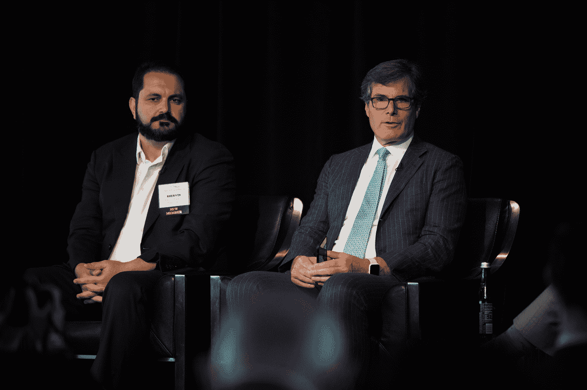

# 确保外国出生的创始人能够在美国发展他们的创业公司

> 原文：<https://web.archive.org/web/https://techcrunch.com/2017/06/19/ensuring-foreign-born-founders-can-grow-their-startups-in-the-u-s/>

鲍比·富兰克林撰稿人

More posts by this contributor

大多数风险投资家可以列举移民企业家的例子，他们建立了伟大的公司，为美国公众提供就业机会和优秀的产品和服务。

这些风投也可以列举移民企业家的例子，他们被我们陈旧的移民制度分散了注意力，感到沮丧，并承受着沉重的负担，这种制度阻止外国出生的企业家留在美国建立自己的公司。尽管有移民法，但移民企业家促进了我们的经济和文化*，而不是因为移民法*——如果我们要像川普总统希望的那样发展经济，这种情况必须改变。**

关于移民创业及其对我们经济的贡献的统计数据确实令人震惊。我们的研究发现，在 2006 年至 2012 年间上市的美国风险投资公司中，足足有三分之一至少有一位移民创始人。

最近的一项研究发现，移民创办了超过一半的美国“独角兽”公司，即价值超过 10 亿美元的私有公司。另一项调查发现，虽然移民占美国总劳动力的 15%，但他们占美国企业家的 25%，风投支持的初创公司的创始人中有 31%是移民。

在该贸易组织 5 月份的年会上，NVCA 成员参与政策讨论。

NVCA 知道外国出生的创始人对创业生态系统和更广泛的美国经济做出了重大贡献，长期以来一直支持为有才华的移民企业家创造创业签证，如果他们能够证明他们的企业是可行的，并有适当的资金支持，就可以留在美国。

这一想法获得了两党的支持，部分原因是移民企业家创立了易贝、英特尔和特斯拉等标志性的美国品牌。理所当然，政策制定者希望我们国家有更多这样的大片。在这种背景下，鉴于如此多移民的创业精神和我们对更大经济增长的需求，我们继续教育政策制定者创业签证的双赢性质。

不幸的是，创业签证的通过陷入了立法僵局，与全面移民改革的通过相关联——国会在这一领域的不作为是众所周知的。幸运的是，有一种方法可以在没有国会行动的情况下，通过移民企业家精神释放动态经济增长。我们只需要特朗普政府允许它生效。

在奥巴马政府期间，国土安全部最终确定了所谓的国际企业家规则。根据该规定，联邦政府将使用其酌情“假释”权，允许有才华的移民企业家在美国停留两年半，以建立和扩大他们的创业公司，并可能再延长两年半。

在 DC 华盛顿州举行的 2017 年 NVCA 年会上，夏尔巴资本的风险投资家舍文·皮舍瓦和 NEA 的斯科特·桑德尔讨论移民改革。

要符合条件，企业家必须在美国创办了一家初创公司，具有快速增长和创造就业的巨大潜力；企业家必须做好推进创业的准备，比如通过持有大量股权；初创企业必须从有成功记录的投资者那里获得大量资本投资。根据国际企业家规则，取得资格并不容易，但如果一位创始人做到了，那么我们的国家及其公民将受益于一些真正特殊的东西。

国际企业家规则将于 7 月 17 日生效。 [NVCA 与奥巴马政府合作](https://web.archive.org/web/20230326013419/http://nvca.org/pressreleases/nvca-applauds-international-entrepreneur-rule-recommends-key-improvements/)制定了最终规则，自特朗普总统 1 月上任以来，我们一直在积极[与他的政府](https://web.archive.org/web/20230326013419/http://thehill.com/policy/technology/337006-entrepreneurship-groups-urge-the-white-house-to-keep-international)接触，倡导该规则及其将给我们国家带来的好处。

在 25 个拥有新兴创业生态系统的州，投资者和初创企业创始人已经加入了我们的行列，他们最近[写信给特朗普总统](https://web.archive.org/web/20230326013419/http://nvca.org/?ddownload=21968)鼓励他保留这一规则。随着规则生效日期的临近，我们将继续这些对话，但鼓励创业生态系统中的其他声音加入合唱。

特朗普总统一再表示，在全国范围内普及经济繁荣是他的首要任务。要做到这一点，最好的办法莫过于开展更多的创业活动，而移民创业者在其中扮演着核心角色。

国际企业家规则将释放全国各地被压抑的创业活动，并为我们的社区带来高质量的就业机会。和我们一起鼓励特朗普总统允许它向前发展，以便全球各地的顶尖人才能够来到美国，发展明天充满活力的年轻公司。