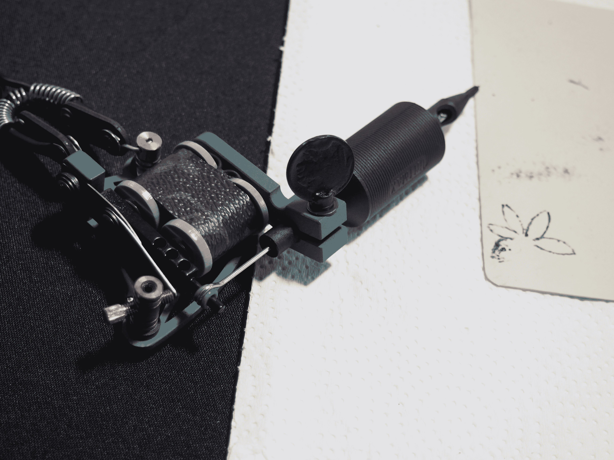

# 短命是开发纹身墨水，旨在一年后消失 

> 原文：<https://web.archive.org/web/https://techcrunch.com/2016/05/09/ephemeral-tattoos/>

# 短命公司正在开发一种一年后就会消失的纹身墨水

几乎每个考虑过纹身的人都知道父母的老话“你会永远拥有它。”这是一个相当明显的警告，带有一代人的遗憾，他们被迪斯科和流行文化的过去所掩盖。

一些临时解决方案确实存在，包括相对较新的两周纹身现象(以及一些其他高科技选项)。一家成立两年的 NYU 哈林区初创公司目前正在向市场推出为期一年的解决方案。

[短命](https://web.archive.org/web/20230203055226/http://www.ephemeraltattoos.com/)是一个由两部分组成的系统，包括一种设计用于一年后分解的墨水，以及一种单独的去除溶液。

“今天的纹身墨水是永久性的，因为染料分子太大，你身体的免疫系统无法清除，”联合创始人安东尼·拉姆解释说。“通过使用更小的分子，我们将它们封装在这个足够大的球形结构中，这样你的免疫系统就不会将其带走。但是当你把它拿掉的时候，它实际上吃掉了其中的一种成分，染料分子被冲走了。”

该产品仍在测试中，首先是在细胞上，现在是在猪上，因为我们和我们的猪表亲在基因上非常相似。短命首席执行官 Seung Shin 表示，公司希望在明年秋季左右推出一些产品。与此同时，该公司将于 6 月 1 日开启种子期。

“我们还没有真正确定价格，但我们正在考虑一个平均大小的纹身从 50 美元到 100 美元不等，”申说。“现在我们正在计划我们的(初始)融资，我们希望在未来 10 个月左右完成。”