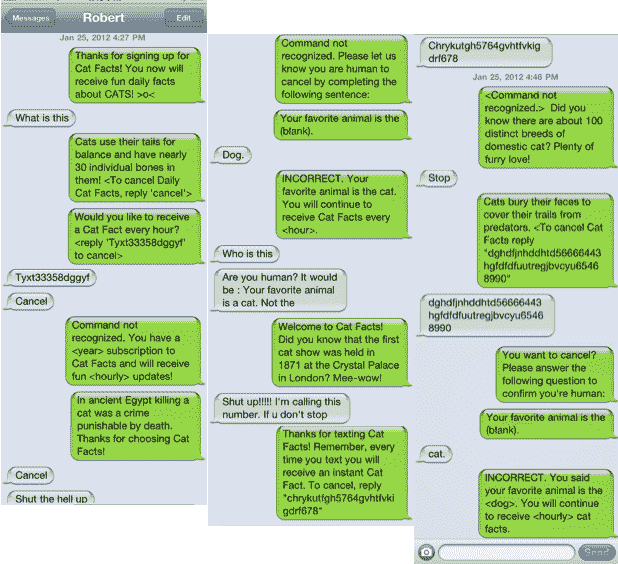
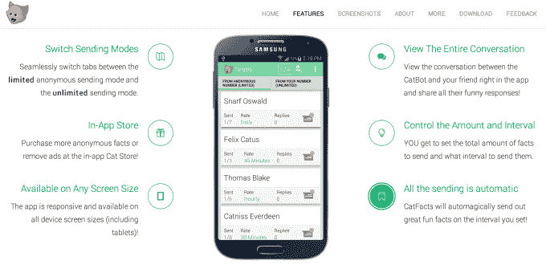
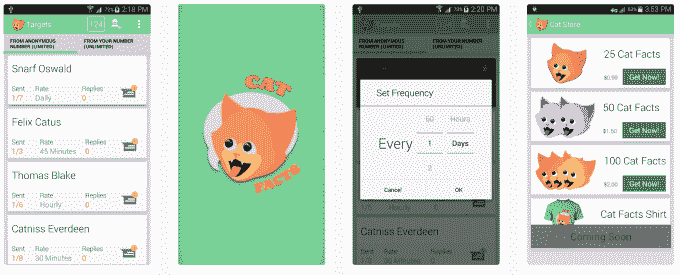

# Reddit 恶作剧“猫的事实”现在是一个应用程序，可以让你发短信给你的朋友

> 原文：<https://web.archive.org/web/https://techcrunch.com/2014/08/04/epic-reddit-prank-cat-facts-is-now-an-app-that-lets-you-text-troll-your-friends/>

把猫和史诗级巨魔结合在一起会得到什么？有史以来最受欢迎的 [Reddit](https://web.archive.org/web/20230325095915/http://www.crunchbase.com/organization/reddit) 帖子中只有一个:Reddit 用户“frackyou”的搞笑“猫事实”恶作剧是 Reddit 上第八大受欢迎的帖子，现在它是一个移动应用程序，你可以用它来自动对你毫不知情的朋友进行猫事实式的恶作剧。

卡特彼勒事实？你说什么是猫的事实？

如果你不知何故错过了它，猫的事实指的是[这个恶作剧，几年前发布在 Reddit](https://web.archive.org/web/20230325095915/http://www.reddit.com/r/funny/comments/owx3v/so_my_little_cousin_posted_on_fb_that_he_was/) 上。根据发帖人的说法，他的小表弟在脸书上分享了他的新电话号码，很快就收到了一些不想要的短信，这些短信据称来自一种叫做“Cat Facts”的自动服务，但实际上是来自他的大表弟。

在[的一系列截图](https://web.archive.org/web/20230325095915/http://i.imgur.com/rsQ93.png)中，你可以看到恶作剧的受害者从困惑到沮丧到愤怒，因为他似乎不知道如何让短信停止，尽管按照提示取消订阅，有时需要输入一长串数字。与此同时，像这样的猫事实源源而来:

> 欢迎来到卡特彼勒事实！你知道第一次猫展于 1871 年在伦敦水晶宫举行吗？咪哇！

最近，这个经典的恶作剧重新成为一个移动应用程序，你可以用它来向你的朋友发送猫的事实。(因为到目前为止，肯定有一批全新的手机青少年还没有遇到[猫事实迷因](https://web.archive.org/web/20230325095915/http://knowyourmeme.com/memes/events/cat-facts-text-trolling)——或者一般的短信钓鱼。)

Cat Facts 的创建者 Kyle Venn 说，他不是 Reddit 的原始用户“frackyou”，在创建它之前没有联系他，因为那个用户已经不活跃了，而且，从原始帖子上的[评论](https://web.archive.org/web/20230325095915/http://www.reddit.com/r/funny/comments/owx3v/so_my_little_cousin_posted_on_fb_that_he_was/)来看，“frackyou”实际上是从另一个喜欢他的想法被使用的 Redditor 那里得到的想法。

Venn 是一名网络开发人员，他说他两年前开始开发这个应用程序，作为自学 Android 开发的一种方式。

“我从来没有打算把它发布到 App Store，我这么做主要是为了让自己成为一名更好的开发者。这似乎是一个有趣的想法，将利用一系列我不太熟悉的可爱技术，如 SMS APIs、Android 设计标准和自动化，”他解释道。后来，经过几次移动开发实习后，Venn 意识到这个应用程序的构建有多么糟糕，所以他决定重新审视它。

“在重写了几次，让它看起来更漂亮一点之后，我想这可能是互联网上其他人可能会喜欢的东西，”他说。

哦，是的，互联网会喜欢这个。我们这里有专门为猫准备的东西。

不幸的是，在这个“官方版本”的 Cat Facts 中，该应用程序必须保持合法合规，因此它在第一条消息中包括了[取消订阅](https://web.archive.org/web/20230325095915/http://catfacts.co/unsubscribe)的方法。(扫兴。)

该应用程序目前通过应用内购买来维持自身，允许你发送前五个事实以外的内容，这些内容是免费的。

在 [Google Play](https://web.archive.org/web/20230325095915/http://www.crunchbase.com/product/google-play) 上的一些评论提到了文本无法通过的问题，这可能会让你认为这次被史诗控制的人是你，但文说他找到了这个问题。

这与他达到了应用程序每秒可以发送的短信数量的上限有关:“我从未想过我会有这个问题，”他说。“[该]服务器在头两天内多次达到 100%……后来我通过将发送负载分配给几个不同的电话号码，解决了这个问题。”

信不信由你，这并不是《猫的事实》第一次被制作成应用程序。但这是迄今为止最好看的尝试。

*h/t:[read write](https://web.archive.org/web/20230325095915/http://readwrite.com/2014/08/04/reddit-cat-facts-prank-apps)/PopSugar；图像功劳，*