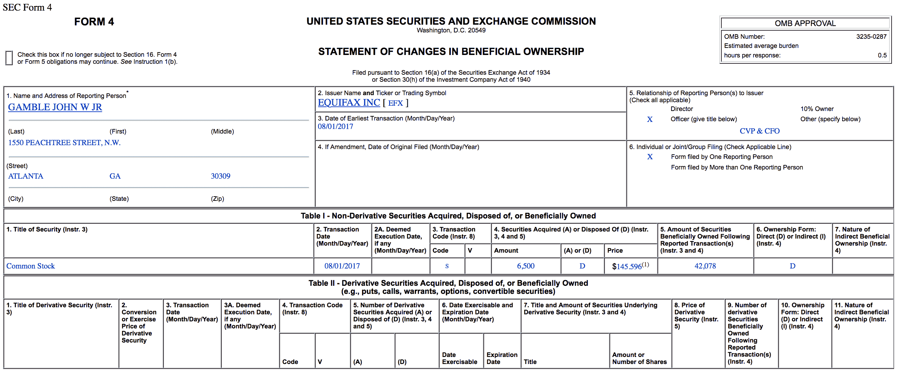
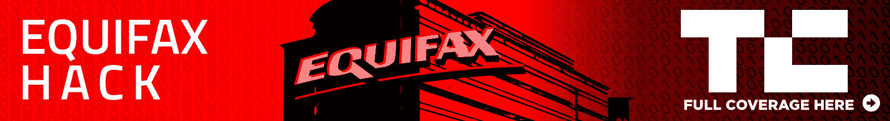

# 黑客新闻公开前 Equifax 高管抛售股票 

> 原文：<https://web.archive.org/web/https://techcrunch.com/2017/09/07/equifax-managers-dumped-stock/>

在今天的《无拘无束的企业贪婪》中，我们为您带来了 Equifax 的经理们，他们在公司意识到自己面临一个大问题后，显然卖出了近 180 万美元的股票。

正如[彭博报道](https://web.archive.org/web/20221209215819/https://www.bloomberg.com/news/articles/2017-09-07/three-equifax-executives-sold-stock-before-revealing-cyber-hack?utm_content=markets&utm_campaign=socialflow-organic&utm_source=twitter&utm_medium=social&cmpid%3D=socialflow-twitter-markets)的那样，在公司内部得知泄露了多达 1 . 43 亿美国人的私人数据，包括社会保险和驾照号码后，公司的三名高级管理人员出售了近 180 万美元的股票

有问题的交易是由首席财务官兼公司副总裁约翰·甘布尔发起的，他出售了[价值 946，374 美元的股票](https://web.archive.org/web/20221209215819/https://otp.tools.investis.com/clients/us/equifax/SEC/sec-show.aspx?Type=html&FilingId=12210406&CIK=0000033185&Index=10000)；美国信息解决方案公司总裁约瑟夫·拉夫兰(Joseph Loughran)，甩了 584099 美元；劳动力解决方案总裁鲁道夫·普洛德出售了 250，458 美元的股票。正如彭博指出的，这些交易不是预先安排的交易，它们发生在 8 月 2 日，即该公司得知黑客入侵的三天后。

虽然大规模隐私泄露的消息刚刚传开，但黑客攻击发生在 5 月中旬至 7 月。该公司在周四的一份声明中描述了这次黑客攻击:

> 被访问的信息主要包括姓名、社会安全号码、出生日期、地址，在某些情况下还包括驾照号码。此外，还访问了大约 209，000 名美国消费者的信用卡号，以及大约 182，000 名美国消费者的某些带有个人身份信息的争议文档。

Equifax 已经为任何可能受到黑客攻击影响的人建立了一个专用网站，但是除了要求新受害的客户给 Equifax 他们的社会安全号码之外，在撰写本文时，它[没有提供任何实际功能](https://web.archive.org/web/20221209215819/https://beta.techcrunch.com/2017/09/07/equifax-data-breach-help-site-leaves-consumers-with-more-questions-than-answers/)。

*更新:* Equifax 回应了 TechCrunch 关于交易时间的问题，特别是首席财务官 John Gamble 的问题，发表了以下声明，声称相关高管并不知道该公司在 7 月 29 日被告知的黑客攻击事件:

> “正如新闻稿中所宣布的，Equifax 在 7 月 29 日星期六发现了网络安全事件。该公司立即采取行动阻止入侵。
> 
> 8 月 1 日(星期二)和 8 月 2 日(星期三)出售一小部分 Equifax 股票的三名高管在出售股票时并不知道发生了入侵。"

乍一看，这些高管出售如此少量的股票似乎有些奇怪。但重要的是要记住，Equifax 已经有 100 多年的历史了。我们不是在和一个创始人拥有公司 20%以上股份的创业公司打交道。

例如，Gamble 只拥有 42，078 股 Equifax 股票。截至今天收盘，在盘后大幅下跌之前，这只股票的价值约为 600 万美元。因此，在这种情况下，虽然 946，374 美元对首席财务官来说似乎不是很多，但实际上超过了他持股的 15%。

当然，这些都不意味着什么。所有这些只是说交易是粗略的。但事实是，我们没有资格称之为证券违规。这一决定只能在实际调查后做出。

