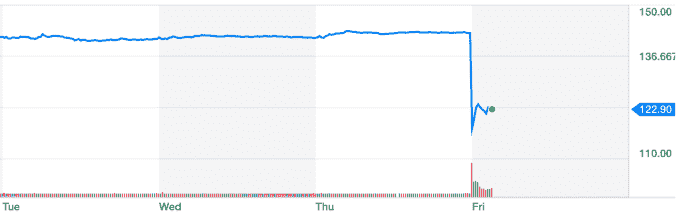
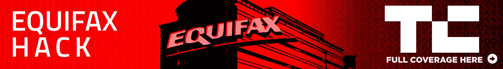

# Equifax 的股票在报道了大规模的安全漏洞后直线下跌 

> 原文：<https://web.archive.org/web/https://techcrunch.com/2017/09/08/equifaxs-stock-is-plummeting-after-it-reported-a-massive-security-breach/>

# Equifax 的股票在报道了一个大规模的安全漏洞后直线下跌

信用报告服务公司 Equifax 的股票在早盘交易时间暴跌，跌幅超过 13 %,该公司昨天报告了可能涉及 1 . 43 亿客户的安全漏洞。

那次泄露包括敏感数据，如社会安全号码、出生日期、地址和可能的驾照号码。总而言之，这是潜在欺诈或身份盗窃的信息金矿。Equifax 表示，它在今年 7 月 29 日发现了这一漏洞。总之，这将是一个昂贵的过程，可能包括许多远远超出最初的撞击坑和调查的事情，如提供信用监测服务。

这将对像 Equifax 这样的公司造成很多影响:削弱对团队、公司和管理层的信心；思考伴随这种大规模违规行为的所有潜在情景和风险；展望未来，顾客越来越少，或者需要付出更大的努力才能赢回顾客，等等。这意味着，传统上关注像 Equifax 这样的公司的华尔街将不得不重新评估它的前进方向。

可以肯定的是，这还不是过去几年里最大的黑客攻击之一。这项荣誉属于雅虎，去年 12 月[它披露发现了超过 10 亿个账户的漏洞](https://web.archive.org/web/20221208174158/https://beta.techcrunch.com/2016/12/14/yahoo-discloses-hack-of-1-billion-accounts/)。但是 Equifax 黑客包含大量个人信息，这些信息的威胁[已经导致俄勒冈州波特兰市对该公司提起集体诉讼](https://web.archive.org/web/20221208174158/https://beta.techcrunch.com/2017/09/08/here-comes-the-class-action-lawsuit-after-equifaxs-massive-hack/)。

总的来说，Equifax 并不是一家大公司，虽然像今天这样的下跌使市值减少了超过 10 亿美元，但它的价值仍然不到 150 亿美元。开盘后，Equifax 的交易价格甚至没有达到消息传出后的绝对低点。但所有这一切基本上都需要重新调整该公司相对于其未来健康状况的价值，这至少在短期内带来了一个大问号和一次大跳水。

