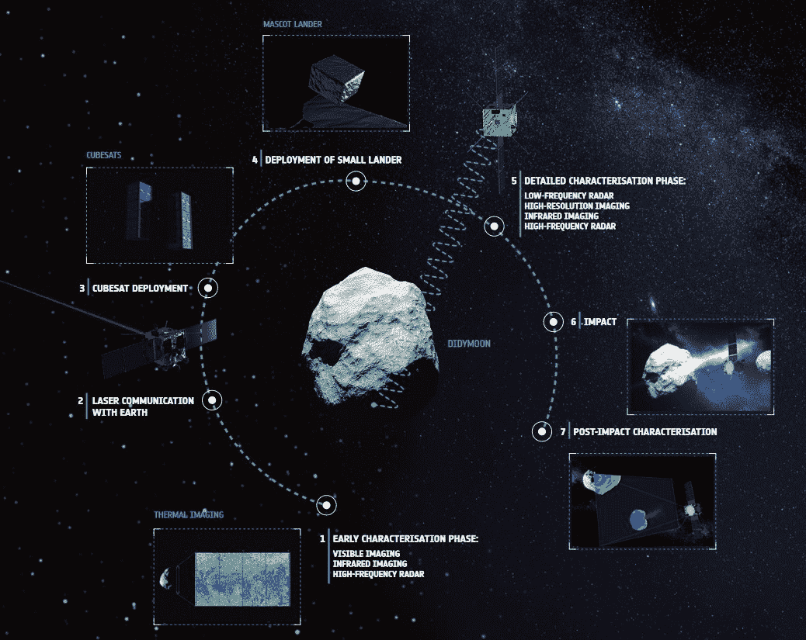

# ESA 承诺为其下一个火星着陆器投资 5 亿美元，尽管其前身已经坠毁 

> 原文：<https://web.archive.org/web/https://techcrunch.com/2016/12/02/esa-commits-half-a-billion-to-its-next-mars-lander-despite-predecessors-crash/>

欧洲航天局(European Space Agency)在火星上加倍努力，投入近 5 亿美元用于火星表面的后续任务——尽管第一次任务实际上充满了坑洞。但是为了找到资金，一项雄心勃勃的重新定位小行星卫星的联合计划被取消了。

10 月，欧洲航天局希望通过斯基帕雷利机器人着陆器加入美国宇航局在火星表面的探索。但是飞船未能正常下降，坠落到地面两英里多的地方，最后只剩下一个烧焦的痕迹。幸运的是，将斯基帕雷利送上火星的轨道飞行器[正在运行，表现令人钦佩](https://web.archive.org/web/20221202105746/http://www.esa.int/Our_Activities/Space_Science/ExoMars/First_views_of_Mars_show_potential_for_ESA_s_new_orbiter)。

[https://web.archive.org/web/20221202105746if_/https://www.youtube.com/embed/opqz5mM8JMA?feature=oembed](https://web.archive.org/web/20221202105746if_/https://www.youtube.com/embed/opqz5mM8JMA?feature=oembed)

视频

类似的命运在 2003 年降临在欧空局的另一个着陆器“小猎犬 2 号”身上。因此，如果他们决定至少暂时放弃一个在他们看来带有诅咒的企业，这是可以理解的。

但是在瑞士的一次重要会议上，欧洲航天局的成员国保持了强硬的态度，并承诺向€的 2020 年 ExoMars 项目提供 4 . 36 亿欧元(约 4 . 64 亿美元)的资助，这只是€协商的 100 多亿欧元中相对较小的一部分。

像第一个 ExoMars 一样，这一个是与俄罗斯 Roscosmos 的合作；€剩余费用的 3 . 39 亿英镑(已经进行了一段时间)将由集体提供，但€的 9700 万英镑必须来自该组织内部——这意味着其他项目将成为欧洲火星野心的牺牲品。

到处省吃俭用可能已经赚了几百万，但最终还是选择取消该机构的[小行星撞击任务](https://web.archive.org/web/20221202105746/http://www.esa.int/Our_Activities/Space_Engineering_Technology/Asteroid_Impact_Mission/Asteroid_Impact_Mission2)。这是一对探测器和一个着陆器，它们将被送往小行星 Didymos，在那里它们将密切观察第二次任务的结果，即双小行星重定向测试，正如你可能猜到的那样，这涉及到非常猛烈地撞击一块太空岩石，看看会发生什么。

AIM 任务摘要。

DART 实际上是美国宇航局的一项任务，将继续进行，但 AIM 将不再伴随它。这是一个重大损失，因为现在撞击必须从地面监测，只能得到 AIM 本应得到的数据的一小部分，而且精度也很低。

领导 AIM 项目的法国行星科学家 Patrick Michel[告诉自然](https://web.archive.org/web/20221202105746/http://www.nature.com/news/europe-s-first-mars-rover-gets-funding-despite-crash-of-test-craft-1.21091?WT.ec_id=NEWSDAILY-20161202):“一个很酷的项目因为缺乏远见，甚至是短期的，和勇气而被扼杀了，这真的很可悲。”