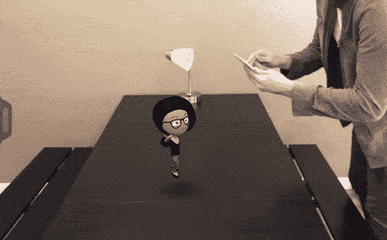

# Escher Reality 正在为跨平台移动 AR TechCrunch 构建后端

> 原文：<https://web.archive.org/web/https://techcrunch.com/2017/08/06/escher-reality-is-building-the-backend-for-cross-platform-mobile-ar/>

移动增强现实的潜力显而易见。去年夏天,《口袋妖怪 Go 》( Pokemon Go )( T1)展示了这种[热潮(T3)会有多大，成千上万兴奋的人们聚集在公园、公交车站和世界各地的其他地方，通过他们的智能手机追逐虚拟怪物。](https://web.archive.org/web/20221206185542/https://beta.techcrunch.com/2016/09/07/pokemon-go-the-hottest-game-on-the-planet-is-coming-to-the-apple-watch/)

苹果也在观望。今年夏天，该公司通过[发布 ARKit](https://web.archive.org/web/20221206185542/https://beta.techcrunch.com/2017/06/05/apple-enters-the-augmented-reality-fray-with-arkit-for-ios/) 表明了自己对该技术的信念:这是一个支持 iOS 开发者构建增强现实应用的开发者工具包。首席执行官蒂姆·库克表示，一旦 iOS 11 在秋季登陆消费者的设备，iOS 将成为世界上最大的增强现实平台——强调了库比蒂诺对移动增强现实管道的期待。

Y Combinator 支持的麻省理工学院(MIT)分拆公司 [Escher Reality](https://web.archive.org/web/20221206185542/http://www.escherreality.com/) 在这两个触发点之前就相信移动增强现实的社会力量。正如联合创始人所说，它正在为移动 AR 开发者建立一个跨平台的工具包和定制后端，旨在降低建立“引人注目的体验”的门槛。

“请记住，这是在 Pokemon Go 之前，”首席执行官罗斯·芬曼(Ross Finman)说，他谈到了他和首席技术官戴安娜·胡(Diana Hu)如何在大约一年半前创立了这家公司，最初只是一个兼职项目，去年 11 月成为全职。“当时每个人都认为我们疯了，现在这个夏天是移动增强现实的夏天……ARKit 一直是我们有史以来最好的事情。”

但是，如果苹果有 ARKit，你可以打赌谷歌将在不太遥远的将来推出一个等同于 Android 的产品，那么埃舍尔现实到底在哪里呢？

“把我们更多地看作是增强现实的后端，”芬曼说。“我们提供的是跨平台、多用户和持久的体验——所以这是苹果和 ARKit 没有做到的三件事。所以，如果你想做任何类型的共享 AR 体验，你需要将两种不同的设备连接在一起——所以这就是我们提供的……有很多与此相关的计算机视觉问题。”

“想想 ARKit 不能给你提供什么的问题，”胡补充道。“如果你已经在外面看过很多当前的演示，它们还不错，你可以在那里看到 3D 模型，但当你开始考虑更长远的问题时，如何才能创造出令人信服的 AR 体验？部分原因是许多工具和许多 SDK 没有提供该功能。因为作为游戏开发人员或应用程序开发人员，他们不想考虑所有那些低级的东西，而且我们已经开发了许多非常复杂的技术。

“如果你考虑一下未来，随着 AR 成为一个更大的运动，作为下一个计算平台，它将需要一个后端来支持许多网络，它将需要我们正在开发的许多工具，以便构建引人注目的 AR 体验。”

“我们现在将提供 Android 支持，但我们预计谷歌将来可能会推出类似的东西，”芬曼补充道，并将这部分业务称为免费增值服务中的免费部分——因此，当时机成熟时，他们更乐意将这部分业务交给谷歌。

该团队制作了一个演示来说明他们旨在支持的各种移动 AR 游戏体验，其中两个人玩同一个移动 AR 游戏，每个人都使用自己的设备作为桨…

https://www.youtube.com/watch?v=fpzalnuXhbw&feature=youtu.be

你在这里看到的是“非常低的延迟，定制的计算机视觉网络协议”，使两个玩家能够同时共享增强现实，正如胡解释的那样。

芬曼描绘了这项技术可能实现的另一个场景，他说它可以支持 Pokemon Go 的一个版本，在这个版本中，朋友们可以同时互相战斗，“实时观看他们的 Pokemon 战斗”。或者允许玩家在一个“非常具体的地点——在现实世界中有意义的地点”建立一个健身房。

本质上，该团队的赌注是移动 AR——尤其是移动 AR 游戏——在支持跨平台和跨设备的丰富互动和多人游戏应用程序的支持下，变得更加有趣。因此，他们正在开发工具和后端，以支持希望开发能够在同一个增强的游戏空间中连接 Android 用户和 iPhone 用户的应用程序的开发者。

毕竟，苹果尤其没有动力帮助支持 Android 上的 AR 协作。这为中立的第三方留下了空间，以帮助弥合平台和硬件差距，并为每个移动游戏玩家提供流畅的 AR 游戏。

Finman 说，核心技术本质上是以一种有效的方式将不同的 SLAM 地图和网络连接编织在一起，即没有会使游戏无法播放的延迟，以便“它实时运行，并且是一致的体验”。因此，为移动处理器调整一切。

“我们不仅深入网络层，甚至深入汇编层，这样我们就可以非常高效地运行一些执行指令，并在手机的 GPU 上进行一些图像处理，”Hu 说。“所以从高层次上来说，这是一个 SLAM 系统，但确切的方法和我们如何设计它对于高效的移动设备来说是新颖的。”

“把 ARKit 当作第一步，我们是第二步和第三步，”Finman 补充道。“你可以做多用户体验，但也可以做持久体验——一旦你关闭应用程序，一旦你再次启动它，你留下的所有对象都将在同一位置。”

> 把 ARKit 当作第一步，我们是第二步和第三步。

“人们可以同时在 AR 体验中合作，”胡补充道。“这是我们真正能提供的一个主要东西，而谷歌或苹果不会提供。”

硬件方面，他们的系统支持过去三年的高端智能手机。虽然，展望未来，他们说他们没有理由不扩展以支持其他类型的硬件——如耳机——如果它们也开始获得牵引力的话。

“在移动领域，现在有 10 亿台设备可以运行增强现实，”芬曼指出。“苹果有一部分市场，安卓有更大一部分。短期内，这将是开发者采用最多的地方。”

埃舍尔现实公司成立于大约一年半前，从麻省理工学院分离出来，最初在芬曼的宿舍里启动——最初是作为一个兼职项目，后来在 11 月份成为全职项目。两位联合创始人可以追溯到大约十年前，他们是朋友，并表示他们经常讨论创业想法，并对增强现实感兴趣。

芬曼将他们最终共同创立的企业描述为“我们两个背景的完美融合”。“对我来说，我正在麻省理工学院攻读 3D 感知博士学位——这是同一类型的技术，”他告诉 TechCrunch。

“我在业界管理过许多计算机视觉和数据科学方面的不同团队，”胡补充道。“因此，在将研究成果投入生产和构建低延迟的大规模数据系统方面，我们有着丰富的经验。”

他们现在有五个人全职工作，两个人兼职。在这一点上，SDK 是由有限数量的开发人员使用，新注册的等待名单。他们的目标是在秋季向所有来者开放。

“我们首先瞄准游戏工作室，”芬曼说。“这项技术可以用于许多不同的行业，但我们首先关注游戏，因为它们通常处于新技术和应用的前沿，然后是一大群真正聪明的开发人员，他们正在追逐有趣的新项目。”

“增强现实被认为如此重要的原因之一是，现实世界中的共享体验真的开辟了大量新的功能、交互和体验，将改善增强现实的当前想法。但实际上，它为许多不同的可能性打开了大门，”他补充道。

在讨论团队看到的移动 AR 管道中的一些“引人注目的体验”时，他指出了他认为该技术特别支持的三个领域——即:教学、可视化和娱乐。

“当你不得不看着一张纸，想象现实世界中有什么——建造任何东西，获得方向，进行远程职业，这些都需要共享的增强现实体验，”他建议道。

虽然，从近期来看，消费娱乐(尤其是游戏)是该团队的第一选择。

“在消费端的娱乐领域，你会看到短片——所以不仅仅是 Snapchat，它是一种实时特效，你可以拍摄并设置自己的电影场景，”他建议道。

当然，在 AR 中设计游戏也给开发者带来了新的概念和设计挑战，这反过来又带来了额外的开发挑战——该工具包旨在帮助应对这些挑战。

“如果你考虑增强现实，有两种新的机制可以使用；一是手机的位置现在很重要，”芬曼指出。“第二件事是……现实世界变得满足。所以和地图数据一样，现实世界，都可以融入到游戏中。这是两个以前在任何其他介质中都不存在的机制。

“从开发人员的角度来看，增强现实的一个额外限制是因为它依赖于真实世界，很难调试……所以我们开发了一些工具，以便您可以回放日志。这样你就可以浏览真实世界中的视频，并在模拟环境中与之互动。”

在讨论他们看到的早期开发者的一些想法和“巧妙的机制”时，他认为颜色是一个有趣的领域。“把真实世界想成内容真的很吸引人，”他说。“将颜色视为一种资源。这样你就可以从现实世界中挖掘颜色。所以，如果你想要更多的黄金，就贴更多的便利贴。”

Escher Reality 的 SDK 的商业模式是基于使用量的，这意味着他们将根据应用程序的成功程度向开发者收取费用。它还作为一个 Unity 插件提供，因此目标开发人员可以很容易地集成到当前的开发环境中。

“这与 Unity 的模式非常相似，Unity 鼓励一个非常健康的独立开发者生态系统，在你真正开始赚钱之前，他们不会收取任何费用，”胡说。“因此，开发者可以开始工作，在开发期间，他们不会被收取任何费用，即使当他们推出它时，如果他们没有那么多用户，他们也不会被收费，只有当他们开始赚钱时，我们也开始赚钱——所以从这个意义上说，很多激励措施都很好。”

这家初创公司将于 2017 年夏季从 YC 大学毕业，现在正朝着演示日前进，他们将寻求筹集资金，以便扩大带宽，支持更多的开发者。芬曼说，一旦他们获得了额外的外部投资，他们的计划是“与尽可能多的游戏工作室签约并合作”，以及“埋头”开发产品。

“AR 领域目前正在爆炸式增长，因此我们需要确保我们能够足够快地跟上它，”他补充道。