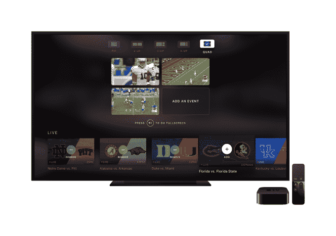

# ESPN 的苹果电视应用程序现在可以让你同时观看四场比赛

> 原文：<https://web.archive.org/web/https://techcrunch.com/2017/08/16/espns-apple-tv-app-now-lets-you-watch-four-games-at-once/>

# ESPN 的苹果电视应用程序现在可以让你同时观看四场比赛

ESPN 今天推出了苹果电视应用的新版本，引入了同时观看四个同步直播流的功能，可以同时显示在屏幕上。该功能利用了 Apple TV 的多播支持——其他一些应用程序已经引入了这一功能，包括最近的 [ABC News](https://web.archive.org/web/20221207075157/https://beta.techcrunch.com/2017/03/16/abc-news-app-adds-support-for-multi-stream-viewing-on-apple-tv/) 。去年，B At 的 MLB[也推出了分屏观看模式；而 T4 的福克斯体育和法国的 Canal 也提供类似的服务。](https://web.archive.org/web/20221207075157/http://appleinsider.com/articles/16/03/09/mlbcom-updates-at-bat-with-tvos-features-promised-at-4th-gen-apple-tv-debut-)

多流是直播体育的理想选择。他们让观众可以同时观看几场比赛，而不必来回切换。这是电视机最初试图通过画中画观看模式解决的问题，但 Apple TV 应用程序提供了一个更现代的解决方案。

ESPN 应用程序本身提供了各种不同的配置来查看多个流。您可以在网格模式中查看所有四个方块，其中每个方块的大小相同。或者你可以点击让一个窗口全屏显示，而其他窗口则显示在一边。还有 2 合 1 模式、3 合 1 模式和画中画模式。

添加您想要跟踪的流后，您可以更改周围的布局，在音频流之间翻转，并使用手势在全屏和多播模式之间来回移动。

至于内容，ESPN 的应用程序可以让你从 ESPN 网络上的 30 多个直播活动中进行选择，以及它的纯数字流，你可以点击它来添加到你的网格中。

不过，使用这款新应用有一个值得注意的注意事项——你必须订阅付费电视才能使用。ESPN 苹果电视应用程序要求用户通过付费电视提供商的认证——这意味着这不是一个适合插队者的解决方案。然而，这在未来可能会改变，因为迪士尼旗下的 ESPN 已经宣布 T2 计划明年引入自己的体育流媒体服务。

[gallery ids="1527551，1527553，1527554，1527555，1527550，1527547，1527556"]