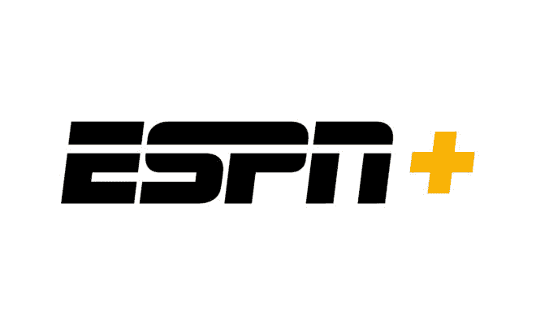

# ESPN 流媒体服务 ESPN+将于 4 月 12 日发布 

> 原文：<https://web.archive.org/web/https://techcrunch.com/2018/04/02/espns-streaming-service-espn-to-launch-april-12/>

ESPN 的新流媒体服务 ESPN+已经预计在今年春天推出。现在我们有了发布日期:2018 年 4 月 12 日。该服务每月收费 4.99 美元，提供直播体育、原创内容和点播节目的流媒体服务，由重新设计的个性化 ESPN 应用程序和 ESPN.com 提供

2017 年 8 月，迪士尼第一[宣布了其新流媒体业务的计划](https://web.archive.org/web/20221206083319/https://www.thewaltdisneycompany.com/walt-disney-company-acquire-majority-ownership-bamtech/)，包括收购流媒体技术公司 BAMTech 的多数股权，以及其两项新的流媒体服务:ESPN+和 2019 年底到来的迪士尼品牌服务。

自那以后的几个月里，有关 ESPN 服务的细节一直在稳步流出。

例如，去年 11 月，迪士尼首席执行官鲍勃·伊格尔[在 ESPN 令人失望的季度新闻中，简要概述了公司为 ESPN+准备的内容。他当时表示，除了 ESPN+订阅提供的额外直播内容外，ESPN+还将能够在经过认证的基础上播放 ESPN 频道。](https://web.archive.org/web/20221206083319/https://techcrunch.com/2017/11/09/espns-new-streaming-service-will-launch-in-the-spring-and-be-called-espn-plus/)

今年 2 月，[该公司进一步证实](https://web.archive.org/web/20221206083319/https://techcrunch.com/2018/02/07/espns-streaming-service-will-cost-4-99-and-launch-this-spring/)访问 ESPN 的 8 个电视频道，如 ESPN 和 ESPN2，仍然需要付费电视订阅。更新后的 ESPN 应用程序将通过一个特殊的直播部分(“电视无处不在”视频)，以及其他专用于比分和新闻、ESPN 音频和 ESPN+的部分，提供这些频道的访问。当时还宣布了 4.99 美元的订阅价格。

今天，ESPN 还详细介绍了 ESPN+将包含的更多细节。

该阵容将提供数以千计的现场体育赛事，例如:

*   超过 180 场 MLB 比赛:这相当于整个常规赛每天一场比赛。每个 MLB 队都将被包括在内。
*   **超过 180 场 NHL 比赛** : ESPN+的订户将在整个常规赛期间每天观看一场 HNL 比赛，与 NHL 的时间表保持一致。
*   **全年拳击赛** : ESPN+将全年播出拳击比赛，包括独家比赛，如 4 月 21 日在英国利物浦举行的阿米尔·可汗对菲尔·洛·格列柯的比赛；此外，从 ESPN 赛事的*顶级赛事到 ESPN 和 PPV 赛事的所有*顶级赛事的全年赛下比赛。来自顶级*和 *ESPN 大战*档案的传奇格斗图书馆也将开放。***
**   **超过 250 场 MLS 比赛**:独家访问整个 MLS 场外赛程，超过 250 场。它也将是芝加哥消防队的独家本地市场主场，芝加哥订户可以观看 27 场比赛。*   **数以千计的大学生运动会和赛事**:棒球、垒球、曲棍球、网球、田径场&足球、男女足球、排球、曲棍球、摔跤、游泳、跳水、体操和冰球都将季节性开放。会议包括美国东部，亚松森，大南方，大西部，地平线，常春藤联盟，MAAC，MAC，MEAC，密苏里谷，NEC，南方会议，南国，峰会联盟，太阳带，WAC 等。*   **PGA 巡回赛现场高尔夫:**超过 100 天的 31 场 PGA 巡回赛赛事报道，包括球员锦标赛、联邦快递杯季后赛、& T 拜伦·尼尔森、AT & T 圆石滩职业高尔夫球赛、旅行者锦标赛、Arnold Palmer 邀请赛等等。*   网球大满贯:数百场温布尔登网球公开赛、美国网球公开赛和澳大利亚网球公开赛的单打和双打比赛*   **橄榄球&板球:**来自 SANZAAR 的数百场比赛(包括超级橄榄球赛、橄榄球锦标赛、狮子系列赛、Mitre10 杯、Currie 杯、Bledisloe 杯和其他国际比赛)、汇丰世界七人制橄榄球系列赛，以及新的美国职业橄榄球联盟(Major League Rugby)的首个赛季的 18 场常规赛。新西兰板球和爱尔兰板球也提供跨测试、ODI 和 T20 格式的比赛。*

 *订户也可以购买 MLB。通过 ESPN 应用程序每月 24.99 美元的电视市场外套餐，以及 NHL。该公司表示，电视市场外的包装。

ESPN 今天也第一次展示了 ESPN+的标志。黑黄相间的标志仍然使用和 ESPN 标志一样的字体，但是在文字的右边增加了一个加号。

ESPN+的到来正值迪士尼有线电视网络的收入不断下降，特别是 ESPN 的广告收入下降。在 2018 财年 Q1，ESPN 报告[广告收入下降](https://web.archive.org/web/20221206083319/http://variety.com/2018/biz/news/disney-fiscal-first-quarter-earnings-1202689418/)11%。该公司需要订阅 ESPN+来帮助阻止这些损失。

“ESPN+的推出标志着我们媒体业务创新的一个令人兴奋的新时代的开始——一个以与消费者日益直接和个人化的关系为特征的时代，”华特·迪士尼公司 Direct-to-Consumer and International 董事长凯文·梅尔(Kevin Mayer)在一份关于这项新服务的声明中说。

梅耶尔最近刚刚接任这一职位，直接向伊格尔汇报，这是上个月迪士尼业务大规模重组的一部分，目的是更加关注流媒体业务。

“这款新产品反映了我们直接面向消费者的战略，专注于将我们钟爱的品牌与我们专有的行业领先技术相结合，为用户提供无与伦比的世界级内容，”他说。*