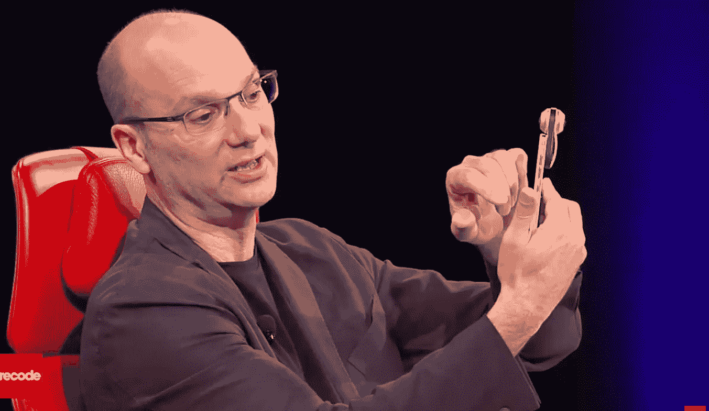

# Essential 正试图为智能家居打造 Android 

> 原文：<https://web.archive.org/web/https://techcrunch.com/2017/05/31/essential-is-trying-to-build-android-for-the-smart-home/>

安迪·鲁宾昨晚出现在代码会议上，这有助于回答一些关于他的新公司 Essential 的挥之不去的问题。但谈话主要围绕着这家初创公司即将推出的手机——鲁宾有意模糊地离开了围绕该公司对智能手机中心 Home 的看法的对话。

但这位首席执行官确实借此机会强调了该项目的一些更广泛的雄心。 [Home](https://web.archive.org/web/20221007161629/https://beta.techcrunch.com/2017/05/30/will-essential-home-be-more-than-another-dumb-smart-home-hub/) 据鲁宾估计，不仅仅是亚马逊 Echo 的另一个竞争对手。这是一个雄心勃勃的尝试，为所有争夺市场份额的不同智能助手创建一个统一的中心。一个智能中心来管理他们。

该剧的核心是 Ambient，这是一个开源操作系统，旨在适应 Alexa 和谷歌助手等第三方产品。Android 的回声很难被忽略。

[https://web.archive.org/web/20221007161629if_/https://www.youtube.com/embed/HCjjnVNXDLI?feature=oembed](https://web.archive.org/web/20221007161629if_/https://www.youtube.com/embed/HCjjnVNXDLI?feature=oembed)

视频

很明显，该公司特意为其第二款硬件产品构建了一个新的操作系统，尽管它选择在手机上坚持使用普通的安卓系统。构建一个新的操作系统对一家初创公司来说是一个雄心勃勃的项目——即使是像鲁宾在台上透露的那样，投资“数亿”。

该公司坚持使用 Android 手机的原因很简单:鲁宾已经开发了他想要的手机操作系统。但是，即使谷歌在家庭自动化领域做出了努力，智能家居领域仍然没有安卓的同类产品。

“我们非常相信，从来没有顶级工艺能够释放 Android 操作系统的全部潜力，”总裁兼首席运营官·尼依格罗酒店·德·马西在活动结束后接受采访时告诉 TechCrunch。“我们相信，我们处于释放能量的最佳位置。在家庭中，没有专注于互操作性的水平的开源生态系统。我们也认为我们在这方面有很多经验。”

该公司开源策略的一部分是拥抱任何允许它的解决方案。正如沃尔特·莫斯伯格在谈话中巧妙地指出的，有些人比其他人更有可能加入。举例来说，亚马逊[一直在抓住每一个机会推出 Alexa。苹果一直是，嗯，苹果。而谷歌介于两者之间。](https://web.archive.org/web/20221007161629/https://beta.techcrunch.com/2017/05/06/amazon-echo-world-domination/)

虽然该公司似乎对智能家居派对有点晚，但 Essential 认为，这个领域与 Android 首次进入该领域时智能手机所处的位置相似。正如德·马西所说，“第一局”。

Essential 的宏伟计划是建立一个系统，让所有不同的程序都能很好地运行。正如鲁宾在台上所说，“消费者不希望家里只有三星的东西。他们想要多元化。”换句话说，在平板电脑/智能手机方面运作良好的生态系统方法，在你开始考虑电器等产品时，并没有真正发挥作用，尽管[三星无疑希望它会](https://web.archive.org/web/20221007161629/https://beta.techcrunch.com/2017/04/18/bixby-debut-samsung/)。

因此，Essential 并不认为 Ambient 是 Echo 等公司的直接竞争对手。“我不认为这是一个面对面的问题，”德马西说。“这是一个做好事情的例子，对我们来说，这就是编排家庭体验和自动化。我们希望在一个数字点解决方案中有效地连接所有的围墙花园体验，而不是制造更多的碎片。”

光是想到在一台设备上运行多个助手和 Essential 自己的产品就让我头疼。虽然该公司表示将与其他公司合作愉快，但我怀疑其游戏计划的一部分是让 Alexa 等公司在后台工作，填补他们自己的助手所欠缺的空白。

这是一种中立的方法，是 Android 开发的基础。当然，如果一切按计划进行，第三方系统将开始直接将环境集成到他们的设备中，而不是必须处理几个不同的系统。这对 Essential 来说是一个双赢的局面，也是一个有助于操作系统推广的策略。

就目前而言，该公司除了几个渲染之外，并没有向公众展示太多，但 de Masi 告诉我，它正在建立一个系统，旨在不仅仅是其他公司输出的结缔组织。它的大部分研发工作都在开发一个智能助理平台，该平台可以为那些尚未购买 Alexa 或 Siri 的人独立工作。

“它是独立的，”他说。“这是最好的部分。它既独立又可互操作。在我看来，对此很难不感到高兴。这是一款集两种优势于一身的设备。”