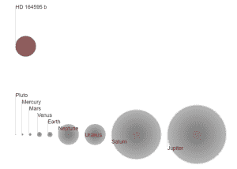

# 是你吗？天文学家在 95 光年外探测到有趣的信号

> 原文：<https://web.archive.org/web/https://techcrunch.com/2016/08/29/et-is-that-you-astronomers-detect-intriguing-signal-95-light-years-away/>

我们在宇宙中是孤独的吗？

一个国际天文学家小组已经[探测到了](https://web.archive.org/web/20230129090258/http://www.centauri-dreams.org/?p=36248)一个有趣的无线电信号尖峰，一个可能来自 95 光年外的恒星系统的外星信号尖峰。

在宇宙这个被称为 SETI 的领域中寻找外星智能的科学家们发现，强大的信号非常独特，足以保证对信号来源的永久监控。

到目前为止，还没有公布多少细节，但是更多关于这个发现的信息将在 9 月最后一周在墨西哥瓜达拉哈拉举行的[国际宇航大会](https://web.archive.org/web/20230129090258/https://www.iac2016.org/) (IAC)上公布。

当然，无线电尖峰很可能完全是由其他东西产生的，比如地球上的无线电干扰，甚至是观测设备中的技术故障。

为了排除其他可能性，将需要使用世界各地的各种射电望远镜进行后续观测。然而，来自其他组织的这些后续观察尚未成为可能，因为那些检测到信号的人出于未知原因在该发现上坐了一年多。

该信号于 2015 年 5 月 15 日被俄罗斯科学院特殊天体物理观测站的天文学家探测到。通常情况下，科学家会公布这样的发现，这样其他天文学家就可以将自己的望远镜指向这个来源，并在某种程度上“检查他们的工作”。

由俄罗斯科学院提供的用于探测信号/图像的 RATAN-600 射电望远镜

为了在宇宙的其他地方寻找智能生命，SETI 的天文学家监听无线电信号。据信，如果外星人试图接触，很可能是通过强大的无线电波，以光速穿越宇宙。如果我们想向遥远的文明传递信息，这就是我们会做的，所以，现在，我们假设聪明的外星人也会这么做。

但是电磁波，像无线电波一样，也是在宇宙中自然存在的，这使得 SETI 天文学家的工作更具挑战性。正因为如此，来自世界各地的 SETI 天文学家，使用不同的射电望远镜，共同排除信号来源的所有其他非 ET 可能性，这一点很重要。

SETI 研究所的高级天文学家 Seth Shostak 告诉 [GeekWire](https://web.archive.org/web/20230129090258/http://www.geekwire.com/2016/signal-seti-interest-hd164595/?utm_content=buffer02df6&utm_medium=social&utm_source=twitter.com&utm_campaign=buffer) ，“这是一个有点令人费解的故事，因为俄罗斯人在一年左右前就发现了这个信号，但只是没有让其他人知道。这不是一个好政策，因为你真正想要的是在另一个望远镜上确认，但是…这是真的吗？信号可能是真的，但我怀疑不是 ET。像这样的宽带信号还有其他可能性，它们是由自然来源(甚至是地面干扰)引起的。”

但我们现在知道的是。信号来自位于武仙座的恒星 HD 164595 的方向。HD 164595 很有趣，因为它被认为是一颗类似太阳的恒星。它有 63 亿岁(我们的太阳有 45 亿岁)，质量是我们太阳的 0.99 倍。

更重要的是，一颗围绕 HD 164595 运行的系外行星已经被确认。这颗行星被称为 HD 164595 b，被认为是一颗温暖的海王星型气体巨星。然而，HD 164595 b 不符合典型的“潜在宜居行星”要求:它不是一颗岩石行星，并且[不在其恒星的宜居带](https://web.archive.org/web/20230129090258/http://www.openexoplanetcatalogue.com/planet/HD%20164595%20b/)内。

HD 164595 b 与太阳系其他行星体相比的大小/图片由[开放系外行星目录](https://web.archive.org/web/20230129090258/http://www.openexoplanetcatalogue.com/planet/HD%20164595%20b/)提供

话说回来，大自然一直被证明比人类有更好的想象力，这种类型的星球上的生命不能完全排除。还有一种可能性是，其他更像地球的系外行星正在 HD 164595 周围运行，只是还没有被发现。

目前，在其他 SETI 天文学家进行后续观测之前，我们必须保持兴奋。幸运的是，有像尤里·米尔纳的 1 亿美元的项目来资助这样的努力。

如果俄罗斯科学院的数据得到证实，这可能是下一个[“WOW 信号”](https://web.archive.org/web/20230129090258/http://www.universetoday.com/122409/what-was-the-wow-signal/)——1977 年在人马座方向探测到的一个类似的有趣的无线电尖峰，因为识别它的天文学家在数据旁边写了“WOW”而得名。

在 WOW 信号的情况下，智能源的可能性从未被排除，但从那以后再也没有检测到其他有趣的无线电信号。

那么，ET 有没有试图联系我们？我们只能等到几周后的 IAC 会议，届时负责的天文学家会发布更多关于他们发现的信息。