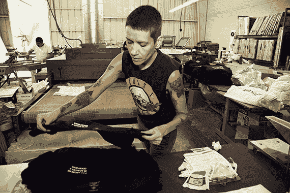

# Etsy 向制造业开放 

> 原文：<https://web.archive.org/web/https://techcrunch.com/2015/09/14/etsy-opens-to-manufacturing/>

在线市场 Etsy 今天宣布，它将推出一项名为 [Etsy Manufacturing](https://web.archive.org/web/20221207112819/https://www.etsy.com/manufacturing/apply) 的新计划，不再是一个仅以“手工”商品闻名的市场，而是更广泛地专注于帮助小卖家扩大业务规模。该服务将卖家与 Etsy 认可的制造商联系起来，帮助他们根据需要获得生产援助。

两年前，Etsy 修改了政策，允许卖家与制造商合作，前提是他们对客户的过程保持透明，并继续保持他们对自己产品和设计的著作权。

在最初做出决定的时候，[公司解释说](https://web.archive.org/web/20221207112819/https://blog.etsy.com/news/2013/notes-from-chad-11/)之前的政策让卖家感到困惑，一些卖家认为任何外界的帮助都会让他们被踢出网站。此外，将产品列表狭隘地限制为“手工”产品，并没有完全涵盖卖家用来创造他们的产品的一些生产方法——如为他们的手工蜡烛或 3D 打印珠宝的蜡饲养蜜蜂——这些过程经常看到卖家与外部公司合作。

Etsy 没有试图围绕“手工制作”的构成实施规则，而是重新定义了这个术语，意思是“著作权、责任和透明度”，并邀请寻求生产援助的卖家申请与外部制造商合作的权利。

该公司表示，如果获得批准，卖家必须在其店铺的“关于”页面上列出制造商的信息。

Etsy 表示，自那以来，它已经批准了约 5000 名卖家的申请，在此过程中，卖家和制造商之间建立了 7853 个合作伙伴关系。该公司还指出，这些关系中有 85%是在同一个国家内，作为对[一些关于 Etsy 卖家使用低成本海外制造来大规模生产产品的投诉](https://web.archive.org/web/20221207112819/http://www.wired.com/2015/02/etsy-not-good-for-crafters/)的回应。

但是，让卖家扩大业务规模不仅仅是 Etsy 做出的决定，因为这有助于卖家持续增长，以满足对其独特产品的需求——这也是一个旨在帮助留住网站上更大、更成功的卖家的决定，以免他们离开 Etsy，去寻找更绿色的(字面意思是，当你[比较成本](https://web.archive.org/web/20221207112819/http://gracedobush.com/2014/11/21/comparing-e-commerce-platforms-for-makers/)时)牧场——比如通过 Shopify 经营自己的在线店面。

现在，Etsy 似乎想让它的卖家群体更容易地生产产品。通过这样做，它也可以让更多的卖家继续留在网站上。

该公司表示，它听说那些希望与制造商合作的卖家有时很难找到合适的合作伙伴。这就是 Etsy 制造公司的目标。这个想法是要创造一个市场，在这里卖家可以与小规模制造商联系，这些制造商在满足选择标准后，已经过公司的事先审查。例如，制造商还必须透明，详细说明他们允许分包的程度，并指定其规模。他们还必须同意“一系列关于透明度、安全和公正的工作场所以及客户服务的承诺”，[Etsy 解释道](https://web.archive.org/web/20221207112819/https://blog.etsy.com/news/2015/the-next-phase-of-responsible-manufacturing-at-etsy/)。

对于 Etsy 来说，这种扩张也有可能增加市场收入。目前，Etsy 收取 0.2 美元的物品上市费，以及 3.5%的交易费。显然，允许卖家生产更多的商品来销售意味着 Etsy 也会生产更多的商品。使用新的市场也不总是免费服务，这将在财务上帮助公司。

Etsy 自今年 4 月在首次公开募股[以来一直在挣扎，只有](https://web.archive.org/web/20221207112819/https://beta.techcrunch.com/2015/04/16/etsy-stock-surges-86-percent-at-close-of-first-day-of-trading-to-30-per-share/)[在 Q2 以微弱优势超出预期，](https://web.archive.org/web/20221207112819/https://beta.techcrunch.com/2015/08/04/etsy-beats-in-q2-but-falls-13-after-hours-on-troublesome-q3-guidance/)称汇率问题是部分原因。此外，该公司表示，其收入增长将放缓，而营销支出将在第三季度增加，导致股价在 Q2 收益后暴跌。该公司股票目前的交易价格约为每股 14 美元，低于其 IPO 时的 30 美元。

新的制造市场将于 2015 年底推出测试版，并允许设计师和制造商在 2016 年进行交易。在测试期间，寻找制造商是免费的，但是通过该网站进行的交易将会产生相关费用，这些费用将会在晚些时候公布。