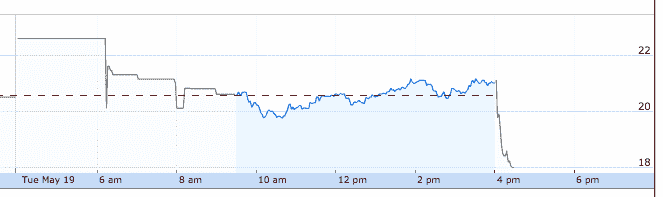

# Etsy 公布第一季度财务业绩后股价暴跌 13%

> 原文：<https://web.archive.org/web/https://techcrunch.com/2015/05/19/etsy-plunges-13-after-reporting-its-first-quarter-financial-performance/>

# Etsy 公布第一季度财务业绩后，股价暴跌 13%

Etsy 的股价今天暴跌，此前该公司报告了大致一致的收入和超出预期的亏损。广受欢迎的手工制品市场 Etsy 公布的收入为 5850 万美元，超过了 5800 万美元的预期。然而，该公司本季度亏损 3660 万美元，或每股亏损 0.84 美元。

在去年同期的季度中，Etsy 的亏损要小得多，为 46.3 万美元。截至发稿时，Etsy 在盘后交易中下跌了 13%以上。

该公司的收入增长与去年同期的 44.4%相比，大大超过了其平台上的销售增长，后者的增幅较低，为 28.2%。投资者可能会认为这种差异预示着潜在的不良收入增长。

增加负面压力的是该公司第二季度的报告。为了保持语气而详细引用[强调我的]:

> 我们想强调几个我们认为会影响 Etsy 2015 年第二季度业绩的因素。首先，如果**的外汇汇率**继续保持目前的水平，那么**很可能会继续影响美国以外的买家行为。其次**，我们预计**与 2015 年第一季度和 2014 年第二季度相比，第二季度将加快招聘步伐。第三，**与 2015 年第一季度和 2014 年第二季度相比，我们计划在第二季度投入更多的营销资金**。最后，我们要提醒投资者，2015 年第二季度的业绩将包括一些一次性费用，如 Etsy 在 2015 年 4 月 16 日提交的 Etsy 招股说明书中描述的对 Etsy.org 的 300，000 美元现金捐款，以及不可从 Etsy 的 IPO 收益中扣除的约 300，000 美元的 IPO 费用。**

这意味着收入增长放缓，员工人数增加，成本上升。结合起来，你可以用下面的方式拼写:边缘压力。与去年同期相比，Etsy 的运营费用增长了 72.6%。

图表[是说明性的:](https://web.archive.org/web/20230317202736/https://www.google.com/finance?q=etsy&ei=6ppbVfmNGML9igLOiYCIAw)

Etsy 以每股 16 美元上市，飙升至 35 美元以上，目前交易价格低于 18 美元。