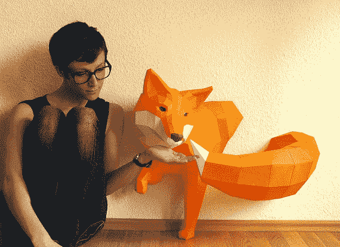

# Etsy 首次公开募股收盘时，股票上涨了 86%

> 原文：<https://web.archive.org/web/https://techcrunch.com/2015/04/16/etsy-stock-surges-86-percent-at-close-of-first-day-of-trading-to-30-per-share/>

事实证明，华尔街的投资者喜欢这些土布工艺品。手工制品在线市场 Etsy 今天上市了。股票在纳斯达克以 31 美元开盘，比最初设定的每股 16 美元的价格上涨了 94%。公司[第一天交易](https://web.archive.org/web/20221208005410/http://finance.yahoo.com/q;_ylc=X1MDMjE0MjQ3ODk0OARfcgMyBGZyA3VoM19maW5hbmNlX3dlYgRmcjIDc2EtZ3AEZ3ByaWQDBG5fZ3BzAzMEb3JpZ2luA2ZpbmFuY2UueWFob28uY29tBHBvcwMxBHBxc3RyAwRxdWVyeQNFVFNZLARzYWMDMQRzYW8DMQ--?p=http%3A%2F%2Ffinance.yahoo.com%2Fq%3Fs%3DETSY%26ql%3D0&fr=uh3_finance_web&uhb=uh3_finance_vert&s=ETSY)以每股 30 美元收盘，比最初价格上涨了 86%。

该公司通过在交易前出售 1670 万股股票筹集了超过 2.87 亿美元，对公司的估值接近 18 亿美元。上午 10 点左右，股票上涨了近 35 美元。Etsy 现在价值超过 35 亿美元。

这家手工工艺品公司尚未实现盈利，但在过去几年里，收入逐年增长，从 2012 年的 7460 万美元(约合人民币 1360 万元)飙升至 2013 年的 1.25 亿美元(约合人民币 1360 万元)，再到去年的 1.9559 亿美元。截至去年 12 月，它有 140 万活跃卖家和 1980 万活跃买家。

## 受到挑战的飞船

现在的问题是，Etsy 计划如何保持其小规模手工艺的身份。该公司拥有一批忠实的买家和卖家，他们会去该网站购买独特的商品。Etsy 将面临挑战，既要与它认为规模更大的竞争对手阿里巴巴、易贝和亚马逊竞争，又不能失去自制商品爱好者的关键基础。

如果该公司看到对其核心市场的兴趣下降，该公司可能被迫通过改变规则来多样化其产品组合，这可能导致客户对其市场不再抱有幻想。该公司必须权衡其现在多样化的公众股东的重要性，以及买卖足够多工艺品以让该公司进行 IPO 的用户的重要性。

每家公司都必须在上市后寻求新的平衡。然而，Etsy 凭借精心打造的品牌和审美，提供独特的产品，如 [3D 纸狐狸](https://web.archive.org/web/20221208005410/https://www.etsy.com/listing/178085095/big-fox-sculpture-diy-paperwolf-fox?ref=shop_home_active_4)和[手工填充海洋生物](https://web.archive.org/web/20221208005410/https://blog.etsy.com/en/2015/featured-shop-big-stuffed/)——保持对品牌的忠诚，这有助于 10 年前从布鲁克林的一套公寓创办一家不起眼的公司，同时取悦股东，这是一个有趣的挑战。

## 预测未来

该公司 IPO 的成功对科技流动性市场来说是一个好兆头，因为它可能会刺激其他观望的公司启动自己的 IPO。2015 年迄今为止，科技 IPO 市场进展缓慢。Box 于今年早些时候上市，[首日涨幅高达 70%](https://web.archive.org/web/20221208005410/https://beta.techcrunch.com/2015/01/23/box-skyrockets-50-to-more-than-21-per-share-in-first-minutes-as-a-public-company/)。然而，Box 的股票[已经开始下跌](https://web.archive.org/web/20221208005410/https://beta.techcrunch.com/2015/03/11/box-drops-15-after-reporting-strong-revenue-growth-wider-than-expected-loss/)。

Etsy 首次公开募股的成功可能会让另一家最近申请首次公开募股的公司 Shopify 大放异彩。他们是相关的，如果不是类似的公司；Shopify 为中小型企业提供电子商务工具，与 Etsy 自己的解决方案形成适度对比。尽管如此，这两家公司都通过各自的平台追踪美元总流量。etsy 2014 年的商品销售总额(GMS)为 19.3 亿美元，而 Shopify 同期的商品销售总额(GMV)为 37.6 亿美元。

正如你所料，鉴于 Etsy 自身作为市场网络的亲密地位，它通过平台获得的每美元收入更多，这与 Shopify 的 SaaS 解决方案形成对比，后者帮助其他人建立自己的销售渠道。鉴于 Etsy 受到投资者的热烈欢迎，鉴于两家公司的共同暗示，Shopify 可能会预计到类似的热烈反应。后者公司尚未定价。

不管对 Shopify 自身 IPO 的任何潜在影响，Etsy 都度过了辉煌的一天。这是任何公司在路演中都梦想得到的接待。

最后一个问题:这家公司的定价是否过于保守，如果是，它真的在乎吗？