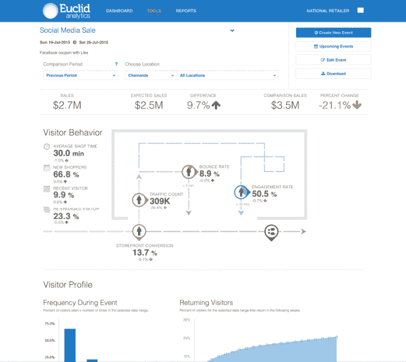

# Euclid Analytics 募集 2000 万美元 C 轮资金，用于跟踪零售店中的消费者行为 

> 原文：<https://web.archive.org/web/https://techcrunch.com/2016/01/14/euclid-analytics-raises-20m-series-c-to-track-consumer-behavior-in-retail-stores/>

[Euclid Analytics](https://web.archive.org/web/20221228104612/http://www.euclidanalytics.com/) 计划在筹集了 2000 万美元的 c 轮融资后，帮助更多公司跟踪其零售店中的客户行为。这笔资金将用于获取客户，增加新员工，以及建立 Euclid 的位置分析平台。

这一轮融资由媒体集团考克斯企业(Cox Enterprises)牵头，使欧几里德的融资总额达到 4400 万美元。阿尔诺集团(持有奢侈品集团路易威登控股股份的投资公司)和 Gold Sky Capital 也参加了会议，还有回归投资者 Benchmark、NEA 和 Harrison Metal。

Euclid 首席执行官布伦特·弗兰森(Brent Franson)告诉 TechCrunch，Groupe Arnault 将成为其战略合作伙伴。这意味着两家公司将利用来自 Groupe Arnault 市场研究的信息，共同提高 Euclid 的技术和洞察力。

欧几里德的位置分析技术监控实体企业内部的交通，包括商店、快餐店、银行、购物中心和机场等交通枢纽。该公司表示，它目前被 65 个国家的 500 个品牌使用，每天捕获约 70 亿个数据点。

欧几里德的技术不需要像门铃或摄像头这样的硬件，而是与 Aerohive、思科、惠普/阿鲁巴网络、Meraki、Ruckus 和 Xirrus 的 Wi-Fi 系统合作，从智能手机收集媒体访问控制(MAC)地址，然后加密并存储在其服务器上(商店需要向想要选择退出的客户显示信息)。然后，Euclid 跟踪购物者在浏览时去了哪里，他们在特定区域停留了多长时间，他们访问的总时间以及他们返回的频率，然后将数据汇总到旨在帮助公司提高销售、营销和转化率的报告中。

“我们的(关键绩效指标)提供了对购物者行为及其如何影响关键业务成果的新见解，”弗兰森在一封电子邮件中说。“例如，购物者停留时间、重复访问、跳出率或店面转换率如何影响销售？广告活动或新商店布局是否增加了客流量或新顾客？快速服务餐厅的员工增加率上升了吗？”

其他帮助零售商回答相同问题的位置分析公司包括 [RetailNext](https://web.archive.org/web/20221228104612/http://retailnext.net/) 、 [Locately](https://web.archive.org/web/20221228104612/http://locately.com/) 和 [Placed](https://web.archive.org/web/20221228104612/https://www.placed.com/) ，但弗兰森表示，欧几里德是唯一一家不要求商店安装硬件或要求其客户首先下载智能手机应用程序来收集数据的公司。他补充说，这将有助于该公司吸引那些需要跟踪实体商店和在线商店消费者流量的品牌。

“随着我们进入全渠道市场，数字化连接的消费者可以在线上和线下无缝购物，我们可以将物理世界的点连接起来，并获得客户的单一视图，”弗兰森说。“我们的竞争对手不能做出这样的声明。”