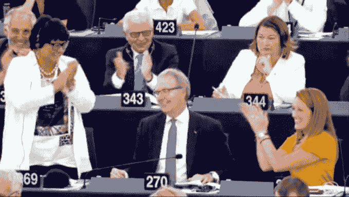

# 欧洲议会支持有争议的版权改革 

> 原文：<https://web.archive.org/web/https://techcrunch.com/2018/09/12/european-parliament-gives-thumbs-up-to-controversial-copyright-reforms/>

欧洲议会刚刚投票支持改革在线版权的有争议的提案，包括支持扩展到出版商内容的片段(第 11 条)，并使拥有大量内容的平台对其用户的版权侵犯负责(第 13 条)。

今天欧洲议会的全体投票是关于欧洲议会议员在 7 月[的投票中否决的修正提案，议员们要求更充分的辩论和更平衡的措施。](https://web.archive.org/web/20221025222130/https://techcrunch.com/2018/07/05/european-meps-vote-to-reopen-copyright-debate-over-censorship-controversy/)

这次投票是欧洲议会议员阿克塞尔·沃斯的一次重大胜利，他一直在推动版权改革。

欧洲议会议员们基本上支持沃斯今天的修正提案，该提案缩小了被拒绝文本的范围，例如，在第 11 条的情况下，允许链接包含出版商内容链接中的单个单词——这是为了回应批评者的论点，即该措施将禁止超链接(通常包含文章的标题)。

关于第 13 条，Voss 的修正提案将范围缩小到既拥有“大量”内容又“推广”这些内容的平台。它还包括一个小企业的例外。

当投票结果公布时，沃斯面带笑容，鼓掌并拥抱他的邻座，同时对所有观众竖起大拇指。

与此同时，批评家和言论自由倡导者把这个结果描述为一场灾难…

“众议院的议员们，衷心感谢我们共同完成的工作。对于欧洲的创意产业来说，这是一个好兆头，”投票结束后，沃斯说，他要求将报告发回委员会，通过欧洲理事会开始与成员国进行机构谈判。

欧洲议会议员义不容辞。

只有一次中断——一名欧洲议会议员站起来谴责这一结果是“对互联网言论自由的巨大打击”。诉讼继续进行。

其他由欧洲议会议员提出但被整个议会否决的修正案包括各种中间立场，但也完全放弃改革，保留现行法律不变。

在投票结束后的一份声明中，盗版党欧洲议会议员、绿党/全民教育集团副总裁朱莉娅·瑞达(Julia Reda)对版权改革提出了尖锐的批评，她说，议会已经投票决定“只做表面上的改变”， 重申了她的警告，即该提案将导致平台实施上传过滤器，捕捉“完全合法的内容，如模仿和模因”，并征收毫无意义的欧盟“链接税”。

“今天的决定是对自由开放的互联网的严重打击，”她说。“通过批准对我们可以在网上发布和分享的内容进行新的法律和技术限制，欧洲议会将公司利润置于言论自由之上，并放弃了使互联网成为今天的长期原则。”

“[‘链接税’在德国生效五年后](https://web.archive.org/web/20221025222130/https://techcrunch.com/2013/03/01/germany-passes-new-internet-copyright-law-after-watering-it-down-to-spare-google-from-having-to-pay/)，没有记者或出版商赚到一分钱，新闻领域的初创公司不得不关门，法院也尚未消除法律上的不确定性，不知道该在哪里划定界限，”她补充道。“同样的困境现在将在欧盟层面重演——除了一厢情愿的想法，没有人提出为什么不会。”

欧洲议会议员 Marietje Schaake 也表示失望，他告诉我们:“议会浪费了让版权改革走上正轨的机会。对于保护我们的基本权利、普通互联网用户和欧洲在人工智能领域的未来来说，这是一个灾难性的结果。我们倒退了一步，而不是创造一个适合 21 世纪的真正的版权改革。”

“对于用户、消费者、创新者和研究人员来说，这是一个可怕的结果，”欧洲议会议员凯瑟琳·斯蒂勒补充说。“这对欧洲数字经济没有任何好处，它将扼杀言论自由，并为欧洲初创企业制造市场准入壁垒。”

除了争论，委员会对投票结果表示欢迎。

在一份联合声明中，欧盟委员会负责数字单一市场的副总裁安德鲁斯·安西普和负责数字经济与社会的委员玛利亚·加布里埃尔说:

> 我们欢迎欧洲议会今天的投票。这是一个强烈而积极的信号，也是我们实现欧盟版权规则现代化这一共同目标的重要一步。
> 
> 共同立法者之间的讨论现在可以开始于一项立法提案，这是数字单一市场战略的一个关键要素，也是欧盟委员会的优先事项之一。
> 
> 我们改革的目标是为欧盟公民、研究人员、教育工作者、作家、艺术家、媒体和文化遗产机构带来实实在在的好处，并通过澄清规则并使其适应数字世界来开发更多创造力和内容的潜力。与此同时，我们致力于保护言论自由，确保在线平台——包括 7000 个欧洲在线平台——能够开发新的创新产品和商业模式。
> 
> 欧盟委员会随时准备开始与欧洲议会和欧盟理事会合作，以便该指令能够尽快获得批准，最好是在 2018 年底之前。我们完全致力于与共同立法者合作，以实现平衡和积极的结果，使欧洲需要的版权立法真正现代化。

同样异常高兴的是一系列创意产业，其中[音乐产业排在第一位](https://web.archive.org/web/20221025222130/http://www.completemusicupdate.com/article/music-industry-welcomes-copyright-directive-vote-in-the-european-parliament/)——该产业长期以来一直指出，他们是在线事物中的输家…

[https://web.archive.org/web/20221025222130if_/https://www.youtube.com/embed/Di6a5Qfa7ns?feature=oembed](https://web.archive.org/web/20221025222130if_/https://www.youtube.com/embed/Di6a5Qfa7ns?feature=oembed)

视频

欧洲出版商理事会欢迎采用出版商的邻接权。

“今天，我们赞扬那些投票支持新闻自由、民主、专业新闻和欧洲价值观的欧洲议会议员。我们感谢报告员、欧洲议会议员阿克塞尔·沃斯(Axel Voss)为取得平衡的结果所做的不懈努力，”该委员会执行主任安吉拉·米尔斯·韦德(Angela Mills Wade)在一份声明中说。

一个代表欧洲杂志媒体协会、欧洲报纸出版商协会、T2 出版商协会、T4 出版商协会、欧洲出版商理事会和欧洲新闻媒体的联盟补充道:“这次改革不仅仅是关于版权的现代化，而是关于我们民主的基本功能。今天，欧洲议员们通过投票支持出版商的权利来证明他们重视欧洲独立新闻，这将有助于确保欧洲新闻部门的可持续性”。

虽然议会现在已经同意了其关于改革的谈判立场，但这一进程尚未结束。

将通过欧洲理事会与成员国代表进行三方讨论，并最终投票通过该法律——可能在明年年初。

Reda 警告说，如果不将过滤器“明确排除在谈判之外”，公众抗议将会增加，并暗示整个指令“很可能在明年欧洲选举前的最终投票中被否决”。

同样不支持改革的计算机和通信行业协会敦促理事会和议会“在最终谈判中取得平衡的结果”。

“我们感到遗憾的是，欧洲议会的大多数成员今天忽视了在线部门、学术界、创新出版商、研究机构和民权团体对这项提案造成的真正威胁的警告，”该机构的高级政策经理莫德·萨奎特(Maud Sacquet)在一份声明中说。

欧洲消费者组织 BEUC 也谴责了全体会议的投票结果，警告称，如果欧洲议会议员今天支持的计划成为欧盟法律，“消费者的互联网利益将面临风险”。

“令人无法理解的是，欧盟的决策者一再拒绝将版权法带入 21 世纪。如今，消费者通过采样、创作和混合音乐、视频和图片来表达自己，然后在网上分享他们的创作。欧洲议会议员已经决定阻挠这种言论自由，这对创造力和创新是危险的，”BEUC 总干事莫尼克·戈延斯在一份声明中说。

“这次投票的结果很明显。平台将别无选择，只能扫描和过滤消费者想要上传的任何内容。经验表明，这将导致许多上传被无理阻止。这不是互联网消费者需要或期望的类型。这种保护主义改革只会让版权行业受益，而牺牲消费者的利益。”