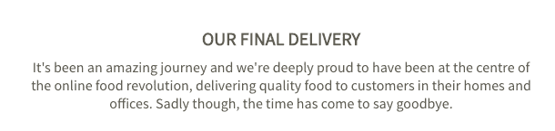

# 欧洲餐馆外卖初创公司 Take Eat Easy 因试图寻找买家而停止交易 

> 原文：<https://web.archive.org/web/https://techcrunch.com/2016/07/26/european-restaurant-delivery-startup-take-eat-easy-ceases-trading-as-it-tries-to-find-a-buyer/>

欧洲的餐馆送餐大战总是会变得混乱不堪，而最新的受害者是[从容不迫](https://web.archive.org/web/20230202101347/http://www.takeeateasy.be/en)。尽管上周庆祝了它的第 100 万个订单，但这家总部位于布鲁塞尔的初创公司已经停止交易，并将在未能筹集到急需的 C 轮融资并耗尽资金后申请“司法重组”。

尽管该公司仍有希望找到买家，但它还没有足够快地在这个竞争异常激烈的市场上继续运营，这个市场已经成为一个现金密集型市场，资金雄厚的竞争对手包括总部位于伦敦的 Deliveroo、Delivery Hero's Foodora、优步的 UberEATs，以及[潜在的亚马逊](https://web.archive.org/web/20230202101347/https://techcrunch.com/2016/07/15/amazon-eyeing-up-london-restaurant-delivery-launch/)，仅举几例。竞争对 Take Eat Easy 筹集更多资金的能力产生了致命影响。

Take Eat Easy 联合创始人兼首席执行官 Adrien Roose 告诉我，该公司去年 10 月开始筹集 C 轮资金，到第二年 3 月，这家初创公司已经被 *114* 风险投资基金拒绝(是的，你没看错！).

一份条款清单最终被一家“法国国有物流集团”摆在了桌面上，该集团被认为是法国邮政集团(Le Groupe La Poste)的快递子公司 GeoPost，该公司也是按需快递初创公司 [Stuart](https://web.archive.org/web/20230202101347/https://techcrunch.com/2016/04/19/stuart/) 的投资者，获得了€3000 万英镑的投资。三个月后，经过一个缓慢的尽职调查过程后，这笔交易告吹，给 Take Eat Easy 的棺材钉上了最后一颗钉子。用卢斯的话说，“没有 B 计划”。

“在过去的 8 周里，我们竭尽全力寻找解决方案来保持业务的活力。我们同时从事融资和收购交易，不幸的是，它们都没有实现。他在一篇博客文章中说:“我们现在已经没有时间继续照常运营，我们正在申请司法重组。”。

Roose 还表示，在过去一年里，Take Eat Easy 实现了 30%的月增长率，除了超过 100 万份外卖，其餐厅合作伙伴从 450 家扩大到 3200 家，客户群从 3 万人扩大到 35 万人。

他还告诉我，对于这家初创公司来说，伦敦代表了一个“小市场”——事实上，我们听说该公司在英国的员工上周被遣送回国，通知说有事发生了——但 Take Eat Easy 在法国及其祖国比利时最强大。

虽然投资者担心 Deliveroo 和优步以及亚马逊的潜在市场准入是可以理解的，但人们对 Rocket Internet 最初支持 Take Eat Easy 以及这家德国公司建设者如何在整个过程中支持这家初创公司提出了质疑。

最初，Rocket Internet 通过其风险部门 GFC 投资了 Take Eat Easy[，随后](https://web.archive.org/web/20230202101347/https://techcrunch.com/2015/09/01/series-b-delivered/)[以德国 Volo 的形式收购了直接竞争对手](https://web.archive.org/web/20230202101347/https://techcrunch.com/2015/04/16/volo/)。该公司后来成为 Foodora，Foodora 又被出售给外卖市场 Delivery Hero，Rocket Internet 拥有该公司 40%的股份。

我的理解是，Rocket Internet 随后在 9 月份出售了其在 Take Eat Easy 的股份，再次出售给了 Delivery Hero，这意味着，与 Rocket Internet 之前一样，该公司现在拥有两家相互竞争的餐厅外卖初创公司。至少可以说令人困惑。

显而易见的解决方案是将 Foodora 和 Take Eat Easy 合并为一家公司，但这将需要 Delivery Hero 以高昂的价格收购 Take Eat Easy 的剩余股份，这显然是该公司不愿进行的收购。