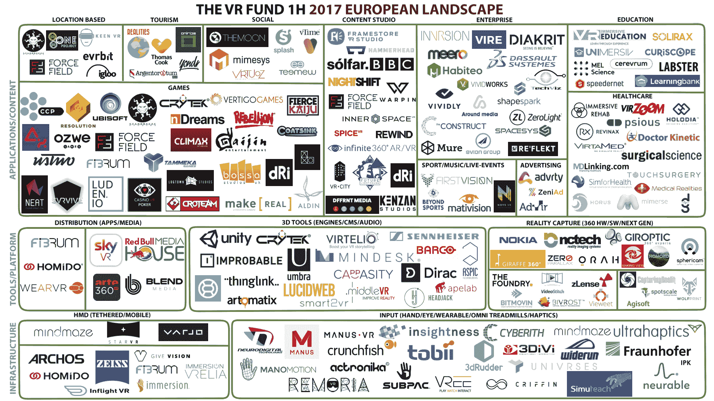

# 尽管市场放缓，欧洲的虚拟现实市场仍在快速增长 

> 原文：<https://web.archive.org/web/https://techcrunch.com/2017/08/29/europes-vr-landscape-continues-to-grow-rapidly-despite-market-slowdown/>

# 尽管市场放缓，但欧洲的虚拟现实前景继续快速增长

阿米尔·博佐格扎德撰稿人

阿米尔·博佐格扎德是

[Virtuleap](https://web.archive.org/web/20221025222301/http://virtuleap.com/)

，一个为创意开发者向世界展示他们的 VR 概念的沙盒，目前正在运行世界上最大的 WebVR 黑客马拉松。他也是的欧洲合伙人

[Edoramedia](https://web.archive.org/web/20221025222301/https://www.edoramedia.com/home)

是一家游戏发行商和数字代理公司，总部位于迪拜。

More posts by this contributor

去年 11 月，我报道了欧洲的 VR meetup 社区如何在自由职业者、初创公司和公司的成员基础上[增加了一倍多](https://web.archive.org/web/20221025222301/https://venturebeat.com/2016/11/09/europes-vr-community-has-doubled-over-the-past-year/)。这个蓬勃发展的地区已经产生了像 [EUVR](https://web.archive.org/web/20221025222301/http://www.euvr.org/) 这样的非营利组织，致力于通过提供平台和资源来帮助解决日益分散的生态系统等问题，使欧洲的虚拟现实产业走向成熟。它的第一个平台于 4 月份首次亮相，是一个互动数据库，它提供了一种在新兴技术领域通常非常缺乏的可视性。领先的日本移动游戏工作室[谷米](https://web.archive.org/web/20221025222301/http://gumi.sg/)正在通过投资和资源支持 EUVR，这转化为对该数据库为该地区快速增长的虚拟现实社区提供的增值的健康信任票。

“欧洲有潜力成为虚拟现实内容的领先地区:我们的创造力、文化遗产和人才都是可以用来创造难忘的虚拟现实体验、令人惊叹的视频游戏和颠覆性 B2B 应用的资产。我们觉得这个数据库可以帮助支持欧洲这个行业的发展，”EUVR 的联合创始人 Juan Bossicard 告诉我。

去年 2 月，总部位于硅谷的风险公司[风险现实基金](https://web.archive.org/web/20221025222301/http://www.thevrfund.com/)与比利时虚拟现实和网络虚拟现实咨询与开发机构 [LucidWeb](https://web.archive.org/web/20221025222301/http://lucidweb.pro/) 合作，发布了其首个欧洲虚拟现实景观。这是与欧洲各地的地区虚拟现实大使通信中收集的广泛研究和信息的结果，当时它跟踪了该地区大约 [300 家活跃的公司](https://web.archive.org/web/20221025222301/https://venturebeat.com/2017/02/07/europes-virtual-reality-sector-has-grown-to-nearly-300-companies/)。

现在， 六个月后， 这一数字已跃升至 487 家公司，其中 188 家出现在风景中(之前为 116 家)。这些有影响力的人有一半以上来自英国(46 人)、法国(29 人)、瑞典(19 人)和德国(15 人)。出现在名单上的选择标准要求公司获得正式资助，并在市场上有商业产品。

LucidWeb 的联合创始人兼首席执行官岳翎·塞格斯说:“虚拟现实行业继续增长，在虚拟现实行业的高性能创业公司数量方面，瑞典现在已经赶上了英国和法国。”。“对于虚拟现实中的子行业，随着 2 月初发布的第一版 EUVR 景观，专注于用户输入、3D 工具和企业应用的公司数量正在快速增长。此外，这些垂直行业的年轻初创公司很容易获得资本，而这些领域的成熟公司更有可能上市或被脸书、微软和 Starbreeze 等公司收购。”

不出所料，游戏仍然是竞争最激烈、最拥挤的领域。两个特别值得注意的工作室是总部位于瑞典的 Logtown Studios 和总部位于英国的 nDreams，前者在 2 月份为€的第一款虚拟现实游戏筹集了 60 万美元，后者仅在上个月就筹集了 347 万美元。

快速增长的用户输入行业，专注于通过大脑(BCI)、身体、眼睛、脚和手在虚拟现实中的交互，也继续吸引投资者的注意力。在被审查的 22 家公司中，有 8 家是新加入的。总部位于英国的超触觉公司(ultra haptics)2300 万美元的 B 轮融资无疑让很多人感到惊讶。

但是，如果投资规模是让你的船漂浮起来的因素，那么 3D 工具领域就是你应该关注的地方。总部设在英国的[不可能](https://web.archive.org/web/20221025222301/https://improbable.io/)在去年 5 月的 B 轮融资中从软银那里筹集了突破性的[5 亿美元](https://web.archive.org/web/20221025222301/https://www.forbes.com/sites/stevenbertoni/2017/05/11/uk-start-up-improbable-raises-massive-500-million-series-b-from-softbank/#187fbb6db99b)，在该行业目前正在经历的[幻灭低谷](https://web.archive.org/web/20221025222301/https://venturebeat.com/2017/06/04/vr-startups-go-into-cockroach-mode-to-survive-barren-consumer-market/)期间，创造了这种区域轰动效应，让该领域的玩家保持希望。

随着这第二次发布，LucidWeb 推出了一个[公共 Trello](https://web.archive.org/web/20221025222301/https://trello.com/b/w1MlJtRs/the-vr-fund-vr-industry-landscape-europe-1st-august-2017) 以获得欧洲增长最快的虚拟现实公司的完整列表。他们和虚拟现实基金将每半年更新一次景观。

