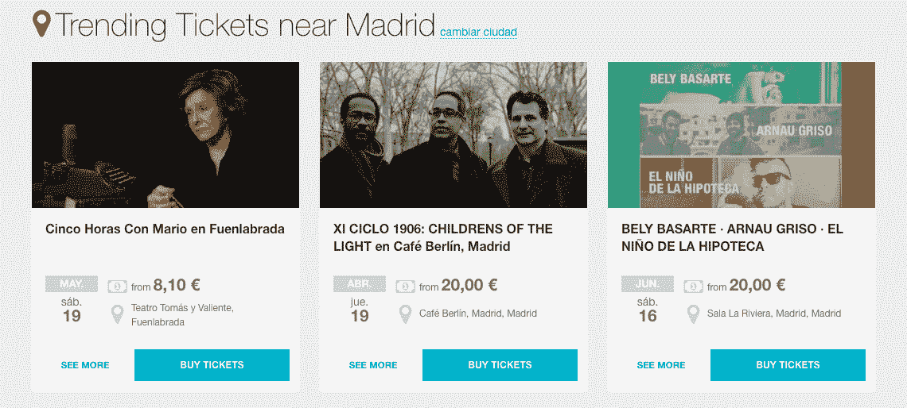

# Eventbrite 收购西班牙票务平台 ticket ea 

> 原文：<https://web.archive.org/web/https://techcrunch.com/2018/04/19/eventbrite-acquires-spanish-ticketing-platform-ticketea/>

[Eventbrite](https://web.archive.org/web/20230217024138/https://www.eventbrite.com/) 又在欧洲购物了——[今天宣布](https://web.archive.org/web/20230217024138/https://www.eventbrite.com/blog/eventbrite-acquires-ticketea-ds00/)收购了西班牙票务公司 [Ticketea](https://web.archive.org/web/20230217024138/https://www.ticketea.com/) 。交易条款尚未透露，但我们正在四处打听。

一个消息来源认为它在€8000 万到 1000 万之间，而另一个消息来源说它更接近€12000 万到 1500 万(也许是考虑到任何收入)。TechCrunch 也明白这是现金和股票的混合物，如果 Eventbrite IPO 或自己退出，Seaya Ventures 和 Ticketea 的其他股东将从中受益。(在前者方面，媒体报道已经确定了今年的首次公开募股。)

总部位于马德里的 Ticketea 提供了一个活动发现和票务平台，让人们可以找到并预订各种现场体验的门票，包括节日、音乐会和表演艺术节目。它主要面向讲西班牙语的国家和中小型活动组织者。

Eventbrite 表示，此次收购将有助于扩大其在音乐活动中的全球足迹，包括通过 Arenal Sound，via Rock，Low Festival 和 Dreambeach festivals。它还将 Ticketea 的“强大的第三方整合生态系统”作为另一个吸引力，该生态系统出售知名娱乐活动和品牌的门票，如比利·埃利奥特音乐剧、太阳马戏团和普拉多国家博物馆。

在一份关于收购的声明中，Eventbrite 的首席执行官兼联合创始人 Julia Hartz 称赞了 Ticketea 解决活动行业挑战的方法，称其“强大的发现平台”以及该公司在南欧市场(不仅仅是西班牙)的“强大领导地位”令人感兴趣。

“从业务、平台和品牌的角度来看，我们两家公司之间有着令人难以置信的协同效应，”Hartz 补充道。“我们非常高兴地欢迎他们才华横溢的团队加入 Eventbrite 大家庭，他们分享了我们通过现场体验将人们聚集在一起的核心使命。”

Ticketea 的联合创始人兼首席执行官 Javier Andres 将加入 Eventbrite，担任西班牙和葡萄牙的国家总监。

“近十年来，我们一直在西班牙建立重要的市场地位。他在一份支持声明中说:“得到全球活动技术领导者的认可令人兴奋，因为他们在我们不断增长的市场上投入了更多资金。”。

“我们期待将我们的团队和技术的影响力远远超越国界，扩展到 180 多个国家和地区，在这些国家和地区，他们强大的平台如今引发了数百万场活动。”

据 [Crunchbase](https://web.archive.org/web/20230217024138/https://www.crunchbase.com/organization/ticketea#section-overview) 报道，Ticketea 自 2009 年成立以来仅筹集了 570 万美元，因此它的投资者——包括总部位于马德里的风险投资公司[Seaya Ventures](https://web.archive.org/web/20230217024138/http://seayaventures.com/)——可能会为他们的投资获得了可观的回报而沾沾自喜。

Ticketea 并不是 Eventbrite 近年来收购的唯一一家欧洲票务公司。去年，这个价值十亿美元的活动管理平台还收购了总部位于阿姆斯特丹的票务初创公司 [Ticketscript](https://web.archive.org/web/20230217024138/http://ticketscript.com/) 。

2017 年，它还在总部位于美国的 [Nivite](https://web.archive.org/web/20230217024138/https://www.eventbrite.com.au/pressreleases/eventbrite-acquires-nvite-648/) 和 [Ticketfly](https://web.archive.org/web/20230217024138/https://www.eventbrite.com/blog/eventbrite-and-ticketfly-ds00/) 上挥霍——从 Pandora 上购买后者，并支付 2 亿美元。

*TechCrunch 的史蒂夫·奥黑尔对本文有贡献*