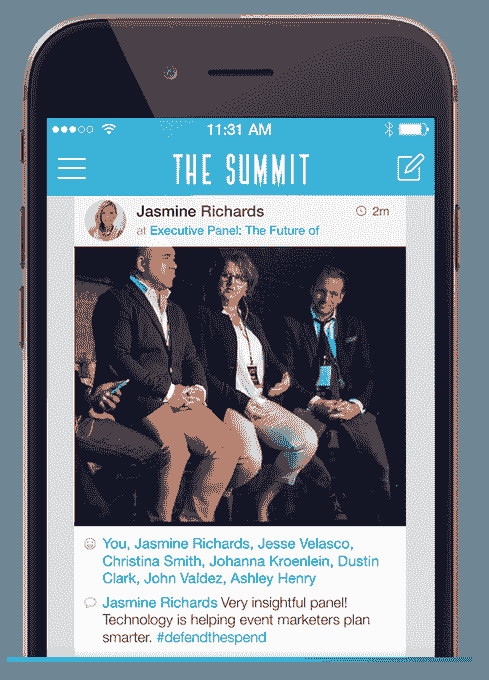

# 活动应用制造商 DoubleDutch 再次裁员，裁员 40% 

> 原文：<https://web.archive.org/web/https://techcrunch.com/2017/01/10/events-app-maker-doubledutch-downsizes-again-lays-off-40-percent-of-staff/>

为活动和会议提供移动应用和分析的初创公司 DoubleDutch 再次裁员。TechCrunch 获悉，DoubleDutch 证实，该公司刚刚宣布了新一轮裁员，影响了大约 40%的员工。大约 70 个职位被取消，包括高级领导职位。

DoubleDutch 的首席财务官、首席合规官、客户成功副总裁和其他人都因这些变动而离职，但包括首席财务官布拉德罗伯茨(Brad Roberts)在内的一些人将暂时继续担任顾问角色。

核心产品和工程团队以及核心上市团队依然存在，包括首席执行官劳伦斯·科伯恩、联合创始人潘卡杰·普拉萨德、CRO·戴夫·西蒙、工程副总裁 CMO·艾米丽·何和首席技术官尼古拉斯·克拉克。

DoubleDutch 成立于 2011 年，筹集了超过 7800 万美元的资金，用于为活动组织者开发移动工具。这包括活动主办者为他们的会议、贸易展览、音乐会和其他活动创建应用程序的能力，以及围绕参与度的跟踪分析。如果你曾经下载过定制的活动应用程序，你很有可能使用过 DoubleDutch 的产品。

这些新的裁员紧随去年 7 月在[举行的前一轮双飞之后，当时作为全公司重组的一部分，55 名员工被解雇。当时，这些离职员工占了 DoubleDutch 全球员工总数的 25%。](https://web.archive.org/web/20221007062014/https://beta.techcrunch.com/2016/07/11/mobile-events-app-doubledutch-lays-off-nearly-25-of-its-workforce/)

该公司当时解释说，裁员是必要的，因为需要实现盈利，并计划在 DoubleDutch 建立其企业平台时向高端市场发展。

科伯恩说，这个计划仍在进行中。他解释道，DoubleDutch 的情况是，该公司发展如此之快，在没有很好地意识到这些客户有多稳定的情况下就获得了业务。事实证明，他们的客户群中只有一部分是健康的——那些事件对其具有战略意义并且大规模运营项目的人。与此同时，它的中小型企业客户流失严重。

目前，DoubleDutch 网站列出的客户包括 CenturyLink、Rite Aid、BlackRock、Gainsight、NRECA、Marketo、Episerver、PRSA、Sime、Decoded Fashion、SaaStr、ASAE、美国海军联盟、UBM 理工大学、Messe Frankfurt、CalABA 和 eLearning Guild。

Coburn 表示，该团队很好地执行了从小客户过渡的计划，这就是为什么新一轮裁员是苦乐参半的。

“这种转变……需要时间，”科伯恩承认。“这听起来真的很奇怪，但我们在 2016 年过得很好，尤其是下半年。我们做了所有我们想做的事情，这真的是其中一个痛苦的部分。我要求团队做这些事情，他们做了这些事情。他说:“我们只是不能足够快地到达那里。

科伯恩说，当时的决定是在 DoubleDutch 仍然是一个品类领导者，可以在人们离开时照顾他们的时候进一步裁员，而不是在以后更具防御性的日期这样做，并补充说裁员不是该公司的唯一选择。(他拒绝就这一点提供进一步的细节，尽管最近几个月，这个空间已经出现了一些值得注意的 M&A 活动。)

今天，市场上仍然有许多活动应用程序制造商，包括 EventMobi、Quickmobile、Bizzabo、Guidebook、Attendify 和许多其他应用程序。但 DoubleDutch 只把 Cvent 视为主要竞争对手。

你可能还记得，Cvent 和 Lanyon 去年合并，Vista Equity Partners 以 16.5 亿美元收购 Cvent 的交易是在反垄断监管机构审查后完成的。此举使新的 Cvent 成为专注于活动管理服务的最大软件公司。

然而，Cvent 为活动组织者推出了一个端到端的解决方案，包括注册、工作流程规划和移动应用程序，这不同于 DoubleDutch 对其功能丰富的活动应用程序产品的狭隘关注。

DoubleDutch 的应用程序被设计成一个私人社交网络，这导致参与度增加，并产生更多数据。事实上，首席执行官指出，每月有数亿个数据点。

“我们业务的一大赌注是，数据将对我们的客户至关重要。他们会像关心 CRM 或营销自动化系统中的数据一样关心这些数据，”他说。

科伯恩对该软件的未来保持乐观。“世界正向我们走来。我们需要确保我们在这里，有一个完整的关键团队，有资金来真正抓住这个机会。”

DoubleDutch 进入 2017 年的路线与之前基本相同，但员工人数有所减少。裁员之后，科伯恩说，除非公司愿意，否则不会再筹集资金。