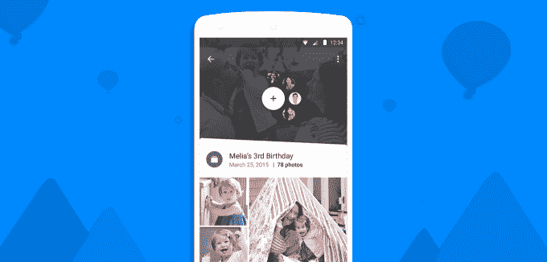
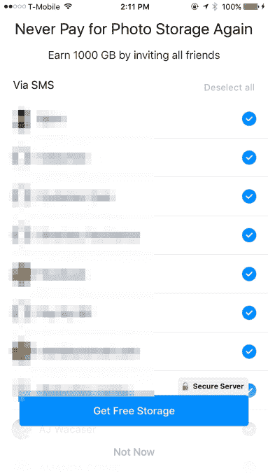
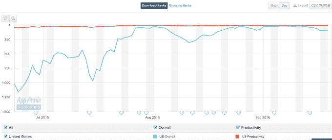

# Everalbum 证明了短信邀请垃圾邮件仍然有效

> 原文：<https://web.archive.org/web/https://techcrunch.com/2016/09/21/everalbum-is-proof-that-sms-spam-still-works/>

开发者称之为“增长黑客”收件人称之为垃圾邮件。最新一款要求用户向你的整个联系人列表发送邀请链接的不太健康的应用是 Everalbum。快速增长的照片分享和备份服务在今年早些时候在 Android 上推出之前攀升至 iOS 排行榜的首位，但后来发现有机增长和传统广告还不够——它需要更大、更快地增长。

该公司由 Khosla Ventures、Felicis Ventures 和 Cherubic Ventures 提供 800 万美元的资金支持，是 iCloud、Dropbox、谷歌照片或脸书时刻的替代产品，因为它允许你通过将手机照片存档在其云存储服务中来释放设备上的空间。

然而，该公司在最近几个月面临着更加激烈的竞争。

迅速改进的 Google 相册刚刚推出了一些聪明的功能，如新的自动电影制作软件 T1，而 T2 脸书增加了对全分辨率照片免费存储的支持 Everalbum 通过其付费服务层提供了这项服务。

这种增加的压力可能促使 Everalbum 变得更有进取心。

该应用现在大力鼓励用户邀请他们的联系人试用该应用，以换取更多免费存储自己的照片。考虑到用户的抱怨，他们在多大程度上理解自己同意的内容还不清楚。那些收到短信的人似乎也不总是那么兴奋。

https://twitter.com/keybuk/status/761290993110888449

该应用在应用商店的所有负面评论，以及在其他地方的[社交媒体](https://web.archive.org/web/20230306012235/https://www.reddit.com/r/photography/comments/4yuljz/everalbum_sending_out_sms_spam_in_the_middle_of/)【Reddit】和[更广泛的](https://web.archive.org/web/20230306012235/http://www.scamcallfighters.com/scam-call-6198318962-Everalbum-spam-texts---YOU-are-invited-to-see-my-ALBUM--Spam-Messages-48731.html) [网络](https://web.archive.org/web/20230306012235/http://whogavethemmoney.com/2016/09/10/warning-virus-is-everalbum-spamming-all-your-contacts/)上的负面评论，似乎都在暗示用户觉得被欺骗了，或者他们的联系人列表被窃取了，并且在未经他们同意的情况下发送了文本。

然而，我们看了一下这个应用程序，看看它是否有什么异常。就目前的情况来看，这个应用程序的当前版本非常清楚 Everalbum 打算做什么。

它承诺“每个邀请发送 1 GB 的存储空间。”

如果你点击大的“获得免费存储”按钮，那么你需要同意让 Everalbum 访问你的联系人。当然，默认情况下，你所有的联系人都会被选中,“取消全选”按钮是灰色的，这样就不太清楚如何选择退出，但是你仍然可以这样做。

当然，如果你继续太快，并按下按钮，应用程序的设计*会鼓励你按下**—*屏幕底部的一个蓝色大按钮“获得免费存储”——你会群发你的整个联系人列表。

一些用户似乎没有意识到他们点击后做了什么。

也有可能 Everalbum 已经在这个屏幕上迭代了，我们现在看到的版本比以前使用的版本更透明，但没有证据证明这一点。

[gallery ids="1389821，1389822，1389824，1389825"]

一位正在调查 Everalbum 违反 TCPA 的律师马克·菲尔普斯(Marc Phelps)表示，他已经与声称该应用程序过去未经许可邀请他们联系人列表中的所有人的客户进行了交谈，但在新版本中这种情况已经改变。但还是那句话，这是基于用户的回忆，而不是截图。

TCPA，或电话消费者保护法，要求任何营销短信收件人的书面同意。Everalbum 可能会也可能不会得到发件人的同意，但绝对不会得到收件人的同意。

也就是说，TCPA 的说法在法庭上站不住脚。法院已经驳回了 TCPA 对 [WhisperText](https://web.archive.org/web/20230306012235/https://www.dataprivacymonitor.com/mobile-privacy/court-dismisses-tcpa-claim-against-whispertext-where-text-messages-sent-at-app-users-direction/) 、 [Shopkick](https://web.archive.org/web/20230306012235/http://blog.ericgoldman.org/archives/2015/08/recent-fcc-order-helps-shopkick-defeat-tcpa-claims.htm) 、 [Life360](https://web.archive.org/web/20230306012235/http://www.law360.com/articles/823143/mobile-app-dodges-tcpa-suit-over-friend-invitations) 、 [Lyft](https://web.archive.org/web/20230306012235/http://maximizesocialbusiness.com/invite-friend-invite-tcpa-lawsuit-14174/) 和其他人的诉讼，因为该应用的用户必须明确同意通过在应用中选择他们的朋友来邀请他们，就像今天 Everalbum 的情况一样。

但菲尔普斯认为，如果该应用程序在之前的版本中没有征求许可，可能还有起诉的空间。然而，他说公司还没有申请。

不管合法性如何，依靠这种增长策略对创业公司来说是有风险的。

用户往往不会很好地通读入门屏幕，通常会让自己受到用户界面的引导——这是我们在电脑上花费多年点击“下一步”安装软件或绕过 EULA 的软件后学会的。

在 Everalbum 的案例中，增长黑客在社交媒体上的言论适得其反。许多人现在警告其他人，该应用程序是垃圾邮件和恶意的。他们说，这令人尴尬的短信他们的整个联系人名单，或者他们为他们无意中发出的垃圾邮件道歉。

更糟糕的是，发送给不知情的收件人的链接具有误导性。

在某些情况下，邀请文本简单地说明:“*【邀请人姓名】允许您查看 Everalbum 上的照片。单击此处:[链接]。"*但其他时候，文本威胁说，如果在一定时间内没有被点击，链接就会过期，或者说你应该点击它“查看你的照片”

与此同时，该应用的用户从一开始就没有真正在 Everalbum 中分享过照片——他们只是试图获得更多的免费存储空间，或者只是试图完成设置过程。

不幸的是，像这样的策略——至少暂时——可以奏效。

根据社交媒体的投诉，Everalbum 入职流程的变化似乎已经在今年夏天的某个时候推出。

7 月中旬，该应用在 App Store 上排名第 967 位，但随后在 8 月 1 日飙升至第 28 位。整个 9 月，它在 App Store 上一直排在前 20 或 30 名，只是最近才回落到 100 名左右。

你可能在浏览 iTunes App Store 上的“排行榜”部分时就已经看到了。

这种增长可以归因于大规模的短信运动。

[gallery ids="1389803，1389804，1389805，1389806"]

Everalbum 的联合创始人 Andrew Dudum 认为邀请系统没有问题。

“像包括 Dropbox、优步和 LinkedIn 在内的许多其他公司一样，我们有一个基于邀请的推荐系统，让人们邀请朋友来释放额外的价值，”他告诉我们。“多年来，这一直是业内的标准做法，可以追溯到 Dropbox 最初是如何让用户在邀请朋友的情况下解锁免费空间的。”

不同的是，其他人的邀请系统通常是他们应用程序中的可选区域。用户可以在这些地方获取链接，并选择与朋友或社交媒体分享。但 Everalbum 将短信邀请作为其入职流程的一部分——甚至在使用其服务之前，你可能会不小心点击它。

顶级应用程序不是这样的——[看看其他大牌应用程序](https://web.archive.org/web/20230306012235/http://uxarchive.com/tasks/onboarding)或[这个应用程序](https://web.archive.org/web/20230306012235/http://www.mobile-patterns.com/onboarding)中的入职屏幕档案。

[gallery ids="1390331，1390332"]

*上图:其他应用的邀请系统*

“我们从不上传联系人或给没有被朋友邀请的人发信息，”Dudum 指出。“肯定有一小部分人匆匆浏览应用程序屏幕，忽略对话框和文本。我们一直在努力改善体验，尽可能提高用户体验的效率和透明度。”

虽然 Everalbum 似乎没有做任何在法庭上被视为非法的事情，但让邀请成为入职的一部分也不是很酷。

如果一个应用值得使用，人们会自己邀请他们的朋友——而不是因为他们在设置时按错了按钮。