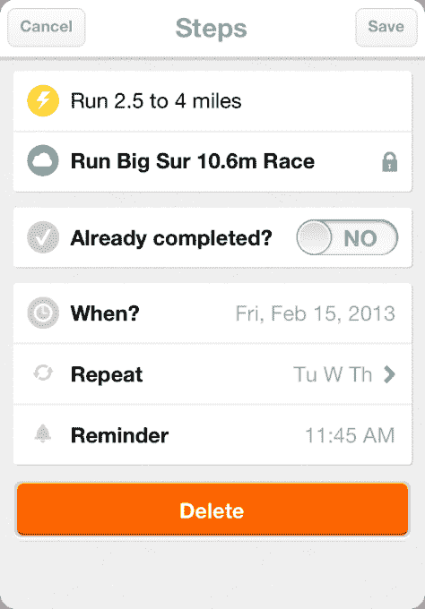

# 彼得·泰尔支持的实现梦想的应用程序 Everest 关闭了 

> 原文：<https://web.archive.org/web/https://techcrunch.com/2014/12/18/everest-the-peter-thiel-backed-app-for-achieving-your-dreams-shuts-down/>

[珠穆朗玛峰](https://web.archive.org/web/20221006101447/http://www.crunchbase.com/organization/everest)，一家[彼得·泰尔支持的移动创业公司](https://web.archive.org/web/20221006101447/https://beta.techcrunch.com/2013/02/14/everest-app/)，去年推出了一款帮助你“实现梦想”的应用程序，现在正在关闭。根据 [CrunchBase](https://web.archive.org/web/20221006101447/http://www.crunchbase.com/organization/everest) 的数据，该公司已经在三轮中筹集了 220 万美元，但在本周发给珠穆朗玛峰用户的一封电子邮件中承认，该公司未能吸引足够多的用户来证明运营服务和保持团队就业的费用是合理的。

该邮件警告说，任何希望从该服务中备份内容的人都需要立即访问该网站，因为服务器很快就会离线。

今天，珠穆朗玛峰网站[只有一个页面](https://web.archive.org/web/20221006101447/http://www.everest.com/)，用户可以登录并下载他们的内容。

该公司与其他目标跟踪应用程序竞争，包括 Twitter 联合创始人的 [Obvious Corp](https://web.archive.org/web/20221006101447/http://www.crunchbase.com/organization/obvious) 孵化的 [Lift](https://web.archive.org/web/20221006101447/http://lift.do/) 应用程序，顺便提一下，[本周首次推出其商业模式](https://web.archive.org/web/20221006101447/https://beta.techcrunch.com/2014/12/16/goal-tracking-and-self-improvement-app-lift-adds-personal-coaching-raises-1-1m-more/)，并已扩展到个人教练领域。Lift 报告说，就用户基础而言，它已经增长到“个位数百万”。

然而，Lift 与珠穆朗玛峰不同，因为它属于更多的任务管理领域——Lift 的用户在试图减肥、锻炼、保持饮食、学习生产力技巧等方面获得社区或个人支持。

另一方面，珠穆朗玛峰更多的是关于用户将他们自己的目标分解成更小的步骤，分享与此相关的照片，并在网络上与其他人联系。去年，当时 23 岁的创始人弗朗西斯·佩德拉萨(Francis Pedraza)将该应用描述为帮助人们确定他们的生活目标以及如何实现这些目标。他说，人们正在“花更多的时间关注自我实现，而珠穆朗玛峰将是一个平台。”

或者不是，事实证明。

该应用在发布时可能遇到了可用性问题。虽然它的外观设计良好，但最初受到漏洞和崩溃的困扰，它的一些关键功能，如查看目标或设置重复任务和提醒，令人困惑，难以使用， [TechCrunch 此前曾指出](https://web.archive.org/web/20221006101447/https://beta.techcrunch.com/2013/02/14/everest-app/)。此外，简单地列出任何目标所涉及的步骤都可能是乏味的。

佩德拉萨在 2012 年与彼得·泰尔见了一次面，后者为这家初创公司提供了 30 万美元的初始资金，其基础是珠穆朗玛峰的早期设计和建立社交网络的概念，这个网络不是由你认识的人(如脸书)定义的，而是由你想做的事情定义的。自那以后，该公司在 2013 年又获得了 170 万美元的天使投资，并在当年晚些时候继续筹集更多资金。创始人当时告诉 VentureBeat，SEC 的一份文件显示，这家初创公司筹集了 500 万美元的资金，其中包括 Everest 之前筹集的 200 万美元可转换票据。

珠穆朗玛峰的置评请求目前还没有得到回应，但如果有回音，我们会及时更新。

佩德拉萨承认，珠穆朗玛峰一开始确实存在可用性问题，但大多数问题在春天得到了解决。他认为，这款应用失败是因为其他原因。

“我们犯的一个错误是没有让用户付费，无论是通过预先购买、订阅、高级功能还是其他一些明确而直接的商业模式。他说:“我们转而寻求品牌赞助，尽管这引起了兴趣，但销售周期很长，我们最终肯定会被活跃用户所衡量。”。

此外，留住用户很难，更直接的商业模式会给 Everest 更多的时间来改进产品，同时在更小的用户基础上取得成功。该应用程序在关闭时已有超过 30 万次下载。

Pedraza 补充说，第二版失败的原因略有不同。“这是一个比版本 1 更好的产品，第 1-30 天的保留率接近 60%(在急剧下降的第 0 天之后)。所以我认为这更多是因为缺乏差异化——它最终与 Instagram 太相似了，”他告诉我们。

该公司没有向投资者返还太多资本(实际上大约 260 万美元)。

发送给用户的完整电子邮件如下:

> 怀着悲伤的心情，我们必须通知你们，珠穆朗玛峰即将关闭。最终，我们无法让足够多的人使用珠穆朗玛峰来证明运营这项服务和保持团队就业的巨大成本是合理的。
> 
> * * *如果您想将精彩瞬间保存到电脑中，请尽快访问 Everest.com；服务器将很快脱机。***
> 
> 如果你需要重置密码来保存你的珠峰时刻，你可以在 iOS 应用程序中这样做。
> 
> 真诚地，
> 珠峰团队
> 
> “请彼此留意，爱和原谅每一个人。生活真好，好好享受吧。”—吉姆·汉森

*更新公司评论，美国东部时间 2014 年 12 月 18 日下午 5:30*