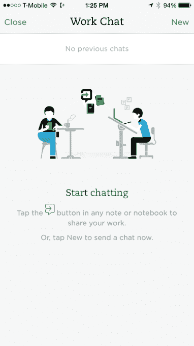

# Evernote 推出新的“工作聊天”功能 

> 原文：<https://web.archive.org/web/https://techcrunch.com/2014/10/31/evernote-rolls-out-its-new-work-chat-feature/>

Evernote 为其网络和移动应用推出了一项新的“工作聊天”功能，允许其在线笔记和协作软件的用户直接在 Evernote 界面上讨论想法和项目，而不必将这些对话转移到电子邮件上。此外，当你通过电子邮件向某人发送通知时，它会自动显示在工作聊天中，这样你就可以永久保存你的通信记录。

该公司在本月初宣布了这一功能，称该功能将“很快”应用于 Evernote 的所有主要桌面、网络、移动和平板电脑版本。然而，从目前的情况来看，桌面软件还没有更新。我们目前在网络、iOS 和 Android 上看到了它。我们还没有在 Mac App Store 上看到它，但是它[似乎已经登陆 Windows](https://web.archive.org/web/20221007201407/https://twitter.com/antoniesousa/status/528253270792605696) 。(Mac 应用商店可能只是一个阶段性的展示——我们已经联系了 Evernote 了解细节。)

工作聊天是一项旨在增加 Evernote 软件内部协作可能性的功能，它允许用户快速与同事分享笔记或整个笔记本，以获得他们的反馈。你可以只和一个人聊天，也可以和一群人聊天，你还可以选择将应用程序与你的谷歌联系人同步。

当你开始与另一个用户聊天时，他们会在应用程序中和通过电子邮件收到通知，通知他们聊天，并提供一个按钮，当点击时，会启动 Evernote。

Evernote 还将开始在你的笔记和笔记本列表中以小而圆的个人资料图标显示你的队友的脸，这些人参与了与特定文件或笔记本相关的聊天。

Evernote 首席执行官 Phil Libin 表示，这项功能是迄今为止请求最多的功能之一，主要是减少组织内电子邮件的一种方式。但它的设计不允许多个用户实时协作处理文档。

该功能目前在网络和手机上运行，应该很快就会出现在桌面上——该公司此前承诺 Chat 将在“2014 年底”出现

聊天是 10 月份宣布的 Evernote 软件的许多新功能之一，包括一个智能的类似人工智能的功能，称为上下文(Context)的功能，显示你正在写的内容的相关链接，以及一个更新的“免分心”网络应用(T3)。

[gallery ids="1077582，1077583，1077584"]

*帖子更新，美国东部时间下午 2:35，包含 Windows 信息。*