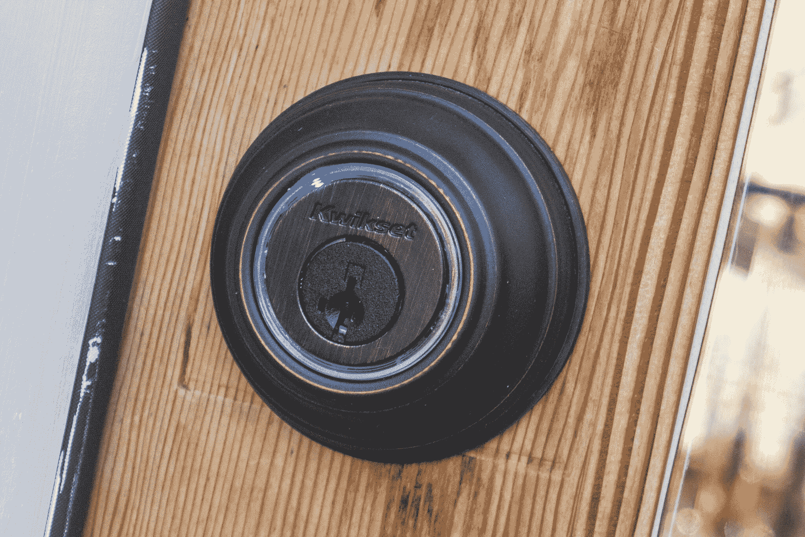
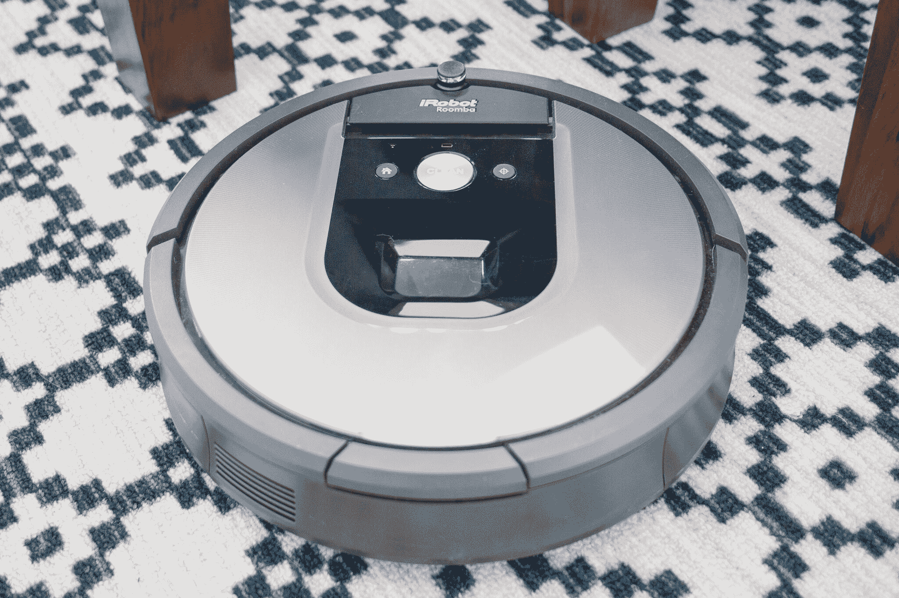
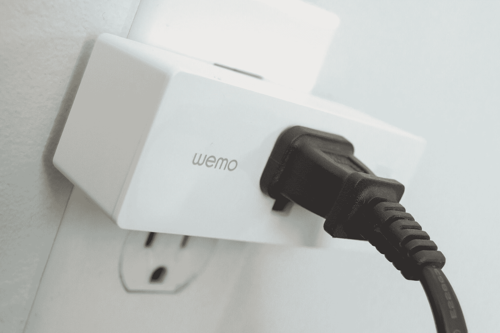
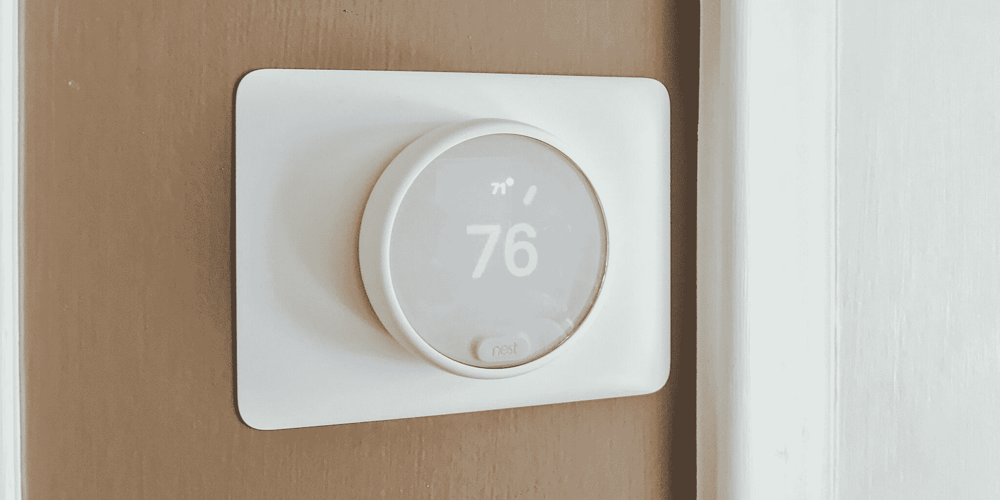
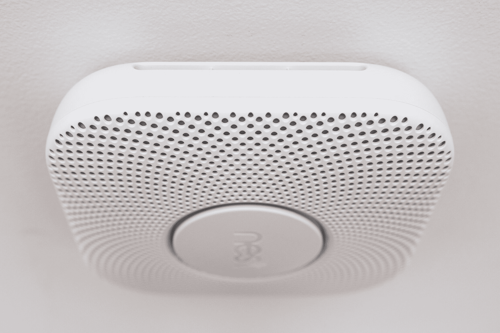

# 智能家居用品

> 原文：<https://web.archive.org/web/https://techcrunch.com/2018/09/15/everyday-home-gear-made-smart/>

马库拉·邓巴撰稿人

More posts by this contributor

**编者按:** *这篇文章是与 [Wirecutter](https://web.archive.org/web/20230326125755/https://thewirecutter.com/?utm_source=techcrunch&utm_medium=referral&utm_campaign=syndication&utm_content=smart-home) 合作完成的。当读者选择购买 [Wirecutter 的](https://web.archive.org/web/20230326125755/https://www.crunchbase.com/organization/the-wirecutter/)独立选择的编辑精选时，Wirecutter 和 TechCrunch 可能会赚取附属佣金。*

如果你只有一个智能家居设备，它可能是简单有趣的东西，比如[声控扬声器](https://web.archive.org/web/20230326125755/https://thewirecutter.com/reviews/amazon-echo-vs-google-home/?utm_source=techcrunch&utm_medium=referral&utm_campaign=syndication&utm_content=smart-home)或[变色 led 灯泡](https://web.archive.org/web/20230326125755/https://thewirecutter.com/reviews/best-smart-led-light-bulbs/?utm_source=techcrunch&utm_medium=referral&utm_campaign=syndication&utm_content=smart-home)。当你扩展你的智能家居设置时，你可以开始更换那些不那么花哨但你仍然每天使用的设备。

切换到连接锁、电源插座和烟雾报警器都是简单的安装，可以提高你在自己家里的安全性和舒适性。我们已经收集了一些我们最喜欢的必需品，为任何希望升级的人提供了智能。

**智能锁:Kwikset Kevo 智能锁第二代**

第二代的 [Kwikset Kevo 智能锁是我们测试过的最通用的](https://web.archive.org/web/20230326125755/http://homedepot.sjv.io/c/197432/456723/8154?subId1=tchcrsyndzz16653&u=https%3A%2F%2Fwww.homedepot.com%2Fp%2FKwikset-Kevo-2nd-Gen-Satin-Nickel-Single-Cylinder-Touch-to-Open-Bluetooth-Smart-Lock-Deadbolt-Works-with-many-Smart-Devices-925-KEVO2-DB-15%2F207190042)[智能锁](https://web.archive.org/web/20230326125755/https://thewirecutter.com/reviews/the-best-smart-lock/?utm_source=techcrunch&utm_medium=referral&utm_campaign=syndication&utm_content=smart-home)。无论您喜欢使用无线遥控器、智能手机应用程序还是钥匙，您都可以使用它们来控制锁。当我们将其与类似型号进行比较时，Kevo 的蓝牙激活轻触解锁机制是最容易使用的。

第二代 Kevo 提高了安全性，采用全金属内部组件，可以更好地防止强行闯入。通过可选的 Kevo Plus 升级，您将增加远程控制锁和接收状态监控更新的能力。

照片:利亚姆·麦凯布

**机器人真空:iRobot Roomba 960**

如果清洁既不是你的专长，也不是你喜欢的消遣，一个机器人吸尘器将会派上用场。我们的升级选择， [iRobot Roomba 960](https://web.archive.org/web/20230326125755/http://linksynergy.walmart.com/deeplink?id=7m8EnekPF5E&mid=2149&u1=tchcrsyndzz17782&murl=https%3A%2F%2Fwww.walmart.com%2Fip%2FiRobot-Roomba-960-Wi-Fi-Connected-Robot-Vacuum-w-Manufacturer-s-Warranty%2F54840215) ，是我们测试过的最强大的型号之一。它可以通过 iRobot Home 应用程序进行控制，并使用凹凸跟踪导航系统，帮助吸尘整个地板，不会遗漏任何地方。

如果它的电池在一次会话中电量不足，它会在完成任务前返回其坞站充电。它很容易拆卸维修，并配备了可修复的零件，使其价格超过我们的一些[不太容易维修的选择](https://web.archive.org/web/20230326125755/https://www.eufylife.com/products/variant/robovac-11s/T2108111)。

照片:雷切尔·切里科拉

**插入式智能插座:Belkin Wemo Mini**

我们测试了 26 个[智能插座](https://web.archive.org/web/20230326125755/https://thewirecutter.com/reviews/best-smart-switch/?utm_source=techcrunch&utm_medium=referral&utm_campaign=syndication&utm_content=smart-home)型号超过 45 个小时，并选择了 [Belkin Wemo Mini](https://web.archive.org/web/20230326125755/http://linksynergy.walmart.com/deeplink?id=7m8EnekPF5E&mid=2149&u1=tchcrsyndzz18384&murl=https%3A%2F%2Fwww.walmart.com%2Fip%2FWemo-Mini-Smart-Plug-No-Hub-Required%2F841010641) Wi-Fi 插头作为我们的首选。如果你曾经认为从你的智能手机远程打开或关闭家庭必需品很好，例如[灯](https://web.archive.org/web/20230326125755/https://thewirecutter.com/reviews/best-led-desk-lamp/?utm_source=techcrunch&utm_medium=referral&utm_campaign=syndication&utm_content=smart-home)、[空调](https://web.archive.org/web/20230326125755/https://thewirecutter.com/reviews/the-best-portable-air-conditioner/?utm_source=techcrunch&utm_medium=referral&utm_campaign=syndication&utm_content=smart-home)和[风扇](https://web.archive.org/web/20230326125755/https://thewirecutter.com/reviews/best-fan/?utm_source=techcrunch&utm_medium=referral&utm_campaign=syndication&utm_content=smart-home)，将它们插入智能插座使之成为可能。

Wemo Mini 经过长期测试证明是可靠的，它不会阻挡同一墙板上的其他插座，并且兼容 iOS 和 Android 设备和助手，包括 HomeKit/Siri、Alexa 和谷歌助手。Wemo 应用程序的界面直观易用。您可以在一个屏幕上查看所有连接的设备，设置电源定时器，并从任何地方打开或关闭插入 Wemo 插座的设备。

摄影:詹妮弗·帕蒂森·图希

**智能恒温器:Nest 恒温器 E**

对于一款[智能恒温器](https://web.archive.org/web/20230326125755/https://thewirecutter.com/reviews/the-best-thermostat/?utm_source=techcrunch&utm_medium=referral&utm_campaign=syndication&utm_content=smart-home)来说，它价格实惠并且不需要大量编程，我们推荐 [Nest 恒温器 E](https://web.archive.org/web/20230326125755/http://homedepot.sjv.io/c/197432/456723/8154?subId1=tchcrsyndzz21256&u=https%3A%2F%2Fwww.homedepot.com%2Fp%2FNest-Thermostat-E-Smart-Wi-Fi-Programmable-Thermostat-White-T4000ES%2F302714540) 。大约一周后，它会在学习您设置的制冷和制热偏好后创建一个时间表。它不像类似的 Nest 型号那样与许多 HVAC 系统兼容，但它易于安装，并不缺少我们期望的任何功能。

它确实带有 Eco 模式——一种节能的地理围栏功能，可以检测到你的房子何时是空的(或者你的智能手机何时不在你的房子附近)。Nest 应用程序使用相同的技术，当它感应到你在回家的路上时，将恒温器设置为首选温度。如果你手头没有智能手机，你仍然可以通过转动外圈并按下触摸屏上的选项来操作恒温器 E。

摄影:迈克尔·赫森

**智能烟雾报警器:巢穴保护**

烟雾报警器是每个家庭最依赖的安全设备之一。尽管如此，人们很容易忘记进行例行检查，以确保它处于最佳状态并正常工作。使用像 [Nest Protect](https://web.archive.org/web/20230326125755/http://linksynergy.walmart.com/deeplink?id=7m8EnekPF5E&mid=2149&u1=tchcrsyndzz16417&murl=https%3A%2F%2Fwww.walmart.com%2Fip%2FNest-Protect-Wired-2nd-Generation-White%2F45806611) 这样的智能烟雾报警器，我们发现其简单的应用程序、自我测试、每月声音检查和一致的警报足以防止火灾安全担忧。

它安装起来并不困难，设计时尚，可以与其他智能家居设备集成，如 Nest Cam(可以录制火灾视频)和 Nest Learning 恒温器(可以关闭可能导致火灾的 HVAC 系统)。它对快速燃烧和慢速燃烧的火灾都很敏感，而且它还能监测家庭中的烟雾和一氧化碳。

这些拨片可能已经被[钢丝剪](https://web.archive.org/web/20230326125755/https://thewirecutter.com/?utm_source=techcrunch&utm_medium=referral&utm_campaign=syndication&utm_content=smart-home)更新过了。当读者选择购买 Wirecutter 独立选择的编辑精选时，Wirecutter 和 TechCrunch 可能会赚取附属佣金。