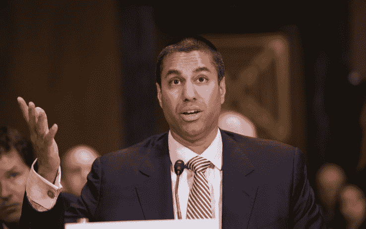

# 关于国会决定向互联网提供商公开你的数据，你需要知道的一切

> 原文：<https://web.archive.org/web/https://techcrunch.com/2017/03/29/everything-you-need-to-know-about-congress-decision-to-expose-your-data-to-internet-providers/>

国会两院刚刚通过了一项联合决议，差一点就要由总统签署，推翻了宽带隐私规则，这是联邦通信委员会的一项法规，对互联网提供商收集和出售他们收集的消费者数据的方式做出了一些不便的改变。但他们现在到底能做些什么，而上周他们做不到呢？

我有好消息和坏消息。好消息是:国会共和党人(大多数；值得一提的是，15 名代表投了反对票)匆忙发起了这项联合决议，因为隐私规则实际上还没有生效。所以从技术上来说，你并没有失去任何保护——他们只是从一开始就阻止你得到保护。我会回到这个话题，但是现在让我们看看如果国会允许你享受这些保护，这些保护会是什么样的。

#### 规则到底是什么？

我称之为规则(全名相当繁琐)，在几个主要领域更新了对宽带互联网提供商的现有要求。根据该规则:

*   互联网服务提供商被要求对他们收集的数据、他们如何使用这些数据以及他们打算与谁共享这些数据保持透明。
*   ISP 在使用“客户专有信息”之前，必须获得消费者的事先许可(即用户必须选择加入)这是由 FCC 定义的一个类别，包含了您通常期望得到保护的内容——医疗数据、社会安全号码——并添加了一些并非固有的个人信息，而是大多数人不赞成的大规模跟踪信息:网页浏览历史和应用程序使用历史。(这是报道最多的部分。)
*   互联网服务提供商必须采取安全方面的“合理措施”来保护这些信息，并且在发生重大违规事件(超过 5，000 个帐户受到影响)时，必须在一周内通知各方以及受影响的消费者。
*   不要为低隐私措施提供价格折扣——例如，如果消费者同意被跟踪，就降低月费。
*   已经发出通知(但尚未提出实际规则),即将对强制仲裁的做法进行审查，这种做法限制了消费者对公司内部程序进行补救的法律手段。

#### 好吧，那么现在互联网服务提供商可以做这些事情了？

算是吧。请稍等片刻。

废除这些规则的主要理由是联邦贸易委员会已经做了隐私保护的事情，而且已经做了很多年了。而且还有点真！比如说，当塔吉特百货的积分卡系统遭到黑客攻击，或者脸书或推特与它的用户串通一气时，联邦贸易委员会实际上正在工作。现在依然如此。但在 2015 年，FCC 专门对互联网提供商行使权力，将他们排除在 FTC 的管辖范围之外。

我们今天谈论的规则——基于联邦贸易委员会的规则和奥巴马政府的消费者隐私权利法案——旨在迅速填补这一监管空白，并增加一些 ISP 特有的东西，如浏览历史，联邦贸易委员会认为不需要保护。

从表面上看，废除这一规定是为了将所有的事情都交还给联邦贸易委员会。但问题是:现在，联邦贸易委员会被法律禁止监管互联网服务提供商！FCC 在 2015 年的举动实际上为 FTC 在 ISP 的业务方面发生问题时介入留出了空间——例如，在国家层面上的价格操纵。但是最近的一项法院判决(实际上没人喜欢，记录在案)将互联网服务提供商*单独置于联邦通信委员会的管辖之下。*

明白了吗？联邦通信委员会*和联邦贸易委员会*现在都被禁止为互联网服务提供商制定隐私规则。根本没有警察在巡逻！

从技术上来说，联邦通信委员会对电信仍有一些剩余权力，但目前的委员会已经明确表示，他们不考虑 ISP 电信，所以他们不会行使这一权力。换句话说，现在，当涉及到他们的用户数据时，ISP 有相当大的自由。当然，他们不会变得疯狂——这种权力真空只会持续到 FCC 撤销其 2015 年的决定，让 FTC 回到原来的位置。

但与此同时，是的，他们可以侥幸逃脱:

*   ISP*可以*记录并出售你的浏览历史、你使用的应用和服务的数据等等。
*   除了他们自愿在隐私政策中声明的内容之外，互联网服务提供商*不需要告诉你他们收集了什么或者卖给了谁。*
*   ISP*可能需要也可能不需要*在发生违规时通知您(这因州而异)。
*   ISP*仍然可以*通过强制仲裁迫使你解决他们内部系统中的投诉或违规行为。
*   互联网服务提供商*可以给同意分享个人信息的用户打折——但是当他们免费得到这些信息时，为什么还要麻烦呢？*

这也是一个很好的时间去尝试像广告注入和超级预订这样的侵入性做法，以及像零评级这样有问题的做法。为什么不呢，对吗？

他们不会做任何会让他们以后在 FTC 遇到麻烦的事情，但是 FCC 针对 ISP 的改进不会很快回来，我们稍后会看到。联邦贸易委员会也不太可能采用类似的规则，因为那就像是承认这个规则是个好主意一样。

#### 但是脸书和谷歌不是看得更多吗？

脸书、谷歌、亚马逊、网飞和上百个其他在线服务也尽可能密切地跟踪你，这是真的。这是反对这一规则的另一个大论点:为什么要对互联网服务提供商制定这些更严格的法规，而边缘提供商(他们被称为)却逍遥法外？

答案有三个。

首先，他们没有逃脱任何惩罚。大多数边缘提供商仍然受 FTC 管辖，因为他们不是宽带提供商。一个很大的例外是 Alphabet/Google，由于其光纤服务，它开始打 ISP 牌。但正如我们之前提到的，法院的判决不会让任何人高兴，可能也活不长了。

如果人们真的担心边缘提供商的隐私威胁，那么，联邦通信委员会是错误的。他们彼此没有任何关系。

 克里斯拉特克利夫/彭博 via Getty Images 
**第二**，ISP 在你的活动上可能没有脸书一样的窗口，但他们有一个独特而广阔的。他们看不到你在谷歌上做了什么(一般来说，查询和内容都是加密的)，但他们可以看到你从谷歌转到某个疾病的 WebMD 页面，在那里花了 15 分钟，然后转到你的医疗服务提供商，然后是当地诊所的页面，然后是你的信用社。你会从中获得什么信息？现在想象一下，你有几百万个数据点，有一个庞大的机器学习专家团队随时准备提供帮助。

你从家庭互联网连接的日常活动中产生的元数据可以描绘出你生活中令人不安的精确画面，从你的购物偏好到你的医疗困境。当然，你小心翼翼隐藏在隐名模式下的东西仍然会被你的 ISP 看到。

ISP 收集的数据不同于 edge 提供商收集的数据，但作为你的在线习惯和角色的一部分，它仍然非常有价值。

第三，脸书和 Gmail 等服务的用户有其他选择。人们有意识地决定限制他们在网上发布的内容，或者使用不收集广告数据的电子邮件服务。他们意识到，在使用这些服务时，他们是在用一点隐私换取免费服务。互联网服务提供商的情况并非如此。

用户不仅无法控制 ISP 看到的流量，而且经常别无选择；没有 Protonmail，没有 DuckDuckGo，没有信号。如果有选择的话，大多数人会在两到三个供应商之间做出选择。这种选择的缺乏使 ISP 与边缘提供商处于不同的类别。

因此，虽然隐私威胁确实来自许多方面，但 ISP 也不例外，事实上，它构成了一个特例，理应受到特殊规则的保护。

#### 我能做些什么来保护自己？

老实说，不是很多。

[HTTPS Everywhere](https://web.archive.org/web/20230325171209/https://www.eff.org/https-everywhere) 是一个好的开始——确保当你连接到一个网站时，你使用一个安全的连接，除了基本 URL，ISP 不能窥探。其他反跟踪软件(Adblock、Disconnect 等。)将主要影响边缘提供商知道什么。

[VPN](https://web.archive.org/web/20230325171209/https://techcrunch.com/2017/01/01/wtf-is-a-vpn/)经常被认为是伪装你流量的一种方式，它们确实有效，但你必须付费(至少我不能推荐任何免费的)。

在您的 ISP 处登录您的帐户，查看选项—您也许可以选择退出某些实践。你也可以试着打电话，看看你能从他们的电话里得到什么。但请记住，他们的手并没有真正被束缚，他们的隐私政策很大程度上是自愿的。

#### 那么，我们都永远处于困境了吗？

这很难说，但事情在好转之前还会变得更糟。

你看，联邦通信委员会的规则在去年的大部分时间里都在争论和调整，但只是在选举前才通过，其中包含的各种要求预计将在明年生效。(一些人认为这是出于政治动机，但另一种选择似乎是，联邦通信委员会在选举年期间什么都不做，以防出现权力逆转，这很荒谬。)

NICHOLAS KAMM/AFP/Getty Images
美国国会从[新任 FCC 主席](https://web.archive.org/web/20230325171209/https://techcrunch.com/2017/01/23/trumps-fcc-chairman-pick-ajit-pai-heralds-a-weaker-meeker-commission/)那里得到了一点帮助，他[勇敢地废除了将于三月初生效的部分规则](https://web.archive.org/web/20230325171209/https://techcrunch.com/2017/03/01/fcc-votes-to-negate-broadband-privacy-rules/)。如果他没有这么做，你*就会*失去一些保护。但他收到了，所以你没收到。坏消息是你可能永远也不会。

但由于时间的原因，废除是根据国会审查法案进行的，这是一种权力平衡的事情，让国会重新审视上届政府后期的立法，并推翻它。某种程度上，一个执政党不会在最后的日子里提出各种疯狂的法案，即使权力易手，这些法案仍然有效。

使用 CRA 的额外效果是防止类似的立法或规则再次被提出——这将需要国会的另一项法案来使再次这样做合法。

在这发生之前，你可以期待联邦通信委员会和国会[撤销建立前者对互联网服务提供商的权威和颁布网络中立规则的命令](https://web.archive.org/web/20230325171209/https://techcrunch.com/2017/02/28/ajit-pai-mwc/)。所以不仅仅是几年的时间，我们也要处理这个问题。

#### 他们为什么要这么做？

对于国会中的共和党人来说，这是一个简单的游戏(这不一定是一个党派问题，但[最终成为了一个](https://web.archive.org/web/20230325171209/https://techcrunch.com/2017/03/23/senate-votes-to-allow-isps-to-collect-personal-data-without-permission/))既要保持真正庞大的互联网服务提供商和电信游说团的好感，同时又要表示他们反对臃肿的官僚机构*和*奥巴马政府。大型互联网提供商是无可争议的赢家，国会中的保守派议员紧随其后。他们出卖了你，简单明了。

