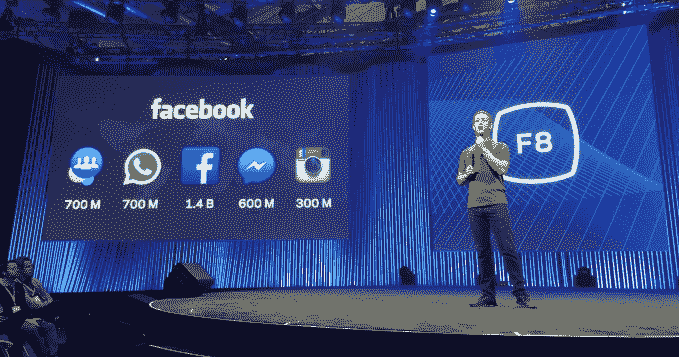

# 从今天的脸书 F8 公告中你需要知道的一切

> 原文：<https://web.archive.org/web/https://techcrunch.com/2015/03/25/everything-you-need-to-know-from-todays-facebook-f8-announcements/>

今天是脸书年度开发者大会 F8 的第一天，公司宣布了一大堆东西！

不过，其中一些比其他的更大——所以我们把今天所有最重要的东西都放在一个容易理解的列表里。尽情享受吧！

*点击任意图片查看我们关于该话题的完整文章……*

脸书希望不仅仅是一个应用程序。[它希望成为一个应用程序家族](https://web.archive.org/web/20230404162627/https://techcrunch.com/2015/03/25/safety-in-numbers/)，服务于不同的使用案例，并保护彼此免受干扰。多亏了 Messenger、WhatsApp、Instagram、Oculus 和外部开发者，脸书保持了 11 年的统治地位。但如果它想让这个家族继续存在，就必须让第三方开发商和营销人员对脸书的长期稳定充满信心。

正如我们上周非常努力地*[所言，脸书正在向开发者开放 Messenger 平台。这意味着开发人员将能够在 Messenger 中添加新的功能——例如用于即时 GIF 搜索的 Giphy、用于语音消息的傻瓜式变声器、用于为朋友涂鸦的画板等。可以把它想象成 Messenger 中的一个迷你应用商店*。*](https://web.archive.org/web/20230404162627/https://techcrunch.com/2015/03/19/facebook-messenger-platform/)*

 *脸书的评论系统(就像你在这篇文章底部看到的正在使用的那个)相当可靠，但是它已经有一段时间没有得到太多的喜爱了。

今天，它看到了一点大修。新评论将实时显示，评论将在故事页面(此页面)和我们的脸书页面上的共享故事项目之间同步，

脸书正在 YouTube 的地盘上采取行动，现在允许用户在其他网站上嵌入他们的脸书视频。这是否意味着 YouTube 上的个人化、家庭视频风格的内容会减少？也许吧。脸书会开始利用这些嵌入的视频流作为他们贴广告的另一个地方吗？几乎可以肯定。

奇怪的是，脸书现在将在新闻订阅中支持 3D 球形视频。您可以用鼠标光标在视频中平移。虽然球形视频在平板屏幕上看起来有点奇怪，但这里的关键是脸书对 Oculus Rift 的购买。带上虚拟现实耳机，打开一个 360 度球形视频，你就好像身临其境一样。VR 在 newsfeed！

想象一下十年后我们会和我们的孩子进行什么样的对话。“在我那个年代，我们一起看电影！同屏！屏幕是平的！*平！*”“好吧，爸爸，太酷了，我能要回我的 Rift 植入芯片吗？”

我们正迎头冲进这个“物联网”的时代——一个互联咖啡机、互联冰箱、互联电灯开关的时代。然而，在标准化这些东西如何在幕后工作(以及如何相互工作)方面，做得很少。

今天，FB 发布了 Parse for Internet Of Things——一组 SDK，充当物联网项目的后端大脑。它首先与 Arduino 兼容，其他平台也在路上。

去年，脸书收购了 LiveRail——一家广告交易所，向出价最高者提供应用和网站内的广告空间。今天，他们做了两项改变:除了视频，他们还将支持移动显示广告，并将能够利用匿名的脸书数据库来决定显示哪个广告。

脸书非常了解 T2 的应用程序用户。现在他们想帮助开发者弄清楚谁在使用*他们的*应用。玩你游戏的大部分人都是女性吗？他们是青少年吗？是那些青少年在游戏里花钱，还是大部分购买者都是 20 出头？脸书的新分析平台可以帮助你解决这个问题。

请继续关注明天 F8 第二天的更多新闻。

*