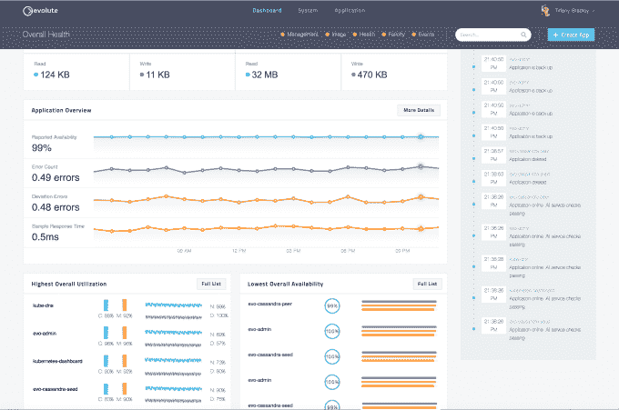

# Evolute 推出企业容器迁移和管理平台 

> 原文：<https://web.archive.org/web/https://techcrunch.com/2018/08/07/evolute-debuts-enterprise-container-migration-and-management-platform/>

# Evolute 推出企业容器迁移和管理平台

山景城外成立 3 年的初创公司 Evolute 今天正式推出了 Evolute 平台，目标是帮助大型组织将应用程序迁移到容器中，并大规模管理这些容器。

Evolute 创始人兼首席执行官克里斯托弗·弗朗西斯科(Kristopher Francisco)表示，他希望让所有财富 500 强公司获得与苹果和谷歌等大公司一样的技术，因为它们的规模和规模。

“我们真的专注于让企业公司做好两件事。第一件事是能够系统地进入容器技术。第二件事是能够大规模运行他们在企业环境中创建的现有和新应用程序，”Francisco 解释道。

虽然有许多复杂的竞争技术，他说他的公司已经提出了一些重要的差异化技术。首先，将传统技术放入容器被证明是一个耗时且具有挑战性的过程。他说，事实上，手动将一个遗留应用程序及其所有依赖项转移到一个容器中，每个应用程序通常需要 3-6 个月的时间。

他声称，他的公司已经将这一过程缩短到几分钟，使任何想要将现有应用程序迁移到容器技术的大型组织都可以实现容器化，同时将转换现有应用程序组合的总加速时间从几年缩短到几周。

Evolute 管理控制台。截图:Evolute

等式的第二部分是管理容器，Francisco 承认还有其他平台在生产中运行容器[，包括开源容器编排工具 Kubernetes](https://web.archive.org/web/20221025230807/https://techcrunch.com/2018/05/06/kubernetes-stands-at-an-important-inflection-point/) ，但他说他的公司大规模管理容器的能力使他与众不同。

“在企业中，你看到[集装箱化]采用数量如此之低的原因部分是因为他们面临的规模挑战。在 Evolute 平台中，我们实际上为他们提供了本地网络、安全和管理功能，以便能够大规模运行，”他说。

该公司还宣布，它被邀请加入雪佛龙技术风险投资公司的 Catalyst 计划，该计划为 Evolute 等早期公司提供支持。这可能有助于将 Evolute 推向雪佛龙内部寻求进入集装箱化技术的业务部门，并成为这家初创公司的一大推动力。

该公司自 2015 年以来一直存在，并拥有除雪佛龙以外的其他几家财富 500 强公司的客户，尽管它目前还不能公开这些公司的名称。根据 Crunchbase 的数据，该公司有 5 名全职员工，已经在两轮融资中筹集了 50 万美元的种子资金。